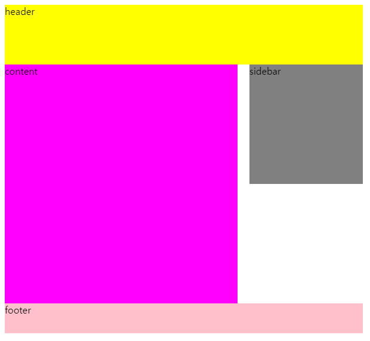

# 2022. 04.19. 수업내용 정리 #2/2

## float 속성 간단 정리~


+ float 속성 정리
  * 블록(block)요소들을 가로 정렬하기 위해 사용합니다. 
  * 박스를 왼쪽 또는 오른쪽으로 이동하거나 이동시키지 않도록 지정할 수 있습니다.
  * position 속성이 'static'인 속성에 사용하며, 기본값은 'none'입니다.


```html
<!--
	float의 속성값으로는
	left|right|none|inherit
	이 있습니다.
-->
<div id="container">
  <div id="header">header</div>
  <div id="content">content</div>
  <div id="sidebar">sidebar</div>
  <div id="footer">footer</div>
</div>

```

```css
#container {
  width: 600px;
}
#header {
  background-color: yellow;
  height: 100px;
}
#content {
  background-color: magenta;
  width: 390px;
  height: 400px;
  float: left;
}
#sidebar {
  background-color: gray;
  width: 190px;
  height: 200px;
  float: right;
}
#footer {
  background-color: pink;
  height: 50px;
  clear: both;
}
```

아래는 위의 코드를 실행시켜 웹에서 본 결과이다.<br>



- float 사용 시 **주의사항!!**

  1. 한 부모에 있는 자식(block)을 float 시킬 경우 그 자식은 위로 붕 뜨게 되어, 부모에게는 **없는 취급**을 받게됨(집 나간 자식 취급), 그 후 나머지 자식들은 빈 공간을 채우게 되며 부모의 height 역시 빠진 자식만큼 줄어들게 됩니다.

  2. 특정 box를 float 하게 되면 block으로 display 속성이 변경됨 (본래 inline, inline-block이었어도 모두 block으로 변경되어 width, height값을 가질 수 있게 됨)

  3. 본래의 block처럼 한 칸을 모두 차지하는 방식이 아니라 뜨는 방식이 되므로 나머지 요소들의 **길막**을 못하게됨.

  4. width 값을 주지 않은 상태에서 block을 float할 경우 가지고 있는 content(내용물) 만큼의 크기를 가지게 됨.

  5. float을 사용하면, block 사용시 자동으로 들어오는 margin값도 들어오지 않게 됨.

  6. float은 나만 볼 수 있음(block안에 있는 content들은  float에 영향을 받아 layout이 무너져버림.. **예로 블록요소가 숨어서 보이지 않거나 갑자기 아래 요소가 올라오는 등의 경우가 있다.**)<br>

     출처:[[CSS\] Float : 네이버 블로그 (naver.com)](https://blog.naver.com/aldzkwp1912/222339027670)