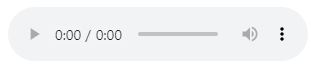
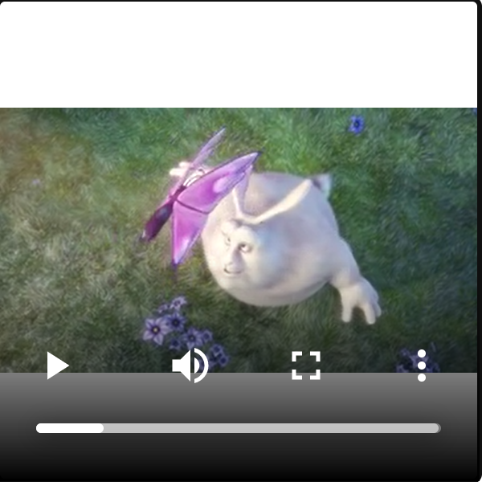
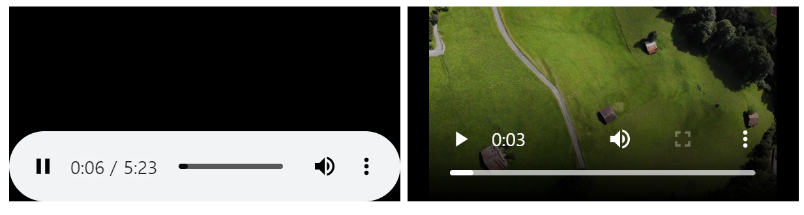

# 04.22 수업내용 정리

## audio,video,embed,iframe 


+ audio

  * 음악이나 오디오 스트림과 같은 사운드를 정의할 때 사용합니다.

  * 요소 내에 위치하는 텍스트는 사용자의 브라우저가 `<audio>`요소를 지원하지 않을 경우 화면에 표시됩니다.

  * MP3,WAV,Ogg 의 세 가지 포맷의 파일을 지원하고 있습니다. <br>

    예시 ↓

    ```html
      <audio src="./audio/piano.mp3" controls></audio>
    ```

    웹 페이지 화면 ↓

    

    사용할 수 있는 속성 표 추가 예정

  <br>

+ video

  * 태그는 무비 클립이나 비디오 스트림과 같은 비디오를 정의할 때 사용합니다.

  * 요소 내에 위치하는 텍스트는 사용자의 브라우저가 `<video>`요소를 지원하지 않을 경우 화면에 표시됩니다.

  * MP4,WebM,Ogg 의 세 가지 포맷의 파일을 지원하고 있습니다.<br>

    예시 ↓

    ```html
    <video controls width="200px" height="200px">
            <source src="./video/mov_bbb.mp4" type="video/mp4">
        </video>
        <!--
            controls:제어창(audio와 동일,재생, 중지, 전체화			면...)
            width, height: 가로 세로
            src:파일 위치, type:비디오/mp4
        -->
    ```

    웹 페이지 화면 ↓

    

사용할 수 있는 속성표 추가 예정

<br><br>

+ embed

  * 외부 애플리케이션이나 대화형 콘텐츠를 포함시킬 수 있는 **컨테이너(contatiner)**를 정의할 때 사용합니다.

  * 오래전부터 많은 웹 브라우저가 `<embed>`요소를 지원해 왔지만 HTML4까지는 정식으로 명세에 포함되지 않았습니다. 따라서 HTML5 에서 새롭게 추가된 `<embed>`요소를 사용한 웹 페이지는 HTML5에서의 유효성 검사는 통과하지만, HTML4에서의 유효성 검사는 통과하지 못할 것입니다. <br>

    예시

    ```html
      <!--
            embed : 포함시키다.
            embeded programing : 임베디드 프로그래밍 
            오디오,비디오,플래시 ... 가리지 않고 모두 가능.
        -->
        <embed src="./audio/piano.mp3" controls/>
        <embed src="./video/swiss (convert-video-			online.com).mp4" controls/>
    ```

    웹 페이지 화면 ↓

    

    bounus

    ```html
      <!--
            유튜브 주소 그대로 입력시 안됨
            https://www.youtube.com/watch?v=rRzxEiBLQCA - 원주소
            https://www.youtube.com/embed/rRzxEiBLQCA - 변형
            https://www.youtube.com/v/rRzxEiBLQCA&start=60 -60초부터 시작 
            &-ampersand-앰퍼샌드
            https://www.youtube.com/v/rRzxEiBLQCA&autoplay=1&start=60 -자동재생, 60초부터 시작
        -->
        <embed width="800px" height="800px" src="https://www.youtube.com/v/rRzxEiBLQCA&start=60" type="video/mp4">
    ```

    웹 페이지 화면 ↓

    

    사용할 수 있는 속성 및 css기본값 추가예정

    <br><br>

+ iframe

  * 인라인 프레임(inline frame)을 정의할 때 사용합니다.

  * 시작 태그와 종료 태그 사이에 `<iframe>`요소를 지원하지 않는 브라우저를 위한 텍스트를 포함할 수도 있습니다. 

    예시 ↓

    ```html
    <!--
           iframe
           inline-frame
           현재 페이지안에 다른 html페이지를 삽입
       -->
       <iframe width="560" height="315" src="https://www.youtube.com/embed/4-W32pQUnfs" 
       title="YouTube video player" 
       frameborder="0" 
       allow="accelerometer; autoplay=1; clipboard-write; encrypted-media; gyroscope; picture-in-picture" 
       allowfullscreen></iframe>
    ```

    웹 페이지 화면 ↓

    

    사용할 수 있는 속성 및 css 기본값 추가예정

    <br><br>

    

​				