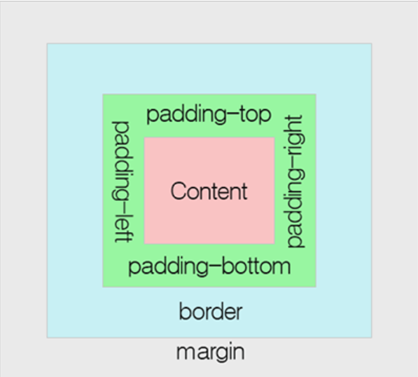

# 2022. 04. 26. 수업내용 정리 #2/3

## padding


+ padding

  * 내용(content)과 테두리(board) 사이의 간격인 패딩영역의 크기를 설정합니다.

  * background-color 속성으로 설정하는 배경색의 영향을 함께 받습니다.

  * CSS를 사용하면 패딩 영역의 크기를 방향별로 따로 설정할 수 있습니다. <br>

    

    <br>

+ 패딩(padding) 속성

  * padding-top
  * padding-right
  * padding-bottom
  * padding-left 

```html
<h1>패딩(padding) 영역 설정</h1>
<div>padding 속성을 설정하지 않은 요소입니다.</div><br>
<div class="pad">padding 속성값을 방향별로 따로 설정한 요소입니다.</div>
```

```css
div {
			background-color: #7FFFD4;
			border: 2px solid teal;
	}
div.pad {
			padding-top: 50px;
			padding-right: 10px;
			padding-bottom: 30px;
			padding-left: 100px;
		}
```

웹 페이지 화면 ↓

/padding영역설정.png)

<br>

+ 패딩 축약 표현

  모든 padding 속성을 이용한 스타일을 한 줄에 설정할 수 있습니다.

```html
<h1>패딩(padding) 영역 설정</h1>
<div>padding 속성을 설정하지 않은 요소입니다.</div><br>
<div class="four">padding 속성값을 4개로 설정한 요소입니다.</div><br>
<div class="three">padding 속성값을 3개로 설정한 요소입니다.</div><br>
<p>padding 속성값을 4개로 한 것과 3개로 한 것이 같은 효과를 내는 것에 주목하세요!</p>
```

```css
div {
			background-color: #7FFFD4;
			border: 2px solid teal;
	}
div.four { padding: 20px 50px 30px 50px; }
div.three { padding: 20px 50px 30px; }
```

웹 페이지 화면 ↓

/padding축약설정.png)

<br>

4개의 padding 속성값을 가질 때는 top, right, bottom, left 순으로 설정합니다.<br>

ex) padding: 10px 20px 30px 40px;<br>

(위의 예제는 아래 4줄의 코드와 같은 의미를 가지고 있습니다.)<br>

padding-top: 10px;<br>

padding-right: 20px;<br>

padding-bottom: 30px;<br>

padding-left: 40px;<br>

 

3개의 padding 속성값을 가질 때는 top, right와 left, bottom 순으로 설정합니다.<br>

ex) padding: 10px 20px 30px;<br>

(위의 예제는 아래 4줄의 코드와 같은 의미를 가지고 있습니다.)<br>

padding-top: 10px;<br>

padding-right: 20px;<br>

padding-bottom: 30px;<br>

padding-left: 20px;<br>

 

2개의 padding 속성값을 가질 때는 top과 bottom, right와 left 순으로 설정합니다.<br>

ex) padding: 10px 20px;<br>

(위의 예제는 아래 4줄의 코드와 같은 의미를 가지고 있습니다.)<br>

padding-top: 10px;<br>

padding-right: 20px;<br>

padding-bottom: 10px;<br>

padding-left: 20px;<br>

 

1개의 padding 속성값을 가질 때는 모든 패딩값을 같게 설정합니다.<br>

ex) padding: 10px;<br>

(위의 예제는 아래 4줄의 코드와 같은 의미를 가지고 있습니다.)<br>

padding-top: 10px;<br>

padding-right: 10px;<br>

padding-bottom: 10px;<br>

padding-left: 10px;<br><br>

+ CSS padding 속성

|      속성      |                            설명                             |
| :------------: | :---------------------------------------------------------: |
|    padding     | 모든 padding 속성을 이용한 스타일을 한 줄에 설정할 수 있음. |
|  padding-top   |              윗쪽의 패딩(padding) 값을 설정함.              |
| padding-right  |             오른쪽의 패딩(padding) 값을 설정함.             |
| padding-bottom |             아래쪽의 패딩(padding) 값을 설정함.             |
|  padding-left  |              왼쪽의 패딩(padding) 값을 설정함.              |

