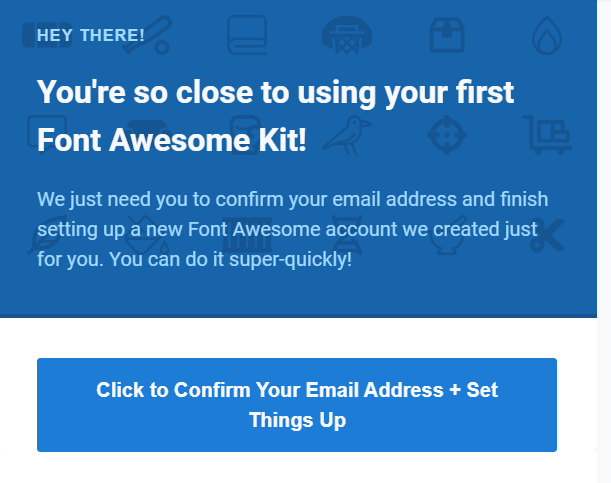

# 2022. 5. 3 수업 정리 #3/3

## Font Awesome (사용법 위주)


+ 어썸폰트(Font Awesome)

  웹 개발에 필요한 아이콘을 텍스트화해서 공유해주는 사이트<br>

  그 밖에도 svg 등 다양한 형식의 아이콘을 공유해주어 웹 사이트 제작에 유용함.<br>

  링크 : https://fontawesome.com/

  <br>

* 사용법

  1. cdn kit을 받을 이메일 주소를 입력

     <br>

  2. 위에 입력한 이메일 주소로 아래와 같은 이메일이 온 것을 확인 후,<br>아래 email 주소 확인을 누르기

     <br>

  3. 이메일의 링크를 타고 들어가면, 해당 주소에 사용할 비번을 입력

     <br>

  4. 아래와 같은 화면이 나오면, 패스 가능

     <br>

  5. 아래와 같은 코드가 나오는데, 아래 코드를 복사

     <br>

  6. 사용할 웹 프로젝트(페이지)의 head 부분에 복사한 코드를 추가

     ```html
     <head>
     	<script    			src="https://kit.fontawesome.com/24ba46a7a7.js" crossorigin="anonymous">
         </script>
     </head>
     ```

  <br>

  7. 아이콘 검색에서 필요한 검색어로 아이콘을 검색 후 하나를 선택하면, copy할 수 있는 class 코드를 복사

     <br>

  

  <br>

  8. copy한 class 코드를 적용할 프런트 소스에 복사

    ```html
    <body>
        <i class="fa-solid fa-trash"></i>
        <i class="fa-solid fa-check"></i>
        <span style="color:blue"><!--icon 색 변경 시 span으로 감싼 후 변경-->>
            <i class="fa-brands fa-facebook"></i>
            <i class="fa-brands fa-facebook fa-1x"></i><!--크기 증가-->
            <i class="fa-brands fa-facebook fa-2x"></i>
            <i class="fa-brands fa-facebook fa-3x"></i>
            <i class="fa-brands fa-facebook fa-4x"></i>
        </span>
        <span style="color: blueviolet;">
            <i class="fa-brands fa-twitch fa-3x"></i>
        </span>
        <span style="color: royalblue;">
            <i class="fa-brands fa-twitter fa-3x"></i>
        </span>
        <span style="color: red;">
            <i class="fa-brands fa-youtube fa-3x"></i>
        </span>
    </body>
    ```

  9. 웹 페이지 화면

     

  
