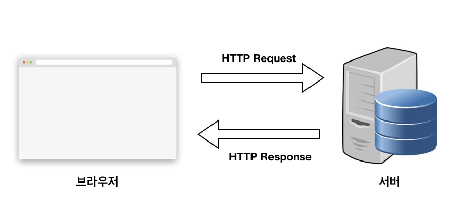

<h1>FrontEnd 기초 지식</h1> 

<h3>지속적인 업데이트 예정</h3>

 

* HTTP에 대한 정리

1. 정의
   HTTP(Hyper Text Transfer Protocol)은 인터넷에서 데이터를 주고받을 수 있는 프로토콜(컴퓨터 내부에서, 또는 컴퓨터 사이에서 데이터의 교환 방식을 정의하는 규칙 체계)입니다.
   상태가 없는 프로토콜로 데이터를 주고받기 위한 각각의 데이터 요청이 서로 독립적으로 관리된다.(이전, 다음 데이터요청이 서로 무관)
   이로 인해 서버는 세션과 같은 별도의 추가 정보관리의 필요가 없어지고 다수의 요청 처리 및 서버의 부하를 줄일 수 있는 성능의 이점이 생김
   TTP 프로토콜은 일반적으로 TCP/IP 통신 위에서 동작하며 기본 포트는 80번

2. Request&Response
   Http 프로토콜로 데이터를 주고받기 위해서 아래와 같이 요청을 보내고 응답을 받아야 합니다.
   
   요청, 응답의 이해 이전에 클라이언트와 서버를 이해해야한다. 
   클라이언트란 요청을 보내는 쪽을 의미하며 일반적으로 웹 관점에서 브라우저를 의미
   서버는 요청을 받는 쪽으로 데이터를 보내주는 원격지의 컴퓨터를 의미

3. URL(Uniform Resource Locators)
   개발자가 아니더라도 이미 우리에게 익숙한 용어입니다.

   서버에 자원을 요청하기 위해 입력하는 영문 주소
   숫자로 IP 주소에 비해 기억하기가 용이하다.

4. HTTP 요청 메서드
   앞에서 살펴본 URL을 이용하면 서버에 특정 데이터를 요청할 수 있음

   여기서 요청하는 데이터에 특정 동작을 수행하고 싶을 때 요청 메서드를 이용
   요청 메서드는 HTTP Verbs라고도 불리우며 아래와 같이 주요 메서드를 갖고 있습니다.

   * GET : 존재하는 자원에 대한 요청
   * POST : 새로운 자원을 생성
   * PUT : 존재하는 자원에 대한 변경
   * DELETE : 존재하는 자원에 대한 삭제 
   * HEAD : 서버 헤더 정보 획득, GET과 비슷하나 Response Body(객체형 자료)를 반환하지 않음
   * OPTIONS : 서버 옵션들을 확인하기 위한 요청. CORS에서 사용

   데이터에 대한 조회, 생성, 변경, 삭제 동작을 HTTP 요청 메서드로 정의할 수 있습니다.
   때에 따라서는 POST 메서드로 PUT, DELETE 동작을 수행할 수 있습니다.

5. HTTP 상태 코드
   서버에서 설정해주는 응답 정보
   이 상태 코드로 에러 처리를 할 수 있습니다.
   상태 코드는 크게 200(성공), 404(실패)로 나뉩니다. 

   * 2xx - 성공
     * 200 : GET 요청에 대한 성공
     * 204 : No Content 성공했으나 응답 본문에 데이터가 없음
     * 205 : React Content 성공했으나 클라이언트의 화면을 새로 고침하도록 권고
     * 206 : Partial Content 성공했으나 일부 범위의 데이터만 반환
   * 3xx - 리다이렉션(이전 주소 요청으로 새 URL로 유도)
     * 301 : Moved Permanently, 요청한 자원이 새 URL에 존재
     * 303 : See Other 요청한 자원이 임시 주소에 존재
     * 304 : Not Modified 요청한 자원이 변경되지 않았으므로 클라이언트에서 캐싱된 자원을 사요하도록 권고, ETag(특정 버전의 리소스를 식별하는 식별자, 다른 서버들이 추적하는 용도)와 같은 정보를 활용하여 변경 여부를 확인
   * 4xx - 클라이언트 에러
     * 400 : Bad Request, 잘못된 요청
     * 401 : Unauthorized, 권한 없이 요청, Authorization 헤더가 잘못된 경우
     * 403 : Forbidden, 서버에서 해당 자원에 대한 접근 금지
     * 405 : Method Not Allowed, 허용되지 않은 요청 메서드
     * 409 : Conflict, 최신 자원이 아닌데 업데이트하는 경우(파일 업로드시 버전 충돌)
   * 5xx - 서버 에러
     * 501 : Not Implemented, 요청한 동작에 대해 서버가 수행할 수 없는 경우
     * 503 : Service Unavailable, 서버가 과부하 또는 유지 보수로 내려간 경우

* REST API

  1. 정의
     두 컴퓨터 시스템이 인턴세을 통해 정보를 안전하게 교환하기 위해 사용하는 인터페이스(애플리케이션 프로그래밍 인터페이스(API)는 다른 소프트웨어 시스템과 통신하기 위해 따라야 하는 규칙을 정의)
     Representational State Transfer(REST)는 API 작동 방식에 대한 조건을 부과하는 소프트웨어 아키텍처입니다.
  2. 동작과정
     * 클라이언트가 서버에 요청을 전송합니다. 클라이언트가 API 문서에 따라 서버가 이해하는 방식으로 요청 형식을 지정합니다.
     * 서버가 클라이언트를 인증하고 해당 요청을 수행할 수 있는 권한이 클라이언트에 있는지 확인합니다.
     * 서버가 요청을 수신하고 내부적으로 처리합니다.
     * 서버가 클라이언트에 응답을 반환합니다. 응답에는 요청이 성공했는지 여부를 클라이언트에 알려주는 정보가 포함됩니다. 응답에는 클라이언트가 요청한 모든 정보도 포함됩니다.
  3. 장점
     * 확장성 : REST API를 구현하는 시스템은 REST가 클라이언트-서버 상호 작용을 최적화하기 때문에 효율적으로 크기 조정할 수 있습니다. 무상태는 서버가 과거 클라이언트 요청 정보를 유지할 필요가 없기 때문에 서버 로드를 제거합니다. 잘 관리된 캐싱은 일부 클라이언트-서버 상호 작용을 부분적으로 또는 완전히 제거합니다. 이러한 모든 기능은 성능을 저하시키는 통신 병목 현상을 일으키지 않으면서 확장성을 지원합니다.
     * 유연성 : RESTful 웹 서비스는 완전한 클라이언트-서버 분리를 지원합니다. 각 부분이 독립적으로 발전할 수 있도록 다양한 서버 구성 요소를 단순화하고 분리합니다. 서버 애플리케이션의 플랫폼 또는 기술 변경은 클라이언트 애플리케이션에 영향을 주지 않습니다. 애플리케이션 함수를 계층화하는 기능은 유연성을 더욱 향상시킵니다. 예를 들어, 개발자는 애플리케이션 로직을 다시 작성하지 않고도 데이터베이스 계층을 변경할 수 있습니다.
     * 독립성 : REST API는 사용되는 기술과 독립적입니다. API 설계에 영향을 주지 않고 다양한 프로그래밍 언어로 클라이언트 및 서버 애플리케이션을 모두 작성할 수 있습니다. 또한 통신에 영향을 주지 않고 양쪽의 기본 기술을 변경할 수 있습니다.

* 브라우저

  1. 정의

     유저가 선택한 자원을 서버로부터 받아와서 렌더링 과정을 통해 웹에서 페이지로 유저에게 보여주고 다른 하이퍼링크를 통해 다른 페이지로 이동할 수 있도록 하는 프로그램

  2. 동작 과정

     * HTML 파일과 CSS 파일을 파싱해서 각각 DOM,CSSOM Tree를 만듭니다. (Parsing)

       \- CSS는 기본적으로 하향식으로 규칙을 정하는 방식을 따르기 때문에 트리구조로 구성

       \- HTML 파싱 과정 중 자바스크립트 파일을 만날 경우 DOM 구조를 변경시킬 수 있기 때문에 자바스크립트를 다운로드(defer, async같은 옵션이 붙어있는 경우는 제외)하고 실행함
       \- 브라우저마다 다르지만, 위와 같은 경우를 대비해서 CSS 파일을 받기 전까지 HTML 파싱을 멈추는 경우도 있습니다. 

     * 두 Tree를 결합(매칭시키는)하여 Rendering Tree를 만듭니다. (Style)

     * Rendering Tree에서 각 노드의 위치와 크기를 계산합니다. (Layout)

     * 계산된 값을 이용해 각 노드를 화면상의 실제 픽셀로 변환하고, 레이어를 만듭니다. (Paint)

     * 레이어를 합성하여 실제 화면에 나타냅니다. (Composite)

* CORS

  브라우저에서는 보안적인 이유로 `cross-origin`(프로토콜,도메인,포트번호 중 하나라도 다른 경우)HTTP 요청들을 제한합니다. 그래서 `cross-origin` 요청을 하려면 서버의 동의가 필요합니다. 만약 서버가 동의한다면 브라우저에서는 요청을 허락하고, 동의하지 않는다면 브라우저에서 거절합니다.

  이러한 허락을 구하고 거절하는 메커니즘을 HTTP-header를 이용해서 가능한데, 이를 CORS(Cross-Origin Resource Sharing)라고 부릅니다.

* CSS Box Model
  HTML element가 웹 페이지에서 차지하는 공간을 정의한 모델
  element의 내용이 담긴(content), element를 감싸는 경계(border), border과 content 사이의 영역(padding), border 바깥의 영역(margin)으로 구성됩니다.

* 시멘틱 마크업
  시멘틱이란 "의미론적인"이라는 뜻을 가지며 마크업이란 HTML 태그로 문서를 작성하는 것을 말합니다. 즉, 의미를 잘 전달하도록 문서를 작성하는 것을 의미합니다.

* CSR vs SSR

  1. CSR

     1. 정의
        Client Side Rendering의 약자 렌더링이 클라이언트 쪽에서 일어납니다.
        즉, 서버는 요청을 받으면 클라이언트에 HTML/CSS, JS를 보내주고 클라이언트는 그것을 받아 렌더링을 시작합니다.
        * user가 웹사이트 요청을 보냄
        * CDN(Content Delivery Network의 약자인 CDN은 지리적 제약 없이 전 세계 사용자에게 빠르고 안전하게 콘텐츠를 전송할 수 있는 콘텐츠 전송 기술)이 HTML과 JS로 접근할 수 있는 링크를 클라이언트로 보냄
        * 클라이언트는 HTML/CSS,JS를 다운로드 받음
        * 다운로드가 완료된 JS가 실행, 데이터를 위한 API가 호출됨
        * 서버가 API로부터의 요청에 응답함
        * API로부터 받아온 data를 placehorder 자리에 넣어줌, 이제 페이지는 상호작용이 가능하게됨(서버에서 처리 없이 클라이언트로 보내주므로 자바스크립트가 모두 다운로드 되고 실행이 끝나기 전까지 사용자는 볼 수 있는게 없음)

  2. SSR

     1. 정의
        Server Side Rendering의 약자, 서버쪽에서 렌더링 준비를 끝마친 상태로 클라이언트에 전달하는 방식
        * User가 웹사이트 요청을 보냄
        * Server는 Ready to Render 즉, 즉시 렌더링 가능한 HTML 파일을 생성(리소스 체크, 컴파일 후 완성된 HTML 콘텐츠로 만듬)
        * 클라이언트에 전달되는 순간, 이미 렌더링 준비가 되어있기 때문에 HTML은 즉시 렌더링 되지만 사이트 자체는 조작이 불가능
        * 클라이언트가 자바스크립트 다운로드
        * 다운로드되는 동안 콘텐츠는 볼 수 있지만 사이트를 조작 할 수는 없다. 이 때의 사용자 조작을 기억합니다.
        * 브라우저가 자바스크립트 프레임워크를 실행합니다.
        * 자바스크립트까지 성공적으로 컴파일 되었기에 기억하고 있던 사용자 조작이 실행되고 이제 웹 페이지는 상호작용이 가능해집니다. (즉, 서버에서 이미 렌더 가능한 상태로 클라이언트에 전달되기 때문에 스크립트 파일이 다운로드 되는 동안 사용자는 무언가를 보고있을 수 있음)

  3. 차이

     1. 웹 페이지 로딩시간
        웹 페이지의 로딩은 첫 페이지와 나머지 이렇게 두 가지로 로딩의 종류가 나뉩니다.

        * 첫 페이지 로딩시간
          CSR의 경우 HTML, CSS와 모든 스크립트들을 한 번에 불러옵니다.
          반면 SSR은 필요한 부분의 HTML과 스크립트만 불러오게 됩니다.
          따라서 평균적으로는 SSR이 더 빠릅니다.
        * 나머지 로딩시간
          첫 페이지 로딩 후, 사이트의 다른 곳으로 이동하는 식의 동작을 가정했을 때, CSR은 이미 첫 페이지 로딩할 때 나머지 부분을 구성하는 코드를 받아왔기 때문에 빠릅니다.
          반면, SSR은 첫 페이지를 로딩한 과정을 정확하게 다시 실행하므로 더 느립니다.

     2. SEO 대응
        검색 엔진은 자동화된 로봇인 '크롤러'로 웹사이트들을 읽습니다.
        CSR은 자바스크립트를 실행시켜 동적으로 콘텐츠가 생성되기 때문에 자바스크립트가 실행 되어야 meatadata가 바뀌었다.

        (이전 크롤러들은 자바스크립트를 실행시키지 않았었기에 SEO 최적화가 필수적이었습니다.)

        SSR은 애초에 서버 사이드에서 컴파일되어 클라이언트로 넘어오기 때문에 크롤러에 대응하기 용이합니다.

     3. 서버 자원 사용
        SSR이 매번 서버에 요청을 하기 때문에 서버 자원을 더 많이 사용합니다.
        \- renderToStrng은 React에서 서버사이드 렌더링을 구현하는데 사용되는 메소드다. 그런데 이게 스택을 막고 동기적으로 처리된다. 이게 실행될 동안 서버는 멈춘다. 😢 참고 renderToString은 리액트가 버전업이 되면서 '클라이언트에서'의 퍼포먼스가 개선되었다.
        반면 CSR은 클라이언트에서 처리하기 때문에 부하가 적음.

