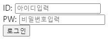
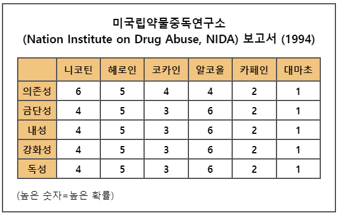
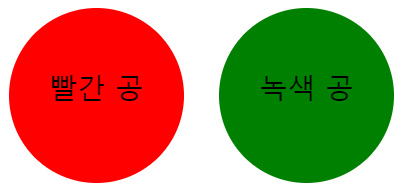

# 2022. 04. 21. 수업내용 정리

## span, input, form, table...

 

+ span 

  * HTML 문서에서 인라인(inline) 요소들을 하나로 묶을 때 사용

  * 그 자체만으로는 의미를 가지지 않지만, class나 id 같은 **전역속성**과 함께 사용하여 스타일링을 위해 요소들을 그룹화하거나 lang  속성과 같은 속성값을 공유하는 데 유용하게 사용할 수 있습니다.

  * div요소와 매우 비슷하게 사용되지만, div 요소는 블록타입인데 반해 span 요소는 인라인 타입입니다. 

  * div vs span

    ```html
    <div id="divtag1"></div>
    <div id="divtag2"></div>
    <span id="spantag1">11111</span>
    <span id="spantag2">22222</span>
    ```

    ```css
    #divtag1{
      width:100px;
      height:100px;
      background-color:red;
    }
    #divtag2{
      width:100px;
      height:100px;
      background-color:blue;
    }
    #spantag1{
      width:100px;
      height:100px;
      background-color:red;
    }
    #spantag2{
      width:100px;
      height:100px;
      background-color:blue;
    }
    ```

    아래는 위의 코드를 실행한 후 나온 결과이다.

    

    <br>span은 인라인 요소이기에 내부에 컨텐츠가 필요하고 컨텐츠의 크기만큼만 영역을 차지하는 반면, div는 블록 요소이므로 한 칸 모두를 차지하고 세로로 자동 정렬됩니다.

    <br><br>

+ input

  * input 태그는 사용자로부터 입력을 받을 수 있는 입력 필드를 정의할 때 사용합니다.

  * 사용자가 데이터를 입력할 수 있는 입력 필드를 선언하기 위해서 **form** 요소 내부에서 사용됩니다. 이러한 입력 필드는 input 요소의 type 속성값을 달리함으로써 여러 가지 모양으로 나타낼 수 있습니다.

  * input 태그는 빈 태그이며, 속성만을 포함하고 있습니다.

  * label 요소를 사용하면 input 요소의 라벨을 정의할 수도 있습니다.

    ```html
      <input type="text" placeholder="아이디를 입력하세요." value="1234" maxlength="10"\>
        <input type="password" placeholder="비밀번호를 입력하세요.">
    ```

    <br>

+ form

  * 사용자로부터 입력을  받을 수 있는 HTML입력 폼을 정의할 때 사용합니다.

  * 아래의 요소들 중 하나 이상을 포함할 수 있습니다.

    - `<button>`

    - `<fieldset>`

    - `<input>`

    - `<label>`

    - `<option>`

    - `<optgroup>`

    - `<select>`

    - `<textarea>`

      예시..

    ```html
    <form action="loginCheck.jsp" method="get">
      <label for="ID">ID:</label>
      <input type="text" placeholder="아이디입력" id="ID"><br>
      <label for="PW">PW:</label>
      <input type="password" placeholder="비밀번호입력" id="PW"><br>
      <input type="submit" value="로그인">
    </form>
    ```

    웹 화면 ↓

    

+ table

  * 여러 종류의 데이터를 보기 좋게 정리하여 보여주는 표를 의미합니다.

    HTML에서는 `<table>`태그를 사용하여 이러한 테이블을 작성할 수 있습니다.

  * table 태그의 구성은 아래와 같습니다.

    - `<tr>`태그는 테이블에서 열을 구분해 줍니다.

    - `<th>`태그는 각 열의 제목을 나타내며, 모든 내용은<br> 자동으로 굵은 글씨에 가운데 정렬이 됩니다.

    - `<td>`태그는 테이블의 열을 각가의 셀(cell)로 나누어줍니다.

      예시..

      ```html
        <table width="550" height="250" border="1" cellpadding="0" cellspacing="0">
          <tr>
            <td align="center">
              <table width="500" height="200" border="1" cellpadding="0" cellspacing="0">
                <caption>
                  <h3 align="light">미국립약물중독연구소<br>
                    (Nation Institute on Drug Abuse, NIDA) 보고서 (1994)
                  </h3>
                </caption>
                <tr>
                  <th id="box"> </th>
                  <th id="head">니코틴 </th>
                  <th id="head">헤로인 </th>
                  <th id="head">코카인 </th>
                  <th id="head"> 알코올</th>
                  <th id="head">카페인 </th>
                  <th id="head">대마초</th>
                </tr>
                <tr>
                  <th id="name">의존성</th>
                  <th>6</th>
                  <th>5</th>
                  <th>4</th>
                  <th>4</th>
                  <th>2</th>
                  <th>1</th>
                </tr>
                <tr>
                  <th id="name">금단성 </th>
                  <th>4 </th>
                  <th>5 </th>
                  <th>3 </th>
                  <th> 6</th>
                  <th>2 </th>
                  <th>1 </th>
                </tr>
                <tr>
                  <th id="name">내성 </th>
                  <th>4 </th>
                  <th>5 </th>
                  <th>3 </th>
                  <th> 6</th>
                  <th>2 </th>
                  <th>1 </th>
                </tr>
                <tr>
                  <th id="name">강화성 </th>
                  <th>4 </th>
                  <th>5 </th>
                  <th>3 </th>
                  <th> 6</th>
                  <th>2 </th>
                  <th>1 </th>
                </tr>
                <tr>
                  <th id="name">독성 </th>
                  <th>4 </th>
                  <th>5 </th>
                  <th>3 </th>
                  <th> 6</th>
                  <th>2 </th>
                  <th>1 </th>
                </tr>
              </table>
              <p align="left">&nbsp;&nbsp;&nbsp;&nbsp;(높은 숫자=높은 확률)</p>
            </td>
          </tr>
        </table>
      
        <style>
          #head {
            width: 40px;
            height: 25px;
            background-color: rgb(241, 196, 128);
          }
      
          #name {
            width: 35px;
            height: 0px;
            background-color: rgb(241, 196, 128);
          }
      
          #box {
            background-color: rgb(241, 196, 128)
          }
        </style>
      ```
      
      웹 페이지 화면 ↓
      
      

      bonus.. (with border-radius).. 테이블과 응용가능

      ```html
      <style>
            div{
                  width: 100px;
                  height: 100px;
                  float: left;
                  border-radius: 100%;
                  text-align: center;
                  padding-top: 35px;
                  box-sizing: border-box;
              }
              #div1{
                  background-color: red;  
                  margin-right: 20px;                   
              }
              #div2{
                  background-color: green;          
              }
      </style> 
      
      	<div id="div1">
              빨간 공
          </div>
          <div id="div2">
              녹색 공
          </div>
      ```
      
      웹 페이지 화면 ↓
      
      

​				
