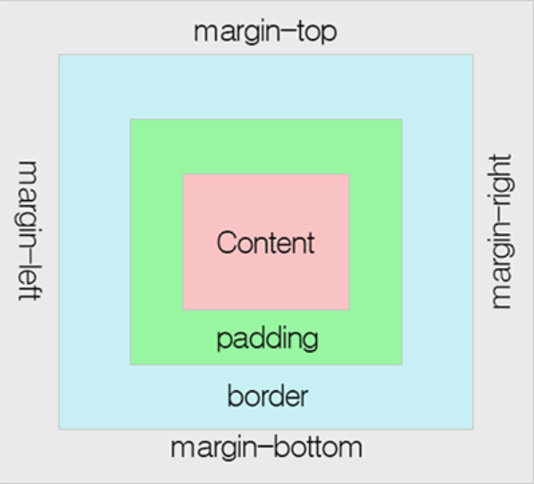
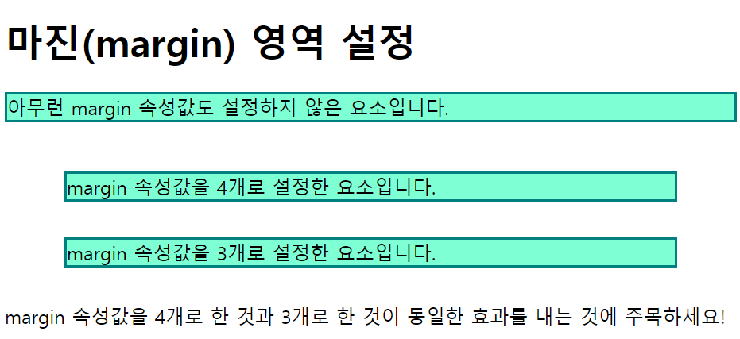

# 2022. 04. 26. 수업내용 정리 #1/3

## margin 정리


+ margin

  * 테두리(block)와 이웃하는 요소 사이의 간격인 마진 영역의 크기를 설정합니다. 

  * 패딩 영역과 달리 background-color 속성으로 설정하는 배경색의 영향을 받지 않습니다. 

  * CSS 사용 시 마진 영역의 크기를 방향별로 따로 설정할 수 있습니다.

    

+ 마진(margin) 속성

  * margin-top
  * margin-right
  * margin-bottom
  * margin-left 

  ```html
  <h1>마진(margin) 영역 설정</h1>
  <div>아무런 margin 속성값도 설정하지 않은 요소입니다.</div><br>
  <div class="mar">margin 속성값을 각 측면마다 별도로 지정한 요소입니다.</div>
  ```

  ```css
  div {
  			background-color: #7FFFD4;
  			border: 2px solid teal;
  	}
  div.mar {
  			margin-top: -25px; /*음수로 할 시 해당요소를 다른 요소의 위에 겹치게 할 수도 있습니다.*/
  			margin-right: 10px;
  			margin-bottom: 30px;
  			margin-left: 100px;
  		}
  ```

  웹 페이지 화면 ↓

  /marginexample-16510353879533.png)

  <br>

  margin 속성값을 `inherit`으로 설정시 부모요소의 margin 속성을 그대로 물려받습니다.

  ```html
  <h1>margin 속성값 조절</h1>
  <div>아무런 margin 속성값도 설정하지 않은 요소입니다.</div><br>
  <div class="parent">left-margin 속성값을 100px로 설정한 요소입니다.
  	<div class="child">left-margin 속성값을 inherit로 설정한 요소입니다.</div>
  </div>
  ```

  ```css
  <style>
  		div {
  			background-color: #7FFFD4;
  			border: 2px solid teal;
  		}
  		div.parent {
  			height: 100px;
  			margin-left: 100px;
  		}
  		div.child {
  			background-color: #FFF8DC;
  			margin-left: inherit;
  		}
  ```

  웹 페이지 화면 ↓

  /margininerit.png)

+ 마진 축약표현

  * 모든  margin 속성을 이용한 스타일을 한 줄에 설정할 수 있습니다.

    ```html
    <h1>마진(margin) 영역 설정</h1>
    <div>아무런 margin 속성값도 설정하지 않은 요소입니다</div><br>
    <div class="four">margin 속성값을 4개로 설정한 요소입니다.</div>
    <div class="three">margin 속성값을 3개로 설정한 요소입니다.</div>
    <p>margin 속성값을 4개로 한 것과 3개로 한 것이 동일한 효과를 내는 것에 주목하세요!</p>
    ```

    ```css
    div {
    		background-color: #7FFFD4;
    		border: 2px solid teal;
    	}
    div.four { 
        		margin: 20px 50px 30px 50px; 
             }
    div.three { 
        		margin: 20px 50px 30px; 
    		  }
    ```

    웹 페이지 화면 ↓

    

    - 예시

      4개의 margin 속성값을 가질 때는 top, right, bottom, left 순으로 설정합니다.<br>

      ex) margin: 10px 20px 30px 40px;<br>

      (위의 예제는 아래 4줄의 코드와 같은 의미를 가지고 있습니다.)<br>

      margin-top: 10px;<br>

      margin-right: 20px;<br>

      margin-bottom: 30px;<br>

      margin-left: 40px;<br>

       

      3개의 margin 속성값을 가질 때는 top, right와 left, bottom 순으로 설정합니다.<br>

      ex) margin: 10px 20px 30px;<br>

      (위의 예제는 아래 4줄의 코드와 같은 의미를 가지고 있습니다.)<br>

      margin-top: 10px;<br>

      margin-right: 20px;<br>

      margin-bottom: 30px;<br>

      margin-left: 20px;<br>

       

      2개의 margin 속성값을 가질 때는 top과 bottom, right와 left 순으로 설정합니다.<br>

      ex) margin: 10px 20px;<br>

      (위의 예제는 아래 4줄의 코드와 같은 의미를 가지고 있습니다.)<br>

      margin-top: 10px;<br>

      margin-right: 20px;<br>

      margin-bottom: 10px;<br>

      margin-left: 20px;<br>

       

      1개의 margin 속성값을 가질 때는 모든 마진값을 같게 설정합니다.<br>

      ex) margin: 10px;<br>

      (위의 예제는 아래 4줄의 코드와 같은 의미를 가지고 있습니다.)<br>

      margin-top: 10px;<br>

      margin-right: 10px;<br>

      margin-bottom: 10px;<br>

      margin-left: 10px;<br><br>

+ margin 속성값에 auto를 사용하는 이유

  * auto로 설정시, 웹 브라우저가 수평 방향 마진을 자동으로 설정합니다.(좌우 마진을 자동 설정)

  * 결과적으로 해당 요소는 그 요소를 포함하고 있는 부모 요소의 정중앙에 위치하게 됩니다. 

    ```html
    <h1>margin 속성값 auto를 이용한 수평 정렬</h1>
    <div>margin 속성값을 auto로 설정한 요소입니다.</div>
    ```

    ```css
    div {
            border: 2px solid teal;
            width: 350px;
            margin: auto;
    	}
    ```

    웹 페이지 화면 ↓

    /marginauto.png)

    <br><br>

+ CSS margin 속성

  |     속성      |                            설명                            |
  | :-----------: | :--------------------------------------------------------: |
  |    margin     | 모든 margin 속성을 이용한 스타일을 한 줄에 설정할 수 있음. |
  |  margin-top   |              윗쪽의 마진(margin) 값을 설정함.              |
  | margin-right  |             오른쪽의 마진(margin)값을 설정함.              |
  | margin-bottom |             아래쪽의 마진(margin)값을 설정함.              |
  |  margin-left  |              왼쪽의 마진(margin)값을 설정함.               |
