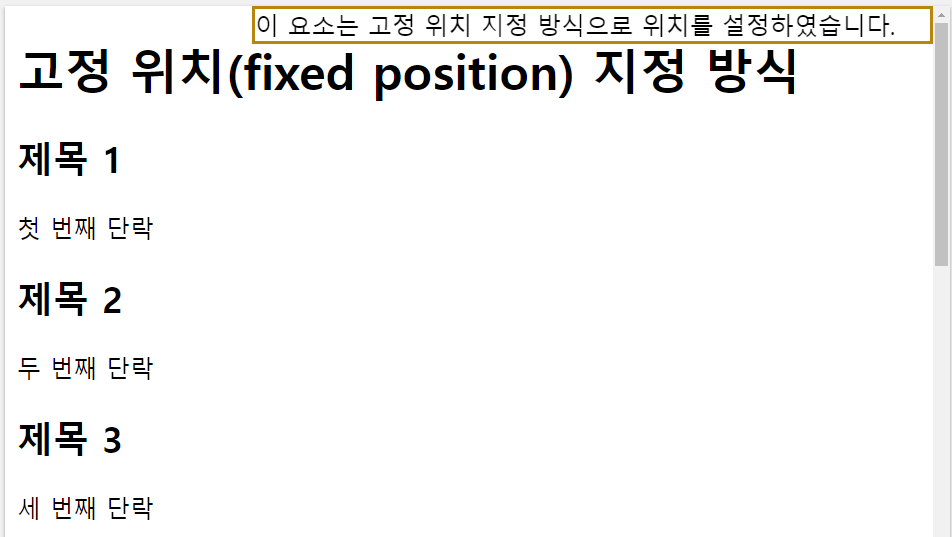

# 2022. 04. 26 수업내용 정리 #3/3

## position


+ position

  HTML요소가 위치를 결정하는 방식을 설정하고 아래의 4가지 방식이 있습니다.

  * 정적위치(static) 지정 방식

    position의 기본속성으로 top,right,bottom,left 속성값에 영향을 받지 않습니다.

  ```html
  <h1>정적 위치(static position) 지정 방식</h1>
  <div>이 요소는 정적 위치 지정 방식으로 위치를 설정하였습니다.</div>
  <p>정적 위치는 단순히 웹 페이지의 흐름에 따라 차례대로 요소들을 위치시키는 방식입니다!</p>
  ```

  ```css
  div {
          border: 2px solid #CD5C5C;
          position: static;
  	}
  ```

  웹 페이지 화면 ↓

  /static.png)<br>

  * 상대위치(relative position) 지정 방식

    해당 HTML 요소의 기본 위치를 기준으로 위치를 설정하는 방식입니다.<br>

    이 때, 기본 위치는 정적 위치(static position) 지정 방식일 때 결정되는 위치를 의미합니다.

  ```html
  <h1>상대 위치(relative position) 지정 방식</h1>
  <div class="static">이 요소는 정적 위치 지정 방식으로 위치를 설정하였습니다.</div><br>
  <div class="relative">이 요소는 상대 위치 지정 방식으로 위치를 설정한 후, left 속성값을 30px로 설정하였습니다.</div><br>
  <p>상대 위치는 해당 HTML 요소의 정적 위치(static position)에 따라 위치를 재조정하는 방식입니다!</p>
  ```

  ```css
  div.static {
      			width:60%;
                  border: 2px solid #B8860B;
                  position: static;
  		   }
  div.relative {
      			width:60%;
                  border: 2px solid #CD5C5C;
                  position: relative;
                  left: 30px;
  			 }
  ```

  웹 페이지 화면 ↓

  /relative.png)<br>

  * 고정 위치(fixed position) 지정 방식

    뷰포트(viewport)를 기준으로 위치를 설정하는 방식입니다.<br>

    즉, 웹 페이지가 스크롤 되어도 고정 위치로 지정된 요소는 항상 같은 곳에 위치하게 됩니다.

  ```html
  <h1>고정 위치(fixed position) 지정 방식</h1>
  <div class="fixed">이 요소는 고정 위치 지정 방식으로 위치를 설정하였습니다.</div>
  <h2>제목 1</h2>
  <p>첫 번째 단락</p>
  
  <h2>제목 2</h2>
  <p>두 번째 단락</p>
  
  <h2>제목 3</h2>
  <p>세 번째 단락</p>
  
  <h2>제목 4</h2>
  <p>네 번째 단락</p>
  
  <h2>제목 5</h2>
  <p>다섯 번째 단락</p>
  
  <h2>제목 6</h2>
  <p>여섯 번째 단락</p>
  
  <h2>제목 7</h2>
  <p>일곱 번째 단락</p>
  
  <h2>제목 8</h2>
  <p>여덟 번째 단락</p>
  
  <h2>제목 9</h2>
  <p>아홉 번째 단락</p>
  
  <h2>제목 10</h2>
  <p>열 번째 단락</p>
  
  <h2>제목 11</h2>
  <p>열한 번째 단락</p>
  
  <h2>제목 12</h2>
  <p>열두 번째 단락</p>
  
  <h2>제목 13</h2>
  <p>열세 번째 단락</p>
  ```

  ```css
  div.fixed {
  			border: 2px solid #B8860B;
  			width: 450px;
  			position: fixed;
  			top: 0;
  			right: 0;
  		  }
  ```

  웹 페이지 화면 ↓

  

  제목 3까지 스크롤 후 ↓

  /fixed2-165104440040522.png) <br>

  * 절대 위치(absolute position) 지정 방식

    위치가 설정된 조상(ancestor) 요소를 기준으로 위치를 설정하게 됩니다.<br>

    하지만 위치가 설정된 조상(ancestor) 요소를 가지지 않는다면, HTML 문서의 body 요소를 기준으로 위치를 설정하게 됩니다.<br>

  ```html
  <h1>절대 위치(absolute position) 지정 방식</h1>
  <div class="relative">이 요소는 상대 위치 지정 방식으로 위치를 설정하였습니다.
      <div class="absolute">이 요소는 절대 위치 지정 방식으로 위치를 설정한 후, top 속성값을 50px로 설정하였습니다.</div>
  </div>
  <div class="absolute">이 요소는 절대 위치 지정 방식으로 위치를 설정한 후, top 속성값을 50px로 설정하였습니다.</div>
  <p>절대 위치는 해당 요소의 바로 상위의 위치가 설정된 조상(ancestor) 요소에 따라 위치를 재조정하는 방식입니다!</p>
  ```

  ```css
  div.relative {
      border: 2px solid #B8860B;
      width: 500px;
      height: 200px;
      position: relative;
  } 
  div.absolute {
      border: 2px solid #006400;
      width: 200px;
      height: 100px;
      position: absolute;
      top: 50px;
      right: 0;
  }
  ```

  웹 페이지 화면 ↓

  /absolute.png)<br>

  > ※ 위치가 설정된 요소라는 것은 정적 위치(static position) 지정 방식을 제외한 다른 방식(relative, fixed, absolute)으로 위치가 설정된 요소를 의미합니다.

  아래는 위의 4가지 위치 지정방식을 반영한 예제 ↓

  ```html
  <h1>정적 위치(static position) 지정 방식의 특징</h1>
  <div class="container">
      <div class="static position">정적 위치(static position)</div>
      <div class="relative position">상대 위치(relative position)</div>
      <div class="fixed position">고정 위치(fixed position)</div>
      <div class="absolute position">절대 위치(absolute position)</div>
  </div>
  ```

  ```css
  .container {
  			border: 3px solid red;
  			width: 100%;
  			height: 1000px;
  			position: relative;
  		   }
  .position {
              width: 150px;
              height: 50px;
              top: 100px;
              left: 120px;
            }
  .static {
              border: 3px solid black;
              position: static;
  		}
  .relative {
              border: 3px solid green;
              position: relative;
  		  }
  .fixed {
              border: 3px solid orange;
              position: fixed;
         }
  .absolute {
              border: 3px solid blue;
              position: absolute;
  		  }
  ```

  웹 페이지 화면 ↓

  /종합예제.png)

  /종합예제2.png)<br>

  * z-index
    - HTML 요소의 위치를 설정하게 되면 어떤 요소들은 설정된 위치 및 방식에 따라 서로 겹칠 수 있습니다.
    - z-index 속성은 이렇게 겹쳐지는 요소들이 쌓이는 스택(stack)의 순서를 설정합니다.
    - 스택(stack)의 순서는 양수나 음수 모두 설정할 수 있으며, 크기가 클수록 앞쪽에 위치하고 작을수록 뒤쪽에 위치하게 됩니다.

  ```html
  <h1>z-index 속성을 이용한 노출 순서 변경</h1>
  <div>
      <div class="static position">정적 위치(static position)</div>
      <div class="first position">고정 위치(fixed position)</div>
  </div>
  <br><br>
  <div>
      <div class="static position">정적 위치(static position)</div>
      <div class="last position">고정 위치(fixed position)</div>
  </div>
  ```

  ```css
  .position {
  			width: 180px;
  			height: 50px;
  		  }
  .static {
              background-color: lightblue;
              position: static;
  		}
  .first {
              background-color: orange;
              position: fixed;
              top: 90px;
              left: 120px;
  	   }
  .last {
              background-color: orange;
              position: fixed;
              top: 180px;
              left: 120px;
              z-index: -1;
  	  }
  ```

  웹 페이지 화면 ↓

  /zindex.png)<br>

  * CSS position 속성

  |    속성    |                             설명                             |
  | :--------: | :----------------------------------------------------------: |
  |  position  |          HTML 요소의 위치를 결정하는 방식을 설정함.          |
  |    top     |     위치가 설정된 조상 요소의 위로부터의 여백을 설정함.      |
  |   right    |  위치가 설정된 조상 요소의 오른쪽으로부터의 여백을 설정함.   |
  |   bottom   |    위치가 설정된 조상 요소의 아래로부터의 여백을 설정함.     |
  |    left    |   위치가 설정된 조상 요소의 왼쪽으로부터의 여백을 설정함.    |
  |  z-index   |    겹쳐지는 요소들이 쌓이는 스택(stack)의 순서를 설정함.     |
  |    clip    | 절대 위치(absolute position) 지정 방식으로 위치한 요소를 자름. |
  |   cursor   |            표시되는 마우스 커서의 모양을 설정함.             |
  |  overflow  | 내용(content)의 크기가 해당 요소의 박스(box)를 넘어갈 때 어떻게 처리할지를 설정함. |
  | overflow-x | 내용(content)의 크기가 해당 요소의 수평 방향으로 박스(box)를 넘어갈 때 어떻게 처리할지를 설정함. |
  | overflow-y | 내용(content)의 크기가 해당 요소의 수직 방향으로 박스(box)를 넘어갈 때 어떻게 처리할지를 설정함. |

  

