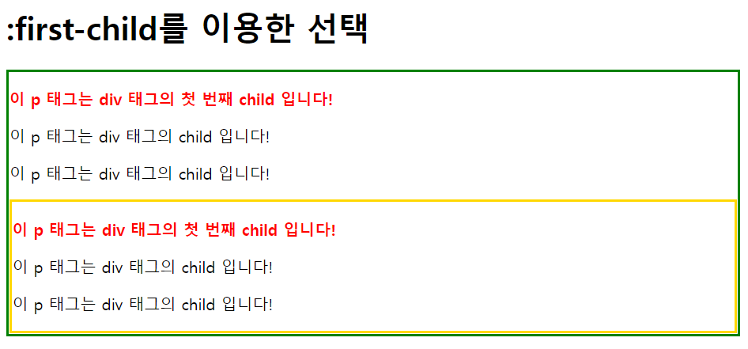
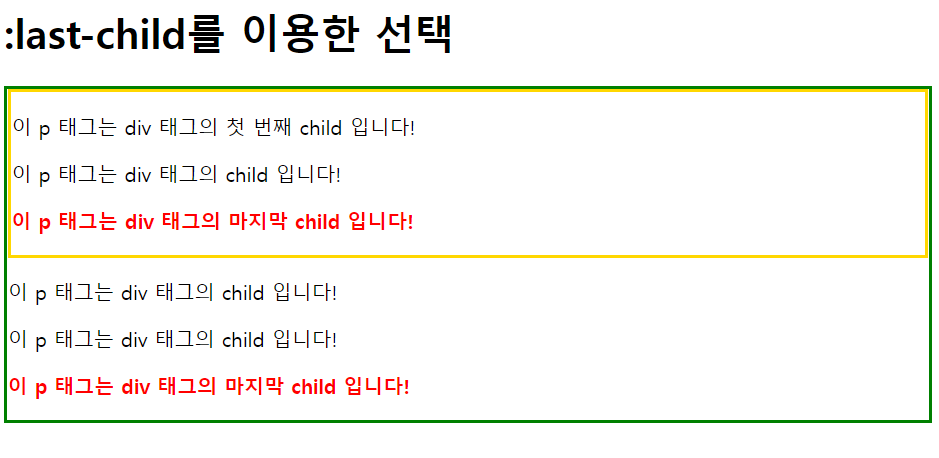
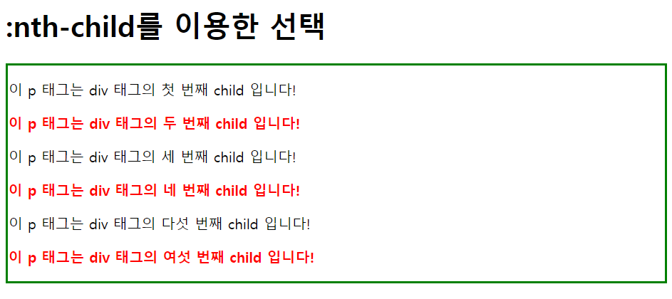
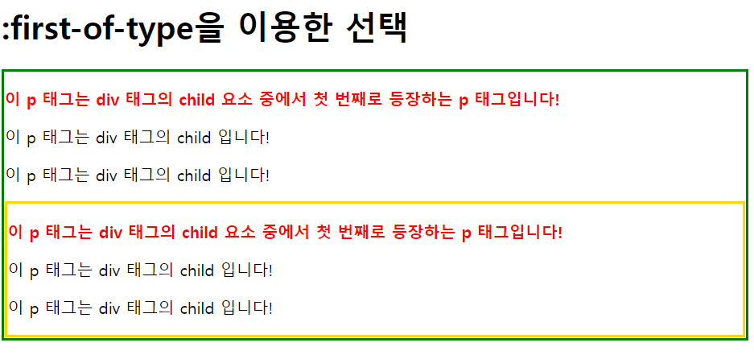
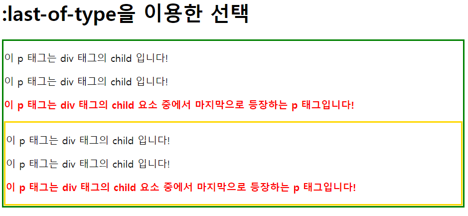
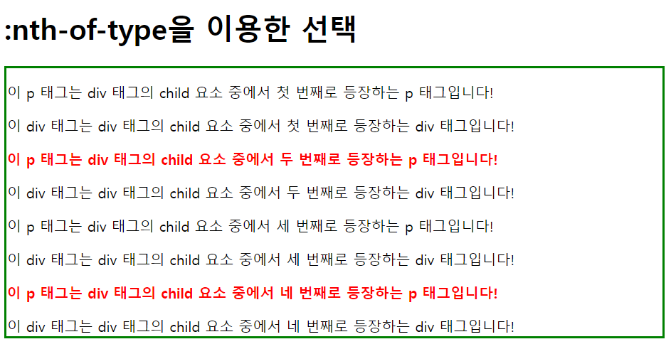
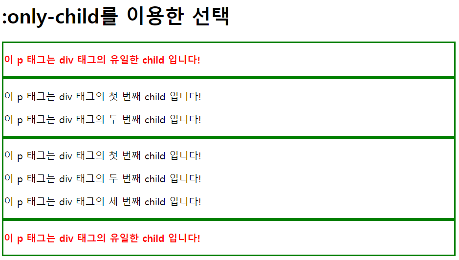
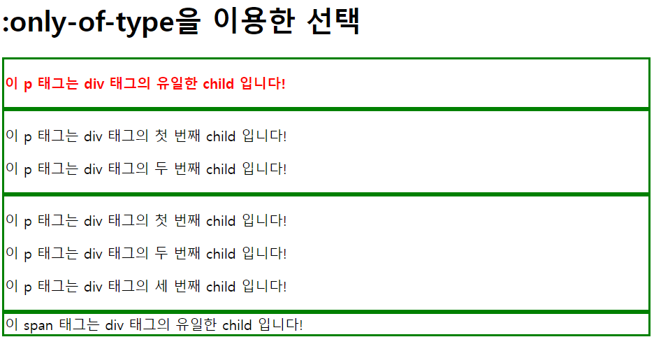
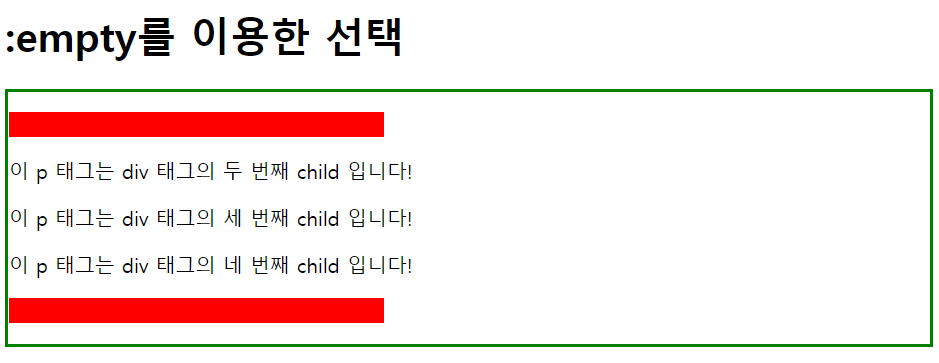
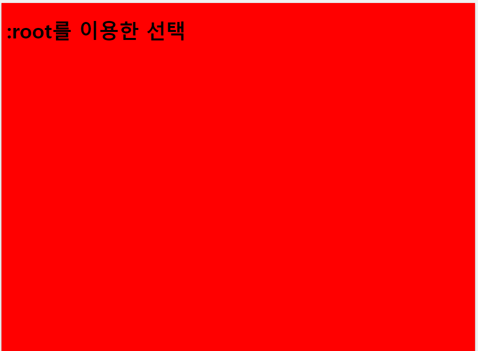

# 2022. 5. 3 수업 정리 #2/3

## 구조 의사 클래스


+ 구조 의사 클래스(structural pesudo-class)

  구조 의사 클래스를 사용하면 HTML 요소의 계층 구조에서 특정 위치에 있는 요소를 선택할 수 있습니다.<br>

  * first-child
  * last-child
  * nth-child
  * nth-last-child
  * first-of-type
  * last-of-type
  * nth-of-type
  * nth-last-of-type <br><br>

+ :first-child

  모든 자식(child) 요소 중에서 맨 앞에 위치하는 자식(child) 요소를 모두 선택합니다.

  ```html
  <h1>:first-child를 이용한 선택</h1>
  <div class="first">
      <p>이 p 태그는 div 태그의 첫 번째 child 입니다!</p>
      <p>이 p 태그는 div 태그의 child 입니다!</p>
      <p>이 p 태그는 div 태그의 child 입니다!</p>
      <div class="second">
          <p>이 p 태그는 div 태그의 첫 번째 child 입니다!</p>
          <p>이 p 태그는 div 태그의 child 입니다!</p>
          <p>이 p 태그는 div 태그의 child 입니다!</p>
      </div>
  </div>
  ```

  ```css
  div.first{ 
      border: 3px solid #008000; 
  }
  div.second{ 
      border: 3px solid #FFD700; 
  }
  p:first-child {
      color: red;
      font-weight: bold;
  }
  ```

  웹 페이지 화면 ↓

  <br>

+ :last-child

  모든 자식(child) 요소 중에서 맨 마지막에 위치하는 자식(child) 요소를 모두 선택합니다.

  ```html
  <h1>:last-child를 이용한 선택</h1>
  <div class="first">
      <div class="second">
          <p>이 p 태그는 div 태그의 첫 번째 child 입니다!</p>
          <p>이 p 태그는 div 태그의 child 입니다!</p>
          <p>이 p 태그는 div 태그의 마지막 child 입니다!</p>
      </div>
      <p>이 p 태그는 div 태그의 child 입니다!</p>
      <p>이 p 태그는 div 태그의 child 입니다!</p>
      <p>이 p 태그는 div 태그의 마지막 child 입니다!</p>
  </div>
  ```

  ```css
  div.first{ 
      border: 3px solid #008000; 
  }
  div.second{ 
      border: 3px solid #FFD700; 
  }
  p:last-child {
      color: red;
      font-weight: bold;
  }
  ```

  웹 페이지 화면 ↓

  <br>

+ :nth-child

  모든 자식(child) 요소 중에서 앞에서부터 n번째에 위치하는 자식(child) 요소를 모두 선택합니다.

  ```html
  <h1>:nth-child를 이용한 선택</h1>
  <div>
      <p>이 p 태그는 div 태그의 첫 번째 child 입니다!</p>
      <p>이 p 태그는 div 태그의 두 번째 child 입니다!</p>
      <p>이 p 태그는 div 태그의 세 번째 child 입니다!</p>
      <p>이 p 태그는 div 태그의 네 번째 child 입니다!</p>
      <p>이 p 태그는 div 태그의 다섯 번째 child 입니다!</p>
      <p>이 p 태그는 div 태그의 여섯 번째 child 입니다!</p>
  </div>
  ```

  ```css
  div{ 
      border: 3px solid #008000; 
  }
  p:nth-child(2n) {
      color: red;
      font-weight: bold;
  }
  ```

  웹 페이지 화면 ↓

  <br>

+ first-of-type

  모든 자식(child) 요소 중에서 맨 처음으로 등장하는 특정 타입의 요소를 모두 선택합니다.

  ```html
  <h1>:first-of-type을 이용한 선택</h1>
  <div class="first">
      <p>이 p 태그는 div 태그의 child 요소 중에서 첫 번째로 등장하는 p 태그입니다!</p>
      <p>이 p 태그는 div 태그의 child 입니다!</p>
      <p>이 p 태그는 div 태그의 child 입니다!</p>
      <div class="second">
          <p>이 p 태그는 div 태그의 child 요소 중에서 첫 번째로 등장하는 p 태그입니다!</p>
          <p>이 p 태그는 div 태그의 child 입니다!</p>
          <p>이 p 태그는 div 태그의 child 입니다!</p>
      </div>
  </div>
  ```

  ```css
  div.first{ 
      border: 3px solid #008000; 
  }
  div.second{ 
      border: 3px solid #FFD700; 
  }
  p:first-of-type {
      color: red;
      font-weight: bold;
  }
  ```

  웹 페이지 화면 ↓

  <br>

+ :last-of-type

  든 자식(child) 요소 중에서 맨 마지막으로 등장하는 특정 타입의 요소를 모두 선택합니다.

  ```html
  <h1>:last-of-type을 이용한 선택</h1>
  <div class="first">
      <p>이 p 태그는 div 태그의 child 입니다!</p>
      <p>이 p 태그는 div 태그의 child 입니다!</p>
      <p>이 p 태그는 div 태그의 child 요소 중에서 마지막으로 등장하는 p 태그입니다!</p>
      <div class="second">
          <p>이 p 태그는 div 태그의 child 입니다!</p>
          <p>이 p 태그는 div 태그의 child 입니다!</p>
          <p>이 p 태그는 div 태그의 child 요소 중에서 마지막으로 등장하는 p 태그입니다!</p>
      </div>
  </div>
  ```

  ```css
  div.first{ 
      border: 3px solid #008000; 
  }
  div.second{ 
      border: 3px solid #FFD700; 
  }
  p:last-of-type {
      color: red;
      font-weight: bold;
  }
  ```

  웹 페이지 화면 ↓

  <br>

+ :nth-of-type

  모든 자식(child) 요소 중에서 n번째로 등장하는 특정 타입의 요소를 모두 선택합니다.

  ```html
  <h1>:nth-of-type을 이용한 선택</h1>
  
  <div class="first">
      <p>이 p 태그는 div 태그의 child 요소 중에서 첫 번째로 등장하는 p 태그입니다!</p>
      <div>이 div 태그는 div 태그의 child 요소 중에서 첫 번째로 등장하는 div 태그입니다!</div>
      <p>이 p 태그는 div 태그의 child 요소 중에서 두 번째로 등장하는 p 태그입니다!</p>
      <div>이 div 태그는 div 태그의 child 요소 중에서 두 번째로 등장하는 div 태그입니다!</div>
      <p>이 p 태그는 div 태그의 child 요소 중에서 세 번째로 등장하는 p 태그입니다!</p>
      <div>이 div 태그는 div 태그의 child 요소 중에서 세 번째로 등장하는 div 태그입니다!</div>
      <p>이 p 태그는 div 태그의 child 요소 중에서 네 번째로 등장하는 p 태그입니다!</p>
      <div>이 div 태그는 div 태그의 child 요소 중에서 네 번째로 등장하는 div 태그입니다!</div>
  </div>
  ```

  ```css
  div.first{ 
      border: 3px solid #008000; 
  }
  div.second{ 
      border: 3px solid #FFD700; 
  }
  p:nth-of-type(2n) {
      color: red;
      font-weight: bold;
  }
  ```

  웹 페이지 화면 ↓

  <br>

+ :only-child

  자식(child) 요소를 단 하나만 가지는 요소의 자식(child) 요소를 모두 선택합니다.

  ```html
  <h1>:only-child를 이용한 선택</h1>
  <div>
      <p>이 p 태그는 div 태그의 유일한 child 입니다!</p>
  </div>
  <div>
      <p>이 p 태그는 div 태그의 첫 번째 child 입니다!</p>
      <p>이 p 태그는 div 태그의 두 번째 child 입니다!</p>
  </div>
  <div>
      <p>이 p 태그는 div 태그의 첫 번째 child 입니다!</p>
      <p>이 p 태그는 div 태그의 두 번째 child 입니다!</p>
      <p>이 p 태그는 div 태그의 세 번째 child 입니다!</p>
  </div>
  <div>
      <p>이 p 태그는 div 태그의 유일한 child 입니다!</p>
  </div>
  ```

  ```css
  div{ 
      border: 3px solid #008000; 
  }
  p:only-child {
      color: red;
      font-weight: bold;
  }
  ```

  웹 페이지 화면 ↓

  <br>

+ :only-of-type

  자식(child) 요소로 특정 타입의 요소 단 하나만을 가지는 요소의 자식(child) 요소를 모두 선택합니다.

  ```html
  <h1>:only-of-type을 이용한 선택</h1>
  <div>
      <p>이 p 태그는 div 태그의 유일한 child 입니다!</p>
  </div>
  <div>
      <p>이 p 태그는 div 태그의 첫 번째 child 입니다!</p>
      <p>이 p 태그는 div 태그의 두 번째 child 입니다!</p>
  </div>
  <div>
      <p>이 p 태그는 div 태그의 첫 번째 child 입니다!</p>
      <p>이 p 태그는 div 태그의 두 번째 child 입니다!</p>
      <p>이 p 태그는 div 태그의 세 번째 child 입니다!</p>
  </div>
  <div>
      <span>이 span 태그는 div 태그의 유일한 child 입니다!</span>
  </div>
  ```

  ```css
  div{ 
      border: 3px solid #008000; 
  }
  p:only-of-type {
      color: red;
      font-weight: bold;
  }
  ```

  웹 페이지 화면 ↓

  <br>

+ :empty

  자식(child) 요소를 전혀 가지고 있지 않은 요소를 모두 선택합니다.

  ```html
  <h1>:empty를 이용한 선택</h1>
  <div>
      <p></p>
      <p>이 p 태그는 div 태그의 두 번째 child 입니다!</p>
      <p>이 p 태그는 div 태그의 세 번째 child 입니다!</p>
      <p>이 p 태그는 div 태그의 네 번째 child 입니다!</p>
      <p></p>
  </div>
  ```

  ```css
  div{ border: 3px solid #008000; }
  p:empty { 
      width: 300px;
      height: 20px;
      background: red; 
  }
  ```

  웹 페이지 화면 ↓

  <br>

+ :root

  해당 문서의 root 요소를 선택합니다.

  ```html
  <h1>:root를 이용한 선택</h1>
  ```

  ```css
  :root { 
      background: red; 
  }
  ```

  웹 페이지 화면 ↓

  <br>

  **★HTML 문서에서 root 요소는 언제나 html 요소입니다.★**

  <br>

  |    의사 클래스    |                             설명                             |
  | :---------------: | :----------------------------------------------------------: |
  |   :first-child    | 모든 자식(child) 요소 중에서 맨 앞에 위치하는 자식(child) 요소를 모두 선택함. |
  |    :last-child    | 모든 자식(child) 요소 중에서 맨 마지막에 위치하는 자식(child) 요소를 모두 선택함. |
  |    :nth-child     | 모든 자식(child) 요소 중에서 앞에서부터 n번째에 위치하는 자식(child) 요소를 모두 선택함. |
  |  :nth-last-child  | 모든 자식(child) 요소 중에서 뒤에서부터 n번째에 위치하는 자식(child) 요소를 모두 선택함. |
  |  :first-of-type   | 모든 자식(child) 요소 중에서 맨 처음으로 등장하는 특정 타입의 요소를 모두 선택함. |
  |   :last-of-type   | 모든 자식(child) 요소 중에서 맨 마지막으로 등장하는 특정 타입의 요소를 모두 선택함. |
  |   :nth-of-type    | 모든 자식(child) 요소 중에서 n번째로 등장하는 특정 타입의 요소를 모두 선택함. |
  | :nth-last-of-type | 모든 자식(child) 요소 중에서 뒤에서부터 n번째로 등장하는 특정 타입의 요소를 모두 선택함. |
  |    :only-child    | 자식(child) 요소를 단 하나만 가지는 요소의 자식(child) 요소를 모두 선택함. |
  |   :only-of-type   | 자식(child) 요소로 특정 타입의 요소 단 하나만을 가지는 요소의 자식(child) 요소를 모두 선택함. |
  |      :empty       | 자식(child) 요소를 전혀 가지고 있지 않은 요소를 모두 선택함. |
  |       :root       |                  문서의 root 요소를 선택함.                  |

  
