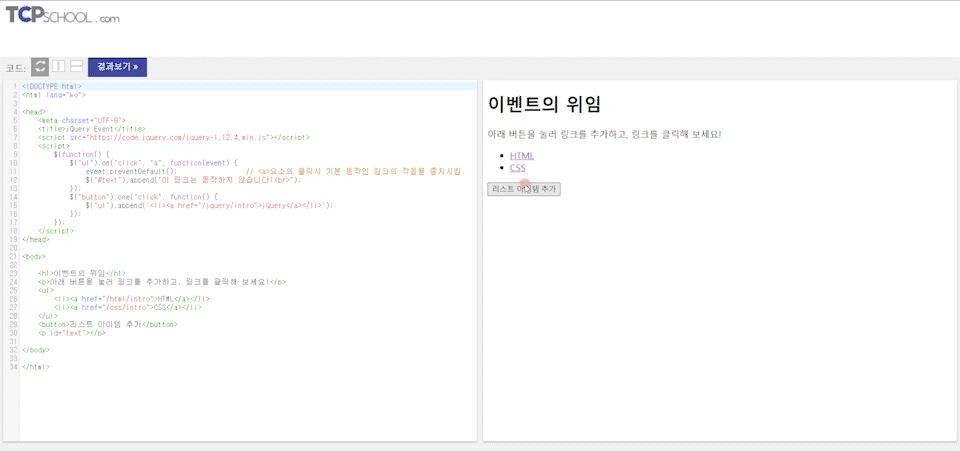
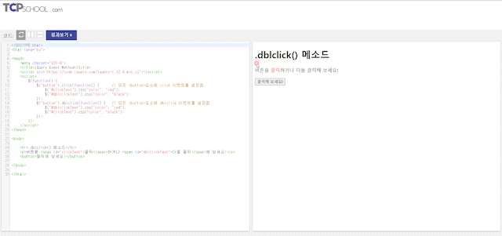
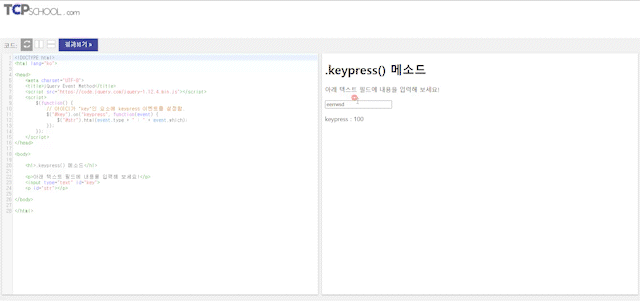
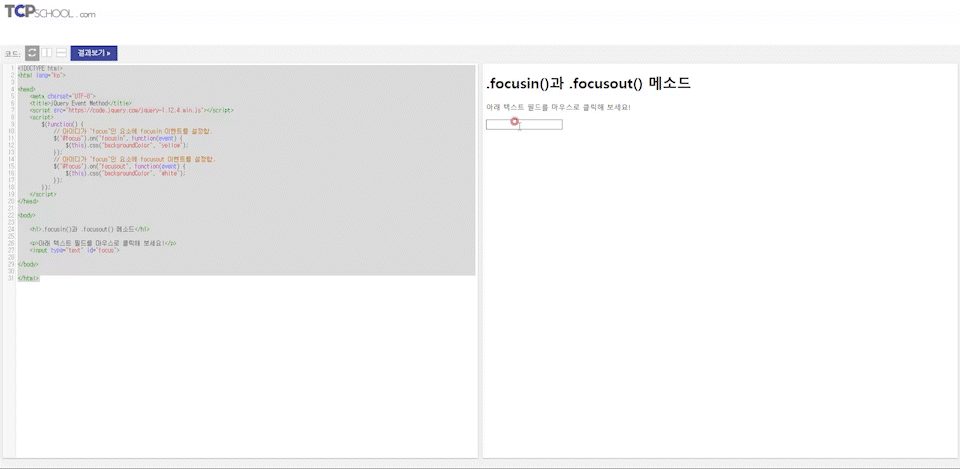

# 2022. 06. 17. 수업내용 정리 

## 이벤트 개념.. 처리.. 위임.. 메소드..

<br>

* 이벤트

  오늘날 웹 페이지는 사용자와 수많은 상호작용을 하게 됩니다.<br>

  사용자는 마우스를 움직이거나, 요소를 클릭하거나, 텍스트 박스에 글을 쓰는 등 수많은 종류의 동작(action)를 수행합니다.<br>

  위에서 예를 든 사용자의 동작들이 모두 이벤트(event)를 발생시킵니다.<br>

  즉, 이벤트가 발생했다는 것은 웹 페이지에서 특정 동작이 발생하여, 웹 브라우저가 그 사실을 알려주는 것을 의미합니다.

  <br><br>

* 이벤트 핸들러(event handler)

  웹 페이지에서는 수많은 이벤트가 계속해서 발생합니다.<br>

  특정 요소에서 발생하는 이벤트를 처리하기 위해서는 이벤트 핸들러(event handler)라는 함수를 작성하여 연결해야만 합니다.<br>

  이벤트 핸들러가 연결된 특정 요소에서 지정된 타입의 이벤트가 발생하면, 웹 브라우저는 연결된 이벤트 핸들러를 실행합니다.

  <br>

  ```html
  <!DOCTYPE html>
  <html lang="ko">
  
  <head>
  	<meta charset="UTF-8">
  	<title>jQuery Event</title>
  	<script src="https://code.jquery.com/jquery-1.12.4.min.js"></script>
  	<script>
  		$(function() {
  			$("button").on({				// 모든 <button>요소에
  				mouseenter: function() {	// mouseenter 이벤트를 설정함.
  					$("#text").append("마우스가 버튼 위로 진입했어요!<br>");
  				},
  				click: function() {			// click 이벤트를 설정함.
  					$("#text").append("마우스가 버튼을 클릭했어요!<br>");
  				},
  				mouseleave: function() {	// mouseleave 이벤트를 설정함.
  					$("#text").append("마우스가 버튼 위에서 빠져나갔어요!<br>");
  				}
  			});
  		});
  	</script>
  </head>
  
  <body>
  
  	<h1>.on() 메소드</h1>
  	<button>마우스를 버튼 위로 가져가거나 클릭해 보세요!</button>
  	<p id="text"></p>
  	
  </body>
  
  </html>
  ```

  웹페이지 화면 ▼

  /image-20220618094727296.png)

  on event 작동 후 ▼

  /image-20220618095102058.png)

  <br><br>

* 이벤트 객체(event object)

  이벤트 핸들러 함수는 이벤트 객체(event object)를 인수로 전달받을 수 있습니다.<br>

  어떻게 전달받은 이벤트 객체를 이용하여 이벤트의 성질을 결정하거나, 이벤트의 기본 동작을 막을 수도 있습니다.<br>

  제이쿼리의 이벤트 객체는 W3C 표준 권고안을 따르는 이벤트 객체를 정규화한 것입니다.

  <br><br>

* 이벤트의 연결(event binding)

  특정 요소에서 발생하는 이벤트를 처리하기 위해서는 이벤트 핸들러(event handler) 함수를 작성해야만 합니다.<br>

  이렇게 작성된 이벤트 핸들러를 특정 요소에 연결하는 것을 이벤트의 연결(event binding)이라고 합니다.<br>

  제이쿼리는 이벤트의 연결을 위한 다양한 방법을 제공합니다.

  <br>

  ```javascript
  // id가 "btn"인 요소에 클릭(click) 이벤트 핸들러를 연결하는 다양한 방법
  
  1. $("#btn").click(function(event) { // 실행하고자 하는 제이쿼리 코드 });
  
  2. $("#btn").bind("click", function(event) { // 실행하고자 하는 제이쿼리 코드 });
  
  3. $("#btn").on("click", function(event) { // 실행하고자 하는 제이쿼리 코드 });
  
  4. $("body").on({click: function(event) { // 실행하고자 하는 제이쿼리 코드 }}, "#btn");
  
  5. $("body").on("click", "#btn", function(event) { // 실행하고자 하는 제이쿼리 코드 });
  ```

  ```html
  <!DOCTYPE html>
  <html lang="ko">
  
  <head>
  	<meta charset="UTF-8">
  	<title>jQuery Event</title>
  	<script src="https://code.jquery.com/jquery-1.12.4.min.js"></script>
  	<script>
  		$(function() {
  			$("body").on({				// <body>요소에
  				click: function() {		// click 이벤트가 발생했을 때
  					$("#text").html("버튼을 클릭했습니다!");
  				}
  			}, "#btn");		// id가 "btn"인 요소에 이벤트 핸들러를 등록함.
  		});
  	</script>
  </head>
  
  <body>
  
  	<h1>이벤트의 연결</h1>
  	<button id="btn">버튼을 클릭해 보세요!</button>
  	<p id="text"></p>
  	
  </body>
  
  </html>
  ```

  웹페이지 화면 ▼

  /image-20220618095608078.png)

  버튼 입력 후 ▼

  /image-20220618095709686.png)

  <br><br>

* .on() 메소드

  제이쿼리는 특정 요소에 이벤트를 연결(event binding)하기 위해 .on() 메소드를 사용합니다.<br>

  1. 선택한 요소에 어떤 타입의 이벤트라도 연결할 수 있습니다.

  2. 하나의 이벤트 핸들러에 여러 개의 이벤트를 동시에 연결할 수 있습니다.

  3. 선택한 요소에 여러 개의 이벤트 핸들러와 여러 개의 이벤트를 같이 연결할 수 있습니다.

  4. 사용자 지정 이벤트(custom event)를 위해 이벤트 핸들러로 데이터를 넘길 수 있습니다.

  5. 차후에 다루게 될 요소를 이벤트에 연결할 수 있습니다.

  <br>

  .on() 메소드를 사용하면 하나의 이벤트 핸들러에 여러 개의 이벤트를 동시에 연결할 수 있습니다.<br>

  ```html
  <!DOCTYPE html>
  <html lang="ko">
  
  <head>
  	<meta charset="UTF-8">
  	<title>jQuery Event</title>
  	<script src="https://code.jquery.com/jquery-1.12.4.min.js"></script>
  	<script>
  		$(function() {
  			// 모든 <button>요소에 mouseenter와 mouseleave 이벤트를 설정함.
  			$("button").on("mouseenter mouseleave", function() {
  				$("#text").append("마우스가 버튼 위로 진입하거나 빠져나갔어요!<br>");
  			});
  		});
  	</script>
  </head>
  
  <body>
  
  	<h1>.on() 메소드</h1>
  	<button>마우스를 버튼 위로 가져가 보세요!</button>
  	<p id="text"></p>
  	
  </body>
  
  </html>
  ```

  웹페이지 화면 ▼

  /image-20220618100652168.png)

  on event 동작 후 ▼

  /image-20220618100716519.png)

  <br>

  또한, 하나의 요소에 여러 개의 이벤트 핸들러를 사용하여 여러 개의 이벤트를 같이 연결할 수도 있습니다.<br>

  ```html
  <!DOCTYPE html>
  <html lang="ko">
  
  <head>
  	<meta charset="UTF-8">
  	<title>jQuery Event</title>
  	<script src="https://code.jquery.com/jquery-1.12.4.min.js"></script>
  	<script>
  		$(function() {
  			$("button").on({				// 모든 <button>요소에
  				mouseenter: function() {	// mouseenter 이벤트를 설정함.
  					$("#text").append("마우스가 버튼 위로 진입했어요!<br>");
  				},
  				click: function() {			// click 이벤트를 설정함.
  					$("#text").append("마우스가 버튼을 클릭했어요!<br>");
  				},
  				mouseleave: function() {	// mouseleave 이벤트를 설정함.
  					$("#text").append("마우스가 버튼 위에서 빠져나갔어요!<br>");
  				}
  			});
  		});
  	</script>
  </head>
  
  <body>
  
  	<h1>.on() 메소드</h1>
  	<button>마우스를 버튼 위로 가져가거나 클릭해 보세요!</button>
  	<p id="text"></p>
  	
  </body>
  
  </html>
  ```

  웹페이지 화면 ▼

  /image-20220618100907715.png)

  on event 동작 후 ▼

  /image-20220618100943958.png)

  <br><br>

* .one() 메소드 

  .one() 메소드는 연결된 이벤트 핸들러가 한 번 실행되고 나서는, 더는 실행되지 않습니다.<br>

  또한, 같은 이벤트에 대해 연결된 이벤트 핸들러가 한 번 실행된 후에는 다른 이벤트 핸들러를 실행하고 싶을 때도 사용할 수 있습니다.<br>

  ```html
  <!DOCTYPE html>
  <html lang="ko">
  
  <head>
  	<meta charset="UTF-8">
  	<title>jQuery Event</title>
  	<script src="https://code.jquery.com/jquery-1.12.4.min.js"></script>
  	<script>
  		$(function() {
  			$("button").one("click", function() {
  				// 모든 <button>요소가 처음 클릭됐을 때에만 실행됨.
  				$("#text").append("첫 번째 클릭이에요!<br>");
  				// 모든 <button>요소가 두 번째 클릭됐을 때부터는 이 이벤트 핸들러가 실행됨.
  				$(this).click(function() {
  					$("#text").append("이 버튼을 벌써 클릭했네요!<br>");
  				});
  			});
  		});
  	</script>
  </head>
  
  <body>
  
  	<h1>.one() 메소드</h1>
  	<button>마우스를 클릭해 보세요!</button>
  	<p id="text"></p>
  	
  </body>
  
  </html>
  ```

  웹페이지 화면 ▼

  /image-20220618101313672.png)

  버튼 입력 후 ▼

  /image-20220618101409612.png)

  ★ .one() 메소드는 .on() 메소드와 같은 인수를 전달받습니다.<br>
      따라서 여러 개의 이벤트 핸들러와 여러 개의 이벤트를 가질 수 있는 등 .on() 메소드와 같은 특징을 갖습니다.

  <br><br>

* .off() 메소드

  .off() 메소드는 더는 사용하지 않는 이벤트와의 연결을 제거합니다.<br>

  ```html
  <!DOCTYPE html>
  <html lang="ko">
  
  <head>
  	<meta charset="UTF-8">
  	<title>jQuery Event</title>
  	<script src="https://code.jquery.com/jquery-1.12.4.min.js"></script>
  	<script>
  		$(function() {
  			$("#clickBtn").on("click", function() {		// id가 "clickBtn"인 요소를 클릭했을 때 실행됨.
  				$("#text").append("버튼을 클릭했어요!<br>");
  			});
  			$("#removeBtn").on("click", function() {
  				$("#clickBtn").off("click");			// id가 "clickBtn"인 요소의 클릭 이벤트와의 연결을 제거함.
  			});
  		});
  	</script>
  </head>
  
  <body>
  
  	<h1>.off() 메소드</h1>
  	<button id="clickBtn">마우스를 클릭해 보세요!</button>
  	<button id="removeBtn">클릭 이벤트를 제거합니다!</button>
  	<p id="text"></p>
  	
  </body>
  
  </html>
  ```

  웹페이지 화면 ▼

  

  <br><br>

* 이벤트의 위임(event delegation)

  제이쿼리는 이벤트의 위임을 통해 다수의 요소에 공통으로 적용되는 이벤트 핸들러를 공통된 조상 요소에 단 한 번만 연결하면 동작할 수 있도록 해줍니다.<br>

  ```html
  <!DOCTYPE html> <!--<ul>요소의 자식 요소 중 <a>요소에 대해 요소마다 각각 이벤트 핸들러를 직접 연결하는 예제-->
  <html lang="ko">
  
  <head>
  	<meta charset="UTF-8">
  	<title>jQuery Event</title>
  	<script src="https://code.jquery.com/jquery-1.12.4.min.js"></script>
  	<script>
  		$(function() {
  			$("ul a").on("click", function(event) {	// <ul>요소의 자식 요소 중 모든 <a>요소를 클릭했을 때,
  				event.preventDefault();				// <a>요소의 클릭시 기본 동작인 링크의 작동을 중지시킴.
  				$("#text").append("이 링크는 동작하지 않습니다!<br>");
  			});
  		});
  	</script>
  </head>
  
  <body>
  
  	<h1>이벤트 핸들러의 직접 등록</h1>
  	<ul>
  		<li><a href="/html/intro">HTML</a></li>
  		<li><a href="/css/intro">CSS</a></li>
  	</ul>
  	<p id="text"></p>
  	
  </body>
  
  </html>
  ```

  웹페이지 화면 ▼

  /image-20220618102952648.png)

  <br>

  ```html
  <!DOCTYPE html>
  <html lang="ko">
  
  <head>
  	<meta charset="UTF-8">
  	<title>jQuery Event</title>
  	<script src="https://code.jquery.com/jquery-1.12.4.min.js"></script>
  	<script>
  		$(function() {
  			$("ul a").on("click", function(event) {	// <ul>요소의 자식 요소 중 모든 <a>요소를 클릭했을 때,
  				event.preventDefault();				// <a>요소의 클릭시 기본 동작인 링크의 작동을 중지시킴.
  				$("#text").append("이 링크는 동작하지 않습니다!<br>");
  			});
  			$("button").one("click", function() {
  				$("ul").append('<li><a href="http://www.tcpschool.com/jquery/intro">jQuery</a></li>');
  			});
  		});
  	</script>
  </head>
  
  <body>
  
  	<h1>이벤트 핸들러의 직접 등록</h1>
  	<p>아래 버튼을 눌러 링크를 추가하고, 링크를 클릭해 보세요!</p>
  	<ul>
  		<li><a href="/html/intro">HTML</a></li>
  		<li><a href="/css/intro">CSS</a></li>
  	</ul>
  	<button>리스트 아이템 추가</button>
  	<p id="text"></p>
  	
  </body>
  
  </html>
  ```

  웹페이지 화면 ▼

  /이벤트 예시.gif)

  <br>

  하지만 위의 예제에 이벤트의 위임을 이용하면, 다음과 같이 작성할 수 있습니다.

  ```html
  <!DOCTYPE html>
  <html lang="ko">
  
  <head>
  	<meta charset="UTF-8">
  	<title>jQuery Event</title>
  	<script src="https://code.jquery.com/jquery-1.12.4.min.js"></script>
  	<script>
  		$(function() {
  			$("ul").on("click", "a", function(event) {
  				event.preventDefault();					// <a>요소의 클릭시 기본 동작인 링크의 작동을 중지시킴.
  				$("#text").append("이 링크는 동작하지 않습니다!<br>");
  			});
  			$("button").one("click", function() {
  				$("ul").append('<li><a href="http://www.tcpschool.com/jquery/intro">jQuery</a></li>');
  			});
  		});
  	</script>
  </head>
  
  <body>
  
  	<h1>이벤트의 위임</h1>
  	<p>아래 버튼을 눌러 링크를 추가하고, 링크를 클릭해 보세요!</p>
  	<ul>
  		<li><a href="/html/intro">HTML</a></li>
  		<li><a href="/css/intro">CSS</a></li>
  	</ul>
  	<button>리스트 아이템 추가</button>
  	<p id="text"></p>
  	
  </body>
  
  </html>
  ```

  웹페이지 화면 ▼

  

  .on() 메소드는 해당 요소에 첫 번째 인수로 전달받은 이벤트가 전파되었을 때, 그 이벤트를 발생한 요소가 두 번째 인수로 전달받은 선택자와 같은지를 검사합니다.<br>

  만약 이벤트가 발생한 요소와 두 번째 인수로 전달받은 선택자가 같으면, 연결된 이벤트 핸들러를 실행합니다.<br>
  
  ★ 이벤트의 위임을 이용하면 현재 존재하는 자손 요소뿐만 아니라, 나중에 추가되는 자손 요소까지도 모두 자동으로 연결됩니다.
  
  <br><br>

* 이벤트의 전파(event propogation)

  이벤트의 전파란 이벤트가 발생했을 때, 브라우저가 이벤트 핸들러를 실행시킬 대상 요소를 결정하는 과정입니다.<br>

  이벤트가 Document 객체나 HTML 문서의 요소에서 일어나면 대상 객체를 결정하기 위해 이벤트의 전파가 일어납니다.<br>

  이렇게 이벤트가 전파되는 과정을 이벤트 버블링(event bubbling)이라고 합니다.<br>

  이벤트 버블링은 이벤트가 발생한 요소부터 시작하여 DOM 트리를 따라 위쪽으로 올라가며 전파되는 과정을 의미합니다.<br>

  즉, 이벤트가 발생한 요소에 연결된 이벤트 핸들러가 실행된 후, 그 부모 요소에 연결된 핸들러가 실행됩니다.<br>

  또다시 그 부모 요소에 등록된 핸들러가 실행되며, 마지막에는 Document 객체까지 계속 전파됩니다.<br>

  이러한 전파를 통해 위와 같은 이벤트의 위임(event delegation)이 가능해집니다.

  <br><br>

* 이벤트 메소드

  제이쿼리는 on() 메소드 이외에도 자바스크립트 이벤트와 관련된 다양한 메소드를 제공합니다.<br>

  이러한 이벤트 메소드는 이벤트가 발생하는 요소에 따라 다음과 같이 구분할 수 있습니다.

  <br>

  1. 마우스 이벤트와 관련된 메소드

  2. 키보드 이벤트와 관련된 메소드

  3. 입력 양식(form) 이벤트와 관련된 메소드

  <br><br>

* 마우스 이벤트와 관련된 메소드

  제이쿼리에서 제공하는 마우스 이벤트와 관련된 대표적인 메소드는 다음과 같습니다.

  <br>

  1. .click()

  2. .dblclick()

  3. .hover()

  <br><br>

  * .dbclick() 메소드

    .dblclick() 메소드는 자바스크립트의 "dblclick" 이벤트와 이벤트 핸들러를 연결하거나, 해당 요소에 "dblclick" 이벤트를 발생시킵니다.<br>

    ```html
    <!DOCTYPE html>
    <html lang="ko">
    
    <head>
    	<meta charset="UTF-8">
    	<title>jQuery Event Method</title>
    	<script src="https://code.jquery.com/jquery-1.12.4.min.js"></script>
    	<script>
    		$(function() {
    			$("button").click(function() {		// 모든 <button>요소에 click 이벤트를 설정함.
    				$("#clickText").css("color", "red");
    				$("#dblclickText").css("color", "black");
    			});
    			$("button").dblclick(function() {	// 모든 <button>요소에 dblclick 이벤트를 설정함.
    				$("#dblclickText").css("color", "red");
    				$("#clickText").css("color", "black");
    			});
    		});
    	</script>
    </head>
    
    <body>
    
    	<h1>.dblclick() 메소드</h1>
    	<p>버튼을 <span id="clickText">클릭</span>하거나 <span id="dblclickText">더블 클릭</span>해 보세요!</p>
    	<button>클릭해 보세요!</button>
    	
    </body>
    
    </html>
    ```

    웹페이지 화면 ▼

    

    <br><br>

  * .hover() 메소드

    .hover() 메소드는 자바스크립트의 "mouseenter"와 "mouseleave" 이벤트를 같이 이벤트 핸들러와 연결합니다.<br>

    ```html
    <!DOCTYPE html>
    <html lang="ko">
    
    <head>
    	<meta charset="UTF-8">
    	<title>jQuery Event Method</title>
    	<script src="https://code.jquery.com/jquery-1.12.4.min.js"></script>
    	<script>
    		$(function() {
    			$("button").hover(function() {		// 모든 <button>요소에 hover 이벤트를 설정함.
    				$("#text").append("마우스가 버튼 위로 진입하거나 빠져나갔어요!<br>");
    			});
    		});
    	</script>
    </head>
    
    <body>
    
    	<h1>.hover() 메소드</h1>
    	<button>마우스를 버튼 위로 가져가 보세요!</button>
    	<p id="text"></p>
    	
    </body>
    
    </html>
    ```

    웹페이지 화면 ▼

    

    <br><br>

  * 마우스 이벤트와 관련된 메소드

    |    메소드     |                             설명                             |
    | :-----------: | :----------------------------------------------------------: |
    |   .click()    | 자바스크립트의 "click" 이벤트와 이벤트 핸들러를 연결하거나, 해당 요소에 "click" 이벤트를 발생시킴. |
    |  .dblclick()  | 자바스크립트의 "dblclick" 이벤트와 이벤트 핸들러를 연결하거나, 해당 요소에 "dblclick" 이벤트를 발생시킴. |
    |   .hover()    | 자바스크립트의 "mouseenter"와 "mouseleave" 이벤트를 같이 인벤트 핸들러와 연결함. |
    | .mousedown()  | 자바스크립트의 "mousedown" 이벤트와 이벤트 핸들러를 연결하거나, 해당 요소에 "mousedown" 이벤트를 발생시킴. |
    | .mouseenter() | 해당 요소 위로 마우스가 진입할 때 발생하는 이벤트와 이벤트 핸들러를 연결하거나, 해당 요소에 마우스 진입 이벤트를 발생시킴. |
    | .mouseleave() | 해당 요소에서 마우스가 빠져나갈 때 발생하는 이벤트와 이벤트 핸들러를 연결하거나, 해당 요소에 마우스가 빠져나가는 이벤트를 발생시킴. |
    | .mousemove()  | 자바스크립트의 "mousemove" 이벤트와 이벤트 핸들러를 연결하거나, 해당 요소에 "mousemove" 이벤트를 발생시킴. |
    |  .mouseout()  | 자바스크립트의 "mouseout" 이벤트와 이벤트 핸들러를 연결하거나, 해당 요소에 "mouseout" 이벤트를 발생시킴. |
    | .mouseover()  | 자바스크립트의 "mouseover" 이벤트와 이벤트 핸들러를 연결하거나, 해당 요소에 "mouseover" 이벤트를 발생시킴. |
    |  .mouseup()   | 자바스크립트의 "mouseup" 이벤트와 이벤트 핸들러를 연결하거나, 해당 요소에 "mouseup" 이벤트를 발생시킴. |

    <br><br>

  * .keypress() 메소드

    .keypress() 메소드는 자바스크립트의 "keypress" 이벤트와 이벤트 핸들러를 연결합니다.<br>

    다음 예제는 <input>요소에 키보드로 문자를 입력할 때마다 입력한 문자에 해당하는 유니코드(unicode) 숫자를 출력하는 예제입니다.<br>

    ```html
    <!DOCTYPE html>
    <html lang="ko">
    
    <head>
    	<meta charset="UTF-8">
    	<title>jQuery Event Method</title>
    	<script src="https://code.jquery.com/jquery-1.12.4.min.js"></script>
    	<script>
    		$(function() {
    			// 아이디가 "key"인 요소에 keypress 이벤트를 설정함.
    			$("#key").on("keypress", function(event) {
    				$("#str").html(event.type + " : " + event.which);
    			});
    		});
    	</script>
    </head>
    
    <body>
    
    	<h1>.keypress() 메소드</h1>
    
    	<p>아래 텍스트 필드에 내용을 입력해 보세요!</p>
    	<input type="text" id="key">
    	<p id="str"></p>
    	
    </body>
    
    </html>
    ```

    웹페이지 화면 ▼(a,s,d,f,g,h 순으로 입력)

    

    ★ Shift, Esc, Delete와 같은 화면에 출력되지 않는 키(modifier and non-printing keys)들은 "keydown" 이벤트는 발생시키지만, "keypress" 이벤트는 발생시키지 않습니다.

    <br>

    <br>

  * 키보드 이벤트와 관련된 메소드

    |   메소드    |                             설명                             |
    | :---------: | :----------------------------------------------------------: |
    | .keydown()  | 자바스크립트의 "keydown" 이벤트와 이벤트 핸들러를 연결하거나, 해당 요소에 "keydown" 이벤트를 발생시킴. |
    |  .keyup()   | 자바스크립트의 "keyup" 이벤트와 이벤트 핸들러를 연결하거나, 해당 요소에 "keyup" 이벤트를 발생시킴. |
    | .keypress() | 자바스크립트의 "keypress" 이벤트와 이벤트 핸들러를 연결하거나, 해당 요소에 "keypress" 이벤트를 발생시킴. |

    <br><br>

  * .focusin() 메소드와 .focusout() 메소드

    .focusin() 메소드는 자바스크립트의 "focusin" 이벤트와 이벤트 핸들러를 연결합니다.<br>

    또한, .focusout() 메소드는 자바스크립트의 "focusout" 이벤트와 이벤트 핸들러를 연결합니다.<br>

    ```html
    <!DOCTYPE html>
    <html lang="ko">
    
    <head>
    	<meta charset="UTF-8">
    	<title>jQuery Event Method</title>
    	<script src="https://code.jquery.com/jquery-1.12.4.min.js"></script>
    	<script>
    		$(function() {
    			// 아이디가 "focus"인 요소에 focusin 이벤트를 설정함.
    			$("#focus").on("focusin", function(event) {
    				$(this).css("backgroundColor", "yellow");
    			});
    			// 아이디가 "focus"인 요소에 focusout 이벤트를 설정함.
    			$("#focus").on("focusout", function(event) {
    				$(this).css("backgroundColor", "white");
    			});
    		});
    	</script>
    </head>
    
    <body>
    
    	<h1>.focusin()과 .focusout() 메소드</h1>
    
    	<p>아래 텍스트 필드를 마우스로 클릭해 보세요!</p>
    	<input type="text" id="focus">
    	
    </body>
    
    </html>
    ```

    웹페이지 화면 ▼

    

    ★ this 키워드는 현재 선택되어 있는 요소 그 자체를 가리킵니다.

    <br><br>

  * 입력 양식 이벤트와 관련된 메소드

    |   메소드    |                             설명                             |
    | :---------: | :----------------------------------------------------------: |
    |   .blur()   | 자바스크립트의 "blur" 이벤트와 이벤트 핸들러를 연결하거나, 해당 요소에 "blur" 이벤트를 발생시킴. |
    |  .change()  | 자바스크립트의 "change" 이벤트와 이벤트 핸들러를 연결하거나, 해당 요소에 "change" 이벤트를 발생시킴. |
    |  .select()  | 자바스크립트의 "select" 이벤트와 이벤트 핸들러를 연결하거나, 해당 요소에 "select" 이벤트를 발생시킴. |
    |  .submit()  | 자바스크립트의 "submit" 이벤트와 이벤트 핸들러를 연결하거나, 해당 요소에 "submit" 이벤트를 발생시킴. |
    |  .focus()   | 자바스크립트의 "focus" 이벤트와 이벤트 핸들러를 연결하거나, 해당 요소에 "focus" 이벤트를 발생시킴. |
    | .focusin()  | "focusin" 이벤트와 이벤트 핸들러를 연결하거나, 해당 요소에 "focusin" 이벤트를 발생시킴. |
    | .focusout() | "focusout" 이벤트와 이벤트 핸들러를 연결하거나, 해당 요소에 "focusout" 이벤트를 발생시킴. |

    

    


​	


