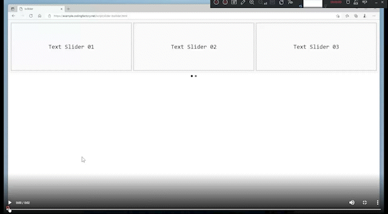

# 2022. 06. 30. 수업내용 정리 

## bxslider() 사용법 및 옵션

<br>

* bxSlider

  홈페이지에 이미지를 바꿔가며 보여주는 이미지 슬라이더를 구현하기 위한 **라이브러리**입니다.<br>

  사이트에 자주 사용되는 기능도 거의 지원하고, 반응형 역시 지원합니다. <br>

  MIT 라이센스로 배포되므로 부담없이 무료로 사용할 수 있습니다.<br>

  반응형 jQuery  플러그인으로 작성되어 있습니다.<br>

  필요하다면, 소스를 직접 수정하거나 기능을 확장하는 것도 가능합니다.<br>

  이미지 뿐만 아니라 웹페이지 상에서 보여지는 어떤 요소든지 바꿔가며 보여줄 수 있기 때문에 이 라이브러리의 타이틀이

  **반응형 jQuery 컨텐츠 슬라이더**입니다.

  <br><br>

* 기본 사용법

  1. 우선 http://bxslider.com/ 에 접속한 후 빨간 박스안에 'Click here to install' 부분을 클릭합니다.

     /image-20220703150842391.png)

     <br>

  2. 아래 화면에서 1번 ~ 3번까지 문항을 순서대로 복사해서  VSC 상의 새로 만든 HTML코드에 붙여넣기 하거나 이미 만든 파일에 적용할 경우 1번 영역을 사진에서와 같이 head 영역에 붙여넣기 하고, 2번 영역 역시 스크립트 태그 안에 붙여넣기 합니다. 

     /image-20220703151431221.png)

     /image-20220703151806378.png)

  3. body 부분에 있는 예시 코드를 지우고 아래의 코드로 대체한 후 실행시켜 보겠습니다.

     ```html
     <!DOCTYPE html>
     <html lang="en">
     <head>
       <meta charset="UTF-8">
       <meta http-equiv="X-UA-Compatible" content="IE=edge">
       <meta name="viewport" content="width=device-width, initial-scale=1.0">
       <link rel="stylesheet" href="https://cdn.jsdelivr.net/bxslider/4.2.12/jquery.bxslider.css">
       <script src="https://ajax.googleapis.com/ajax/libs/jquery/3.1.1/jquery.min.js"></script>
       <script src="https://cdn.jsdelivr.net/bxslider/4.2.12/jquery.bxslider.min.js"></script>
       <title>Document</title>
       <script>
         $(document).ready(function(){
           $('.slider').bxSlider();
         });
       </script>
     </head>
     <body>
        <div class="slider">
           <div>
             
           </div>
           <div>
             
           </div>
           <div>
             
           </div>
           <div>
             
           </div>
           <div>
             
           </div>
           <div>
             
           </div>
       </div>
     </body>
     </html>
     
     ```

     웹페이지 화면 ▼

     /bxslider 예시.png)

     <br><br>

* 옵션 사용법

  옵션은 다믕과 같은 형식으로 넣습니다. 

  ```html
  <script>
    $( document ).ready( function() {
      $( '.slider' ).bxSlider( {
        optionName1: value1,
        optionName2: value2,
      } );
    } );
  </script>
  ```

  아래는 1초마다 자동으로 이미지가 바뀌도록 한 것입니다.

  ```html
  <script>
    $( document ).ready( function() {
      $( '.slider' ).bxSlider( {
        auto: true,
        pause: 1000,
      } );
    } );
  </script>
  ```

  <br>

  아래는 여러 슬라이드를 동시에 보이도록 바꾼 것입니다.

  ```html
  <script>
    $( document ).ready( function() {
      $( '.slider' ).bxSlider( {
        auto: true,
        pause: 1000,
        autoHover: true,
        minSlides: 3,
        maxSlides: 3,
        slideWidth: 800,
        slideMargin: 5,
      } );
    } );
  </script>
  ```

  - auto: true
    슬라이더 전환이 자동으로 시작
  - pause: 1000
  - 1초 마다 슬라이더 전환
  - autoHover: true
    마우스 올렸을 때 전환 멈춤
  - minSlides: 3
    최소 슬라이더 수
  - maxSlides: 3
    최대 슬라이더 수
  - slideWidth: 800
    이미지 가로 크기 800px, minSliders가 설정되어 있으면 그 수만큼 나오도록 가로폭 조정
  - slideMargin: 5
    슬라이더 가로 간격 5px

  <br>

  캡션을 사용해 이미지의 title 속성의  값이 캡션으로 출력되도록 할 수도 있습니다.

  ```html
  <!doctype html>
  <html lang="ko">
    <head>
      <meta charset="utf-8">
      <title>bxSlider</title>
      <script src="//code.jquery.com/jquery-3.3.1.min.js"></script>
      <script src="//cdn.jsdelivr.net/bxslider/4.2.12/jquery.bxslider.min.js"></script>
      <link rel="stylesheet" href="//cdn.jsdelivr.net/bxslider/4.2.12/jquery.bxslider.css">
      <script>
        $( document ).ready( function() {
          $( '.slider' ).bxSlider( {
            auto: true,
            pause: 1000,
            autoHover: true,
            minSlides: 3,
            maxSlides: 3,
            slideWidth: 800,
            slideMargin: 5,
            captions: true,
          } );
        } );
      </script>
    </head>
    <body>
      <div class="slider">
        <div></div>
        <div></div>
        <div></div>
        <div></div>
        <div></div>
      </div>
    </body>
  </html>
  ```

  웹페이지 화면 ▼

  

  <br>

  이미지 외에 다른 것도 슬라이드로 넣을 수 있습니다. 아래는 텍스트로 만든 슬라이더 예제입니다.<br>

  ```html
  <!doctype html>
  <html lang="ko">
    <head>
      <meta charset="utf-8">
      <title>bxSlider</title>
      <script src="//code.jquery.com/jquery-3.3.1.min.js"></script>
      <script src="//cdn.jsdelivr.net/bxslider/4.2.12/jquery.bxslider.min.js"></script>
      <link rel="stylesheet" href="//cdn.jsdelivr.net/bxslider/4.2.12/jquery.bxslider.css">
      <script>
        $( document ).ready( function() {
          $( '.slider' ).bxSlider( {
            auto: true,
            pause: 1000,
            autoHover: true,
            minSlides: 3,
            maxSlides: 3,
            slideWidth: 800,
            slideMargin: 5,
            controls: false,
          } );
        } );
      </script>
      <style>
        .slider div {
          border: 5px solid #dadada;
          background-color: #fafafa;
          padding: 100px 0px;
          text-align: center;
          font-family: Consolas;
          font-size: 30px;
        }
      </style>
    </head>
    <body>
      <div class="slider">
        <div>Text Slider 01</div>
        <div>Text Slider 02</div>
        <div>Text Slider 03</div>
        <div>Text Slider 04</div>
        <div>Text Slider 05</div>
        <div>Text Slider 06</div>
      </div>
    </body>
  </html>
  ```

  웹페이지 화면 ▼

  

  <br>

  그 밖에 사용할 수 있는 옵션은  https://bxslider.com/options/에 설명되어 있습니다.

  


