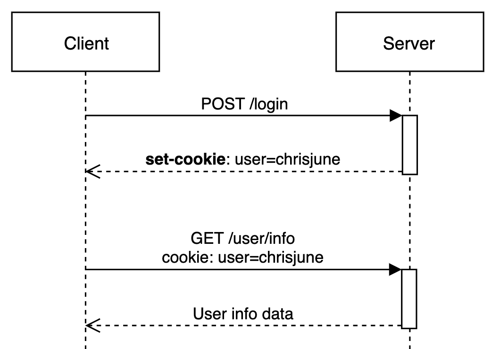
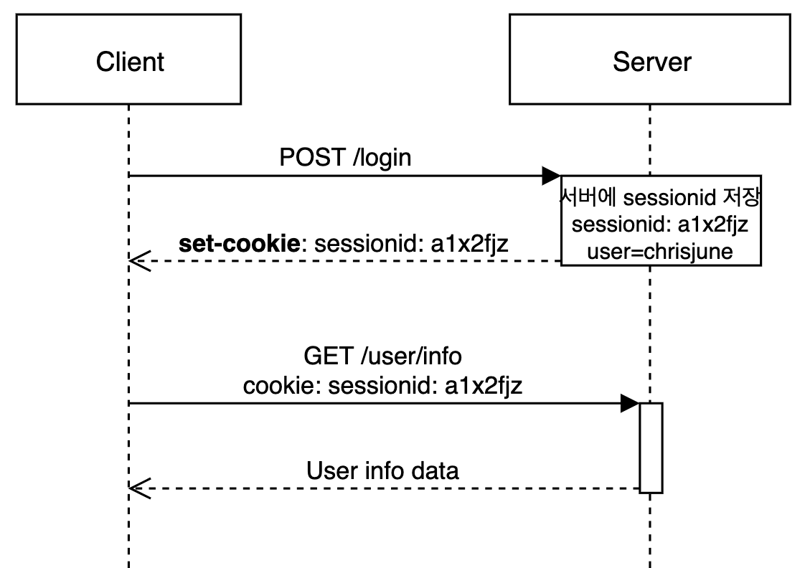

# 2022. 07. 01. 수업내용 정리 

## cookie , session

 

* 쿠키(cookie)

  클라이언트(브라우저) 로컬에 저장되는 키와 값이 들어있는 작은 데이터 파일입니다. 

  사용자 인증이 유효한 시간을 명시할 수 있으며, 유효 시간이 정해지면 브라우저가 종료되어도 인증이 유지된다는 특징이 있습니다. 

  클라이언트의 상태 정보를 로컬에 저장했다가 참조합니다. 

  클라이언트에 300개까지 쿠키저장 가능, 하나의 도메인당 20개의 값만 가질 수 있음, 하나의 쿠기값은 4KB까지 저장합니다. 

  Response Header에 Set-Cookie 속성을 사용하면 클라이언트에 쿠키를 만들 수 있습니다. 

  쿠키는 사용자가 따로 요청하지 않아도 브라우저가 Request 시에 Request Header를 넣어서 자동으로 서버에 전송합니다. 

   

  * 쿠키의 구성요소

    * 이름: 각가의 쿠키를 구별하는 데 사용되는 이름

    * 값: 쿠키의 이름과 관련된 값

    * 유효시간: 쿠키의 유지시간

    * 도메인: 쿠키를 전송할 도메인

    * 경로: 쿠키를 전송할 요청 경로

        

  * 쿠키의 동작 방식

    1. 클라이언트가 페이지를 요청

    2. 서버에서 쿠키를 생성

    3. HTTP 헤더에 쿠키를 포함시켜 응답

    4. 브라우저가 종료되어도 쿠키 만료 기간이 있다면 클라이언트에서 보관하고 있음.

    5. 같은 요청을 할 경우 HTTP 헤더에 쿠키를 함께 보냄.

    6. 서버에서 쿠키를 읽어 이전 상태 정보를 변경 할 필요가 있을 때 쿠키를 업데이트하여 쿠키를 HTTP 헤더에 포함시켜 응답

        

    

      

  * 쿠키의 사용예

    - 방문 사이트에서 로그인 시, "아이디와 비밀번호를 저장하시겠습니까?"

    - 쇼핑몰의 장바구니 기능

    - 자동로그인, 팝업에서 "오늘 더 이상 이 창을 보지 않음" 체크, 쇼핑몰의 장바구니

        

* 세션(Session)

  쿠키를 기반하고 있지만, 사용자 정보 파일을 브라우저에 저장하는 쿠키와 달리 세션은 서버 측에서 관리합니다. 

  서버에서는 클라이언트를 구분하기 위해 세션 ID를 부여하며 웹 브라우저가 서버에 접속해서 브라우저를 종료할 때까지 인증상태를 유지합니다. 

  물론 접속 시간에 제한을 두어 일정 시간 응답이 없다면 정보가 유지되지 않게 설정이 가능 합니다. 

  사용자에 대한 정보를 서버에 두기 때문에 쿠키보다 보안에 좋지만, 사용자가 많아질수록 서버 메모리를 많이 차지하여 서버 과부하로 인한 성능 저하의 요인이 됩니다. 

  클라이언트가 Request를 보내면, 해당 서버의 엔진이 클라이언트에 유일한 ID를 부여하는 데 이것이 세션 ID입니다.

   

   

  * 세션의 동작 방식

    1. 클라이언트가 서버에 접속 시 세션 ID를 발급 받음

    2. 클라이언트는 세션 ID에 대해 쿠키를 사용해서 저장하고 가지고 있지 않음

    3. 클라이언트는 서버에 요청할 때, 이 쿠키의 세션 ID를 같이 서버에 전달해서 요청

    4. 서버는 세션 ID를 전달 받아서 별다른 작업없이 세션 ID로 세션에 있는 클라이언트 정보를 가져와서 사용합니다.

    5. 클라이언트 정보를 가지고 서버 요청을 처리하여 클라이언트에게 응답

        

    

     

     

  * 세션의 특징

    * 각 클라이언트에게 고유 ID를 부여
    * 세션 ID로 클라이언트를 구분해서 클라이언트의 요구에 맞는 서비스를 제공
    * 보안 면에서 쿠키보다 우수
    * 사용자가 많아질수록 서버 메모리를 많이 차지하게 됨

      

  * 세션의 사용 예

    * 로그인 같이 보안상 중요한 작업을 수행할 때 사용

      

* HTTP의 특징과 쿠키와 세션을 사용하는 이유

  HTTP 프로토콜의 특성이자 약점을 보완하기 위해서 쿠키 또는 세션을 사용합니다. 

  기본적으로 HTTP 프로토콜 환경은 "connectionless, stateless"한 특성을 가지기 때문에 서버는 클라이언트가 누구인지 매번 확인해야합니다. 이 특성을 보완하기 위해서 쿠키와 세션을 사용하게됩니다. 

  * connectionless

    클라이언트가 요청을 한 후 응답을 받으면 그 연결을 끊어 버리는 특징 

    HTTP는 먼저 클라이언트가 request를 서버에 보내면, 서버는 클라이언트에게 요청에 맞는 response를 보내고 접속을 끊는 특성이 있다. 

    헤더에 keep-alive라는 값을 줘서 커넥션을 재활용하는데 HTTP1.1에서는 이것이 디폴트다. 

    HTTP가 tcp위에서 구현되었기 때문에 (tcp는 연결지향,udp는 비연결지향) 네트워크 관점에서 keep-alive는 옵션으로 connectionless의 연결비용을 줄이는 것을 장점으로 비연결지향이라 한다. 

     

  * stateless

    통신이 끝나면 상태를 유지하지 않는 특징 

    연결을 끊는 순간 클라이언트와 서버의 통신이 끝나며 상태 정보는 유지하지 않는 특성이 있다. 

    쿠키와 세션은 위의 두 가지 특징을 해결하기 위해 사용합니다. 

    예를 들어, 쿠키와 세션을 사용하지 않으면 쇼핑몰에서 옷을 구매하려고 로그인을 했음에도, 페이지를 이동할 때 마다 계속 로그인을 해야 합니다. 

    쿠키와 세션을 사용했을 경우, 한 번 로그인을 하면 어떠한 방식에 의해서 그 사용자에 대한 인증을 유지하게 됩니다. 

     

    

      

*  쿠키 vs 세션

  * 서로 비슷한 역할을 하며, 세션도 쿠키 기반이기에 동작원리도 비슷합니다. 

  * 가장 큰 차이점은 사용자의 정보가 저장되는 위치입니다. 그렇기에 쿠키는 서버의 자원을 전혀 사용하지 않으며, 세션은 서버의 자원을 사용합니다. 

  * 보안 면에서 세션이 더 우수하지만 세션은 서버의 처리가 필요해 쿠키보다 요청 속도가 더 느립니다. 
  * 보안, 쿠키는 클라이언트 로컬에 저장되기 때문에 변질되거나 request에서 스니핑 당할 우려가 있어서 보안에 취약하지만 세션은 쿠키를 이용해서 sessionid만 저장하고 그것으로 구분해서 서버에서 처리하기 때문에 비교적 보안성이 좋습니다. 

  * 라이프 사이클, 쿠키도 만료시간이 있지만 파일로 저장되기 때문에 브라우저를 종료해도 계속해서 정보가 남아 있을 수 있습니다. 또한 만료기간을 넉넉하게 잡아두면 쿠키삭제를 할 때 까지 유지될 수도 있습니다. 

  * 반면에 세션도 만료시간을 정할 수 있지만 브라우저가 종료되면 만료시간에 상관없이 삭제됩니다. 예를 들어, 크롬에서 다른 탭을 사용해도 세션을 공유됩니다. 다른 브라우저를 사용하게 되면 다른 세션을 사용할 수 있습니다. 

    