<h3>설치해두면 편리한 확장</h3>

* HTML/CSS

  1. HTML CSS Support

     html 요소의 class에서 css 선택자 요소를 쓸 때 자동 완성 기능을 지원해주는 확장. 

     부투스트랩 같은 거대한 css프레임워크를 사용할 때 매우 유용, 아주 빠르게 클래스 속성 코딩이 가능해집니다. 

     [다운로드](https://marketplace.visualstudio.com/items?itemName=ecmel.vscode-html-css){: target="_blank"}  

     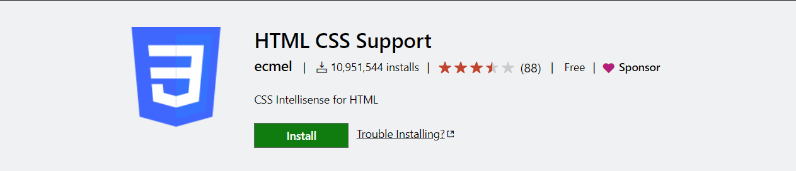

      

  2. HTML to CSS autocompletion

     CSS에서 코딩할때 HTML에서 사용한 속성이름을 자동 완성해주는 기능을 지원. 

     [다운로드](https://marketplace.visualstudio.com/items?itemName=solnurkarim.html-to-css-autocompletion){: target="_blank"}  

     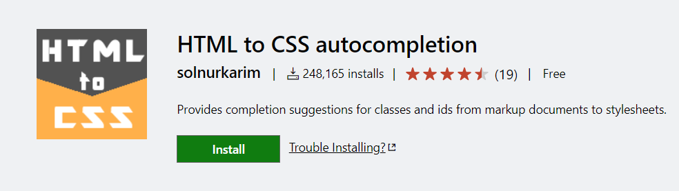

      

  3. Auto Rename Tag

     태그 이름을 수정할 때, 여는 태그와 닫는 태그를 동시에 수정하게 해줍니다. 

     [다운로드](https://marketplace.visualstudio.com/items?itemName=formulahendry.auto-rename-tag){: target="_blank"}  

     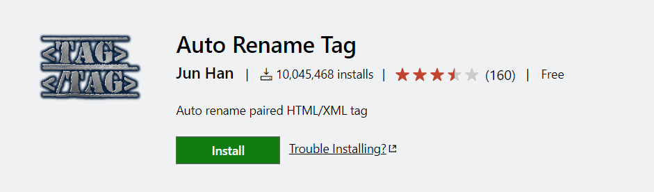

      

  4. Auto Close Tag

     Auto Rename Tag와 함께 사용하는 유용한 확장입니다. 

     태그를 작성할 때 기본적으로 여는 태그와 닫는 태그를 일일이 입력해야 하던 것을 입력태그만 입력하게 해줍니다. 

     즉, `
`만 입력을 해도 `
`가 자동으로 작성이 됩니다. 

     [다운로드](https://marketplace.visualstudio.com/items?itemName=formulahendry.auto-close-tag){: target="_blank"}  

     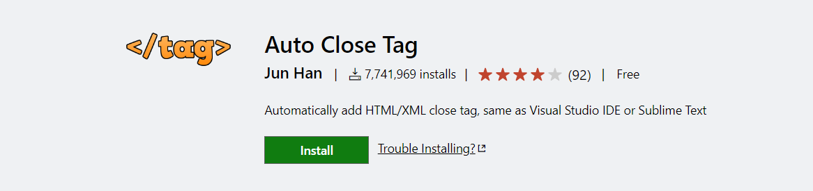

      

  5. htmltagwrap

     단추기 `alt + w`로 태그를 감쌀 수 있습니다. 

     [다운로드](https://marketplace.visualstudio.com/items?itemName=bradgashler.htmltagwrap){: target="_blank"}  

     

      

  6. cdnjs

     vscode 내에서 cdn을 검색해서 바로 적용할 수 있는 확장. 

     [다운로드](https://marketplace.visualstudio.com/items?itemName=JakeWilson.vscode-cdnjs){: target="_blank"}  

     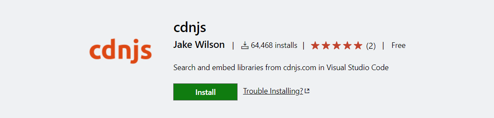

      

  7. Hightlight Matching Tag

     쌍이 되는 태그를 표시해주는 확장으로 태그가 복잡하게 중첩되어있을 때 사용하면 유용합니다. 

     [다운로드](https://marketplace.visualstudio.com/items?itemName=vincaslt.highlight-matching-tag){: target="_blank"}  

     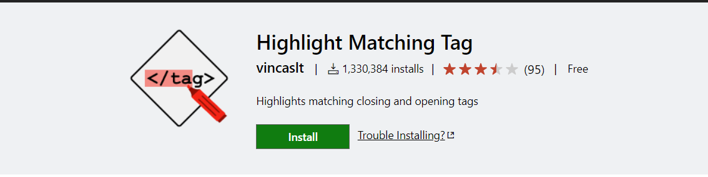

      

  8. Close HTML/XML tag

     해당 프로젝트 파일에서 사용된 태그들을 검색해 닫는 태그를 자동완성 시켜주는 확장입니다. 

     [다운로드](https://marketplace.visualstudio.com/items?itemName=Compulim.compulim-vscode-closetag){: target="_blank"}  

     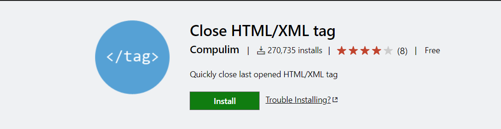

      

  9. HTMLHint

     eslint와 같이 html 코딩할 때 알맞지 않은 문법이나 빠진 부분이 있으면, ide처럼 알려주는 기능입니다. 

     [다운로드](https://marketplace.visualstudio.com/items?itemName=mkaufman.HTMLHint){: target="_blank"}  

     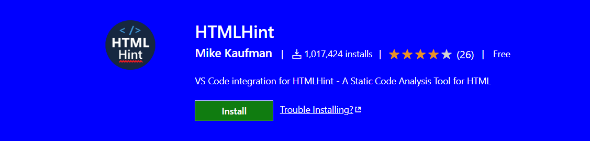

      

  10. image preview

      코드라인 번호 왼쪽에 이미지가 나타납니다. 

      이미지 url에 마우스를 올려놓으면 프리뷰 이미지를 볼 수 있습니다. 

      [다운로드](https://marketplace.visualstudio.com/items?itemName=kisstkondoros.vscode-gutter-preview){: target="_blank"}  

      

       

  11. HTML Auto Completion

      * !html 치고 enter
      * !table 치고 enter
      * !form 치고 enter

      [다운로드](https://marketplace.visualstudio.com/items?itemName=F4Bz3.htmlautocompletion){: target="_blank"}  

      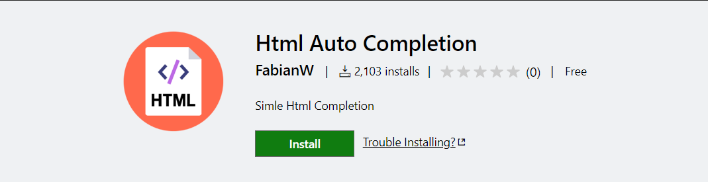

       

  12. CSS Navigation

      html에서 class 속성들을 코딩할 때, 이 클래스가 어느 css 파일 위치해 있는 것인지 바로 확인 할 수 있는 익스텐션이다. 

      클래스명에 마우스 커서를 갖다대고 `F12`를 누르거나 `Ctrl+click` 하시면 바로 해당 css 파일 선택자로 이동합니다. 

      [다운로드](https://marketplace.visualstudio.com/items?itemName=pucelle.vscode-css-navigation){: target="_blank"}  

      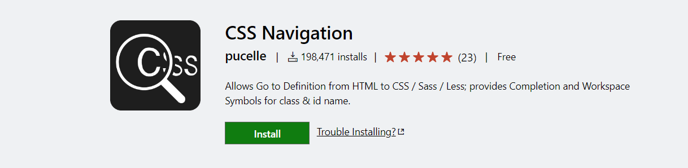

       

  13. CSS Initial Value

      css 속성 기본값을 보여주는 기능.  

      기본값이 뭔지 잊어먹었을 때 바로 확인할 수 있는 소소한 기능입니다. 

      [다운로드](https://marketplace.visualstudio.com/items?itemName=dzhavat.css-initial-value){: target="_blank"}  

      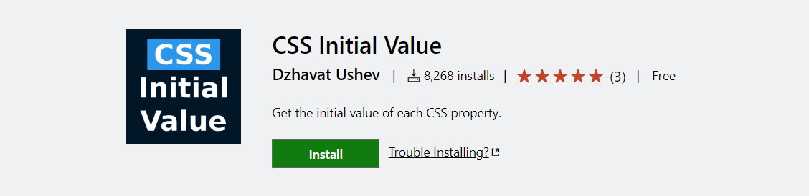

       

  14. Stylelint

      css 구문 오류를 잡아주는 확장. 

      [다운로드](https://marketplace.visualstudio.com/items?itemName=stylelint.vscode-stylelint){: target="_blank"}  

      

       

  15. vscode-styled-components

      자바스크립트나 타입스크립트에서 css 문법 표현을 사용해줄 때 자동완성 기능을 제공해줍니다. 

      [다운로드](https://marketplace.visualstudio.com/items?itemName=styled-components.vscode-styled-components){: target="_blank"}  

      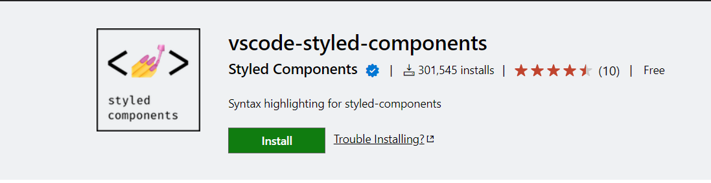

       

       

* javascript

  1. JavaScript (ES6) code snippets

     짧은 문장으로 자주 사용하는 메소드 구성 코드를 사용할 수 있습니다. 

     [다운로드](https://marketplace.visualstudio.com/items?itemName=xabikos.JavaScriptSnippets){: target="_blank"}  

     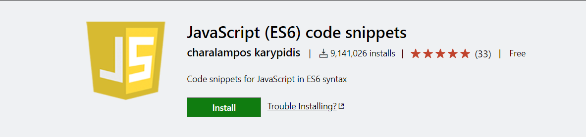

      

  2. Javascript Auto Backticks

     일반 문자열("")에서 ${} 를 감지하면 자동으로 백틱(`)으로 변경해주는 유용한 확장입니다. 

     [다운로드](https://marketplace.visualstudio.com/items?itemName=chamboug.js-auto-backticks){: target="_blank"}  

     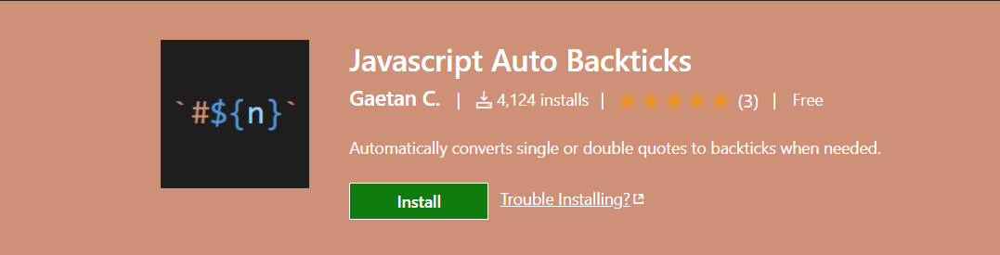

      

  3. JSON Helper

     마우스를 올려다 놓으면 JSON 객체 상속 트리를 프리뷰 해줍니다.  

     [다운로드](https://marketplace.visualstudio.com/items?itemName=zhoufeng.json-helper){: target="_blank"}  

     

       

     <h4>직접 사용했던 확장들을 기준으로 넣은 것들이기에 아직 써보거나 발견하지 못한 유용한 확장들이 많이 있을 거라 생각합니다.</h4>

     <h4>이 포스트는 추후에도 새로운 유용한 확장들을 발견하면 계속해서 추가할 예정입니다.</h4>

  

  

  

​	