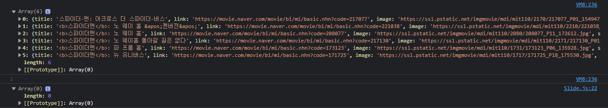

<h1>myMovieSite_portfolio</h1>

<h3>무난한 주제.... 시작부터 어려운 난제??</h3>

<br><br>

드디어 시작되었다.. 지옥이 ㅎㅎ<br>

  

<br><br>

와... 하하...................<br>

<br>

이제 리액트의 기본만(완전 최소한으로) 배웠고 아직까지는 여러가지로 미숙하다고 생각하기에 설령 뻔한 주제라 할지라도, 배운것들을 최대한 담아내려고 한다. <br>

영화 사이트를 봤을 때, 의외로 디자인들이 단순해서 놀랐다. <br>

물론 구현하라고 하면 누구보다 빠르게 **도망칠** 자신이 있다. <br>

..<br>

여튼! 각종 영화 사이트들 및 참고가 될만한 사이트들을 돌아다녀 봤는데... 눈에 띈 **<a href="https://laftel.net/">라프텔</a>** 사이트!<br>


<br>

네이버 영화 사이트 및 넷플릭스 사이트들을 개인적인 느낌을 표현하자면, simple한 대신 필요한 것들만 최소한으러 넣어 깔끔한 느낌이었다.<br>

하지만 뭔가 정적이었다고 할까.. 그밖에도 국내의 영화관련 사이트들 및 해외사이트들도 살펴보았지만.. 기능적으로는 물론 훌륭하고 깔끔했지만.. 원했던 느낌이 아니었다.. <br>

라프텔이 마음에 들었던 것은 화면을 넓게 쓰고 **슬라이드**를 메인으로 작업한 것이 쉽게 파악이 된다는 것이 매력적이었다.<br>

그리고 대부분의 사이트들은 리스트에 있는 컨텐츠나 박스를 누르면 페이지가 이동되는 형식으로 처리가 되었지만 이 사이트는 팝업형식으로 대체해 보다 효율적이라고 느꼈다.<br>

물론.. 모두 라프텔 형식으로 만드는 것이 아니라.. 채용할 부분은 스크린샷에도 나온 메인 화면의 거대한 슬라이드 .. 그대로 채용해도 괜찮아 보이지만 조금은 화면을 줄이고 보이는 형식도 조금 바꿔볼까 한다.<br>

현재는 `swiper.js`를 사용해 기본형으로만 쓰고 있지만.... 왜 썼냐구??? ... 아직 구체적으로 장점을 말하기가 어려워서 pass.. <br>

구글링 했을 때, slick과 swiper가 눈에 띄었는데.. 보다 커스텀에 유리한 swiper가 좋겠다고 판단해 선택했다.<br>

헤드 부분은 밝은 색보다는 어두운 색으로 프레임을 구성해서 fix할 예정.. <br>

기세 좋게 메인 화면 프레임을 마치고 `axios`를 이용해 네이버 api를 끌어와 슬라이드에 넣어보려고 하니 이게 웬걸.....<br>



<br>

어... 왜지??<br>


<br>

```react
import { Component } from 'react'
import Header from './components/Header'
import Slide from './components/Slide'
import Body from './components/Body'
import Footer from './components/Footer'
import './App.css'
import axios from 'axios'

export default class App extends Component {

  constructor(props){
    super(props);
    this.state={
      movieObj:[]
    }
  }


  getMovies=async()=>{
    //화살표함수
      await axios({
      method:'get',
      url:'/v1/search/movie.json?query="스파이더맨"&display=6',
      dataType:'json',
      headers:{
        "X-Naver-Client-Id":'pcSk4iqo1SpsvR7nh1Ul',
        "X-Naver-Client-Secret":'g8wy7q0lQ7'
      }
    })
    .then(response => 
      {
        console.log(response);
        console.log(response.data.items);
        this.setState({
          movieObj:response.data.items
        })
      }
    )
  }

  componentDidMount(){
    this.getMovies()//호출
  }


  render() {
    console.log(this.state.movieObj) //여기에서는 잘 출력되었다.. api의 데이터들이 제대로 콘솔에 나왔다.
    console.log(1)
    return (
      <div id="app">
        <Header></Header>
        <Slide  movieObj={this.state.movieObj}></Slide>
        <Body></Body>
        <Footer></Footer>
      </div>
    )
  }
  onUpdate (movieObj) { this.setState({ movieObj }) } //stack overflow의 답글을 보고 추가해봤지만 변화가 없었다. 
}

```

```react
import {Component} from 'react';
import { Swiper, SwiperSlide } from 'swiper/react';
import { Navigation, Pagination, Autoplay, A11y } from 'swiper';
import '../css/slide.css'


// Import Swiper styles
import 'swiper/css';
import 'swiper/css/navigation';
import 'swiper/css/pagination';
import 'swiper/css/scrollbar';  

export default class Slide extends Component {
  constructor(props){
    super(props);
    this.state={
      slideObj:this.props.movieObj //라이프사이클 관련된 문제인 듯하다..
    }
  }

  render() {
    console.log(this.state.slideObj)
    return (
        <Swiper id="slide"
            modules={[Navigation, Pagination, Autoplay, A11y]}
            spaceBetween={50}
            slidesPerView={4}
            loop= {true}
            //dir="ltr"//슬라이드 진행방향 전환.. 
            navigation// prev,next
            autoplay={{delay: 2000, disableOnInteraction:false}}
            pagination={{ clickable: true }}
            onSlideChange={() => console.log('slide change')}
            onSwiper={(swiper) => console.log(swiper)}
            >
            <SwiperSlide className="item">
                <div id='movieInfo'>
                    Slide1
                </div>
            </SwiperSlide>
            <SwiperSlide className="item">Slide 2</SwiperSlide><!-- 여기 슬라이드 내부에 넣으려고 함-->
            <SwiperSlide className="item">Slide 3</SwiperSlide>
            <SwiperSlide className="item">Slide 4</SwiperSlide>
            <SwiperSlide className="item">Slide 5</SwiperSlide>
            <SwiperSlide className="item">Slide 6</SwiperSlide>
        </Swiper>
    )
  }
}
```

<br>

기존에 배웠던 형식들은 기본 형식이라 사이트가 정적이었고 컴포넌트들을 단순히 `map`으로 처리하면 해결되었지만...<br>

슬라이드를 넣다보니 동작이 됨에 따라서 렌더링이 계속되어서 그런가 정상적으로 전송되어야할 영화 데이터가 하위 컴포넌트에서는 빈 배열만 받았다고 한다...<br>

this.props 로 넣을 경우 새로고침을 누르면 오류가 발생하므로 ... 라이프사이클 관련 문제인 듯 하다. <br>

<br><br>

처음 스스로 기획을 해보고 시작을 하다보니 아직 프레임조차도 제대로 완성시키지 못했다.<br>

그렇다고 시작을 하지 않고 있자니.. 가는 시간이 아까워 일단.. 단순하게라도 프레임을 구성하고 작업을 하면서 보완해나가는게 좋겠다는 생각이 들어 <br>

작업을 시작하게 되었다....<br>

시작이 어렵긴 하더라도 자신만의 사이트를 만든다는 사실이 내심 즐겁다.. <br>

고생은 해도 나온 결과물을 보면서 만족을 할 수 있도록 문제를 해결하고 멈추지 말고 계속 할 일을 찾으면서 전진해야겠다.. <br>

후...... <br>

그럼 오늘은 여기까지...<br>

가급적 작업이 완성될 때마다 올릴거지만 최대한 게시글을 작성하면서 현황 보고하려고 한다. <br><br>


