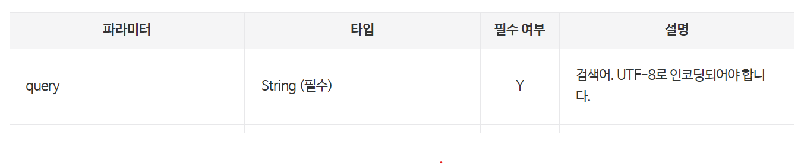

<h1>myMovieSite_portfolio_20220920</h1> 

<h3>API의 한계... 새로운 방향으로의 전환..</h3>

  

지난번 자료가 호출되지 않은 것은 해결했다.. 단순히 코드에 잘못된 부분이 있었음... 

 

그런데 새로운 문제에 직면해버렸다..

 

본래 계획한 프레임.. 포스팅한 시점에서 포트폴리오용 레포지토리에도 올라가지 않음.. 한 마디로 땃!땃!한 프레임~  

본래 여러 사이트(네이버, 씨네21, 라프텔, wavve.. 등)들을 참조하여 괜찮은 부분들을 가져와 적절하게 수정해 위의 프레임을 기준으로 작업을 하려고 했다. 

그런데.. naverAPI가 가진 한계점을 깨달았다.. 

바로..  

이놈의 `query` 파라미터 때문에 모든 계획이 꼬여버렸다.. 

알고보니 전체 데이터를 호출할 수 없고 강제적으로 검색을 통해서만 데이터를 조회할 수 있기 때문에 위와 같은 구조는 불가능하다... 

억지로 검색어를 맞춰서 눈속임으로 하는 방법도 있으나.. 너무 허술하기도 하고 개발자가 목표인 인간이 할 짓은 아니라고 생각했다.  

그래서 여러가지로 알아보았다.   

1. stack overflow

   

   간단히 말하자면, api 요청의 queryString에서 모든 문자열을 표현하는 기호( ex) CSS에서의 *)나 표현식이 있으면 가르쳐 달라고 질문을 올렸지만,

   **있었으면 진작에 썼겠지라는 늬앙스**로 올린지 몇 시간이 지난 지금도 응답이 없다..ㅠㅠ 역시 너무 쉽게 해결하려 했나보다..   

2. 구글링
   혹시나 query를 통한 전체검색에 성공한 경우가 있는지, 또 정규표현식을 통해서 해결할 수는 없는지 확인해보았고 코드에 넣고 결과를 확인했으나.. 이 역시도 소득이 없었다...   

3. 강사님

   **실낱같은 희망**을 품고 던진 질문에 강사님께서는 이렇게 답변해주셨다..  

   

   그리고 제안받은 방법.. 

   직접 rest-api 서버 db 만들기...  

   와.. 그런 신박한 방법이 있었구나  

   와...... 

   

     

   사실 nodeJS, mySQL을 배우면서 연동하고 최종적으로는 REACT와 연동시키면서 요청을 보내 데이터를 받고 수정하는 `CRUD`를 해봤었기에 비슷한 방식으로 하면 될 거 같다. 

   문제는 크롤링 ....  

   API 문제로 프레임을 다시 구성한 탓에 시간이 촉박하다. 

   목표는 10월 11일(수업 종강)까지 맞추는 거라 곧바로 검색을 해서 찾은 적절한 방법은 'R' 이라는 (통계 계산과 그래픽을 위한 [프로그래밍 언어](https://ko.wikipedia.org/wiki/프로그래밍_언어)) 라는데.. 사실 매력적인건 크롤링이 가능하고 딱맞는 포스팅에 유튜브 강의까지 발견해버렸다..  

   이건.... 하늘의 계시야! 

   

     

   왜 이걸썼는가.. 라고 물어보신다면, .. 생각중이다.  
   논리적으로 선택하고 싶었지만.. 시간이 없다.ㅜㅜ 
   파이썬.. 자바스크립트로 크롤링 도구를 만들 수도 있었지만.. 대부분 튜토리얼이 길거나 원하는만큼 데이터를 세분화하지 못했다.  

   가장 큰 이유는 작업 파일에 markdown, javascript, C 등 여러 타입이 존재했고.. 긴 문장 필요없이 짧은 문법으로도 원하는 결과를 얻을 수 있었는 것이 결정적이었다.  

   앞으로 mongoDB 사용법과 해당 데이터를 어떤식으로 쓸 것인지(데이터항목:title,image,rating....) 등을 고려해야하고 요청을 위한 서버(nodeJS)를 통한 DB연결.. 말 그대로 REST API 서버를 구축해야한다...  

   우선 데이터가 없는채로 프레임을 간단하게 구성한 후 데이터를 구축할 예정이다.  

   후... 힘들었어.. 사실 R 프로그램은 오늘 처음 접했지만 생각보다 좋은 영상이 있어 테스트로 크롤링 했을 때 생각보다 쉬웠다.  

   제발 이 다음도 이런 식으로 흘러갔으면 좋겠다. 

   지발 좀..   

   

   

   

   