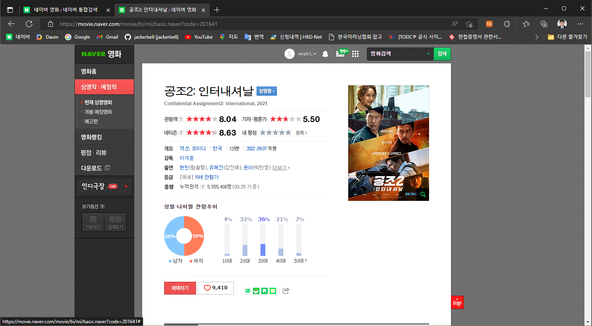
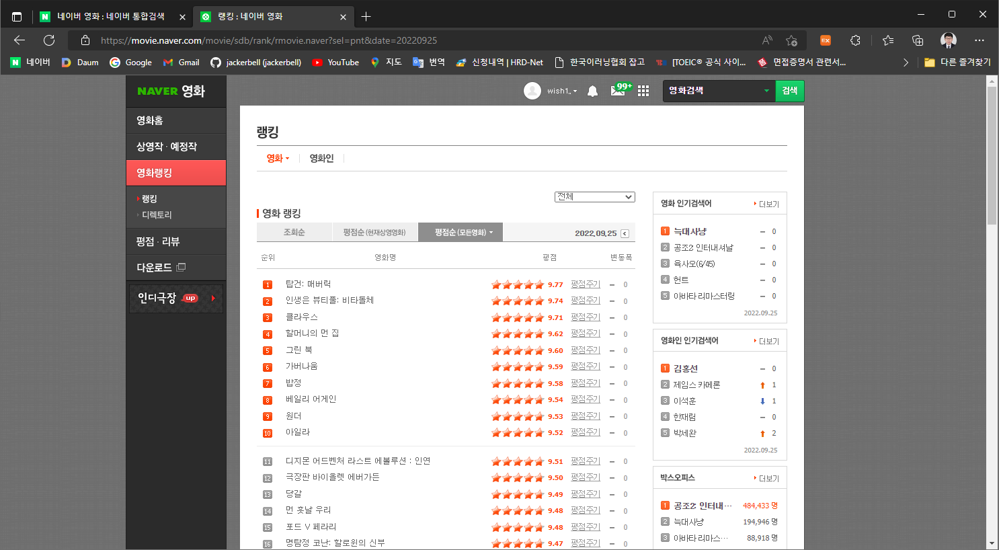
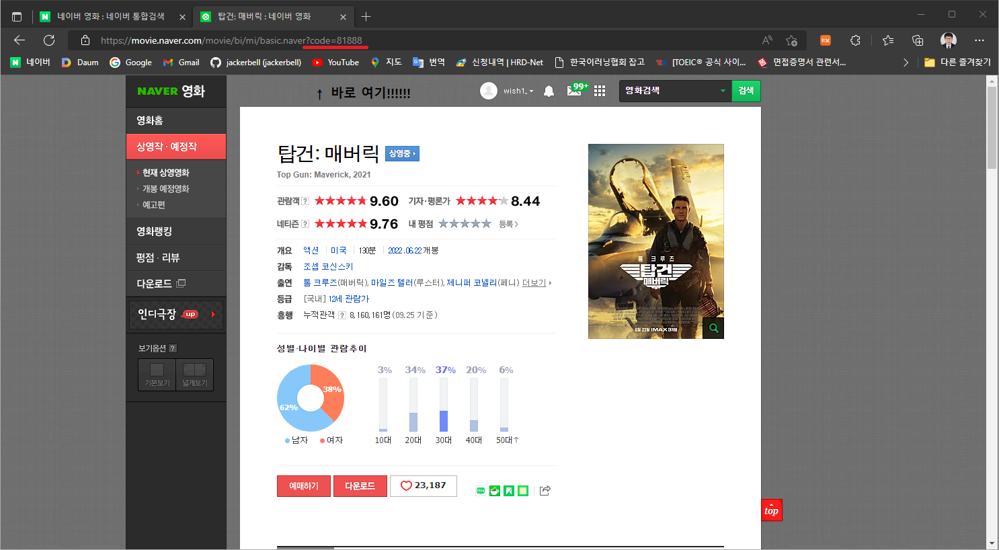
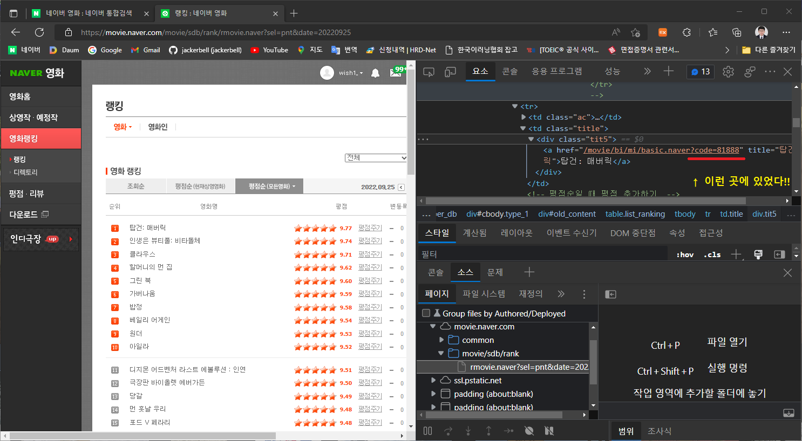
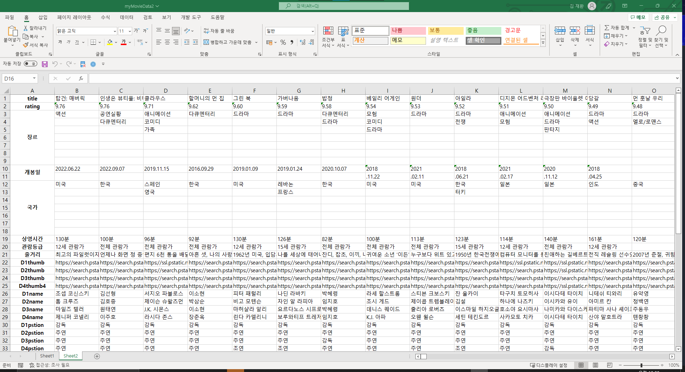

<h1>myMovieSite_portfolio_20220926</h1> 

<h3>DB 만든사람들 리스펙......</h3>

<br><br>

DB를 만들기 위해서 우선 급한대로 구글링을 했고.. 

R 언어를 채택해 

아래의 코드로 네이버 영화 사이트를 크롤링 했다.. 전체는 아니고 필요한 부분만.. 

```R
library("XML")
library("stringr")
library("XML")
library("httr")
library("rvest")
library("dplyr")
library("writexl") #작업을 위해 필요한 라이브러리들을 미리 설치


testarray = c() // 벡터 선언

for (i in 1:40) { # 해당 소개 페이지가 1페이지에서 40페이지까지 있기 때문에 반복문 for in 문 사용.. 2000개의 코드 획득
  movieUrl = paste0("https://movie.naver.com/movie/sdb/rank/rmovie.naver?sel=pnt&date=20220924&page=",i) 
  get_movieUrl = GET(movieUrl)
  my_moviehtml = read_html(get_movieUrl)
  dataSite = my_moviehtml %>% html_nodes(".tit5") %>% html_nodes('a') %>% html_attr('href') 
  testarray = c(testarray,dataSite)
}

result = data.frame() # 최종적으로 엑셀로 보낼 데이터를 담을 곳 미리 데이터 형식을 갖추기위해 데이터 프레임 선언..

for(i in 1:2000){  # 위에서 딴 1~2000번까지의 영화 코드를 순차적으로 돌림
  url=paste0('https://movie.naver.com',testarray[i]) #두 개를 붙이는데 결과는 https://movie.naver.com/movie/bi/mi/basic.naver?code=81888
    
  get_url=GET(url) #url에 get 방식으로 요청...
    
  my_html=read_html(get_url) # 이후 해당 페이지의 html 구조를 읽음..
    
    
  title = matrix(my_html %>% html_nodes('.mv_info_area') %>% html_nodes('.mv_info') %>% html_nodes('.h_movie') %>% html_nodes('a:first-child') %>% html_text(trim = TRUE),nrow = 1,ncol = 1)
  rating = matrix(paste0(my_html %>% html_nodes('.score.score_left') %>% html_nodes('.star_score') %>% html_nodes('a') %>% html_nodes('em:nth-child(2)') %>% html_text(),my_html %>% html_nodes('.score.score_left') %>% html_nodes('.star_score')%>%html_nodes('a')%>%html_nodes('em:nth-child(3)')%>%html_text(),my_html %>% html_nodes('.score.score_left')%>%html_nodes('.star_score')%>%html_nodes('a')%>%html_nodes('em:nth-child(4)')%>%html_text(),my_html %>% html_nodes('.score.score_left')%>%html_nodes('.star_score')%>%html_nodes('a')%>%html_nodes('em:nth-child(5)')%>%html_text()),nrow=1,ncol = 1)
  genre = matrix(my_html %>% html_nodes('.info_spec') %>% html_nodes('dd') %>% html_nodes('p') %>% html_nodes('span:nth-child(1)')%>% html_nodes('a') %>% html_text(trim = TRUE),nrow = 1,ncol = 7)
  opendate = matrix(my_html %>% html_nodes('.info_spec') %>% html_nodes('dd') %>% html_nodes('p') %>% html_nodes('span:nth-child(4)')%>% html_nodes('a') %>% html_text(trim = TRUE),nrow = 1,ncol = 2)
  country = matrix(my_html %>% html_nodes('.info_spec') %>% html_nodes('dd') %>% html_nodes('p') %>% html_nodes('span:nth-child(2)')%>% html_nodes('a') %>% html_text(trim = TRUE),nrow = 1,ncol = 7)
  runningTime = matrix(my_html %>% html_nodes('.info_spec') %>% html_nodes('dd') %>% html_nodes('p') %>% html_nodes('span:nth-child(3)') %>% html_text(trim = TRUE),nrow = 1,ncol = 1)
  movieRating = matrix(my_html %>% html_nodes('.info_spec') %>% html_nodes('.step4 + dd') %>% html_nodes('a') %>% html_text(trim = TRUE),nrow = 1,ncol = 1)
  story = matrix(my_html %>% html_nodes('.section_group.section_group_frst') %>% html_nodes('.con_tx') %>% html_text(trim=TRUE),nrow = 1,ncol = 1)
  crewPhoto = matrix(my_html %>% html_nodes('.section_group.section_group_frst') %>% html_nodes('ul') %>% html_nodes('li') %>% html_nodes('.thumb_people')  %>% html_nodes('img') %>% html_attr('src'),nrow = 1,ncol = 4)
  crewName = matrix(my_html %>% html_nodes('.section_group.section_group_frst') %>% html_nodes('ul') %>% html_nodes('li') %>% html_nodes('.tx_people')  %>% html_text(trim = TRUE),nrow = 1,ncol = 4)
  crewRole = matrix(my_html %>% html_nodes('.section_group.section_group_frst') %>% html_nodes('ul') %>% html_nodes('li') %>% html_nodes('.staff') %>% html_nodes('dt') %>% html_text(trim = TRUE),nrow = 1,ncol = 4)
  movieThumb = matrix(my_html %>% html_nodes('.mv_info_area') %>% html_nodes('.poster') %>% html_nodes('img') %>% html_attr('src'),nrow = 1,ncol = 1)
    
    #위에서부터 영화명, 평점, 장르, 개봉일(최신, 재개봉포함), 국가, 상영시간, 영화관람등급, 줄거리, 제작진사진, 제작진이름, 제작진역할, 영화썸네일
    # 모두 matrix를 건 이유는 2000개의 모든 데이터의 각 기준별 요소의 개수가 모두 다르기 때문에 강제적으로 행과 열을 지정.. 최대개수 기준.. 
    # 위에서 요소의 개수가 1개로 확정된 기준들(title, movieThumb, rating)은 matrix를 제외해도 상관없음..
    
  result = rbind(result,data.frame(title,rating,genre,opendate,country,runningTime,movieRating,story,crewPhoto,crewName,crewRole,movieThumb))
}# 기존의 빈 데이터 프레임과 위에서 수집한 데이터를 rbind함수를 통해 엮음.. 

write_xlsx(result,"myMovieData2.xlsx") #엑셀로 완성한 데이터를 추출.. 
```

<br>

처음부터 제법 삽질을 해버렸다..<br>

오늘의 포스트는 위의 코드가 완성되기 까지의 여정에 대해 말하려고 작성했다.

 <br>


처음에는 기세 좋게 아래와 같은  영화 소개 페이지를 개발자 도구로 HTML 구조를 파악한 후 



이 페이지를 기준으로 하려고 했지만.. <br>

전체 데이터의 개수가 50개가 조금 넘는 수준이라 터무니 없이 부족하다고 생각했다.. <br>

다행히 자료가 많은 곳이 있었으니..<br>



바로 영화랭킹의 평점순으로 정렬된 자료들...<br>

참 좋은데 이 상태만으로 얻을 수 있는 정보는 영화명과 점수뿐이었다. <br>

그래서 하나씩 페이지를 클릭해 소개 페이지로 들어가게 되면 앞서 보여준 ''공조2:인터내셔날''의 소개 페이지와 같은 형식으로 정보가 나온다.. <br>

어쩔 수 없이 하나씩 열어보면서 해당 페이지의 코드번호를 땄다...<br>

어디에 있냐구???<br>



처음에는 랭킹이 있는 사이트의 코드들을 제대로 보지 않아서<br>

무려 2000개가 되는 정보들을 하나씩 열어가며 위의 URL에 있는 코드 번호를 수집했다..<br>

지금 생각해보면 기가막힌 삽질이었다.<br>

2000개를 열 필요도 없이 바로 영화 랭킹이 있는 페이지에 코드를 모을 수 있는 수단이 있었다..<br>

바로!<br>

<br>

 

<br>

후..................

하.........

**떨리는** 마음을 붙잡고 다시 작업에 착수했다..

그 외에도 구조 파악이 제대로 되지 않아 자료를 뽑고 지우고를 몇번이나 반복했다.. 

클래스가 겹쳐 엉뚱한 자료가 크롤링 되기도 하고 최대한 겹치지 않게 선택자의 범주에 신경을 써가면서 코드를 작성하게 되었다.. 

최종적으로는 아래와 같은 엑셀 형식으로 자료를 뽑았다..

 위의 코드에서는 `write_xlsx(result,"myMovieData2.xlsx")`부분에서 데이터에 저장한 정보를 엑셀로 뽑을 수 있도록 도와준다..

<br>

참.. <br>

위의 R 코드를 사용해서 맞출 때도 데이터의 행렬을 맞추는데 고생을 했다..<br>

데이터가 행렬로 나오는 걸 깜빡해서 거기서 시간을 잡아먹고, 데이터의 행과 열을 맞추기 위해서 최대 범주를 구하기 위해서 스크롤을 해가면서 데이터의 개수를 파악했다..<br>

장르, 국가가 이에 해당하는데 각각 최대 7가지까지 가지고 있는 데이터들이 있어 최대 열을 7개로 맞추고 행은 1개로 통일했다.<br>

위 사진은 데이터 중복제거를 위해서 복사 붙여넣기할 때 행렬을 바꾼 붙여넣은 모습<br>

데이터는 엑셀로 어느정도 정리가 되었다.<br>

아쉬운점은 데이터를 실시간으로 가져오기 위해서는 정리하는 수고가 필요하다.<br>

데이터 중복 제거 후 저런 정리된 모습으로 나와있지만<br>

예를 들어 국가의 경우 1개만 지정된 데이터가 있고 7개로 지정된 데이터가 있을 시.. 1개만 지정된 데이터에서는 이를 7개가 될 때까지 반복되는 형식으로 나온다..<br>

(한국한국한국한국한국한국한국).... 이런건 필수적으로 수정을 해야하기 때문에 어쩔 수 없이 노가다를 하게 되었다.<br>

매크로 및 VBA를 간단하게 사용해서 비교적 수월하게 할 수 있었다.. 장르, 국가 약 2000개(성인물 제외) 각각 1시간 조금 넘게 걸린 듯하다.<br>

제일 공포스러운건 아직 프레임을 구성만 해놓고 실제 작업은 들어가지 못했다..<br>

실험용으로 한 거 밖에 없어...<br>

삽질을 너무한 탓일까.. 최근들어 무덤으로 들어가느 느낌이 든다..<br>

기분탓이겠지....<br>


다음에야 말로

꼭...

프레임 기반의 사이트 사진을 들고 돌아오겠다...

반드시..


 

