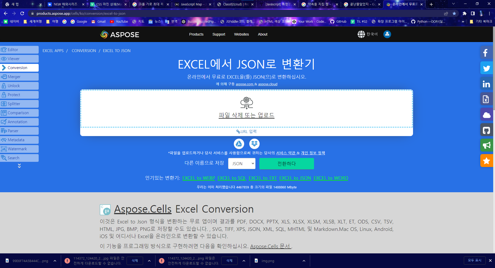

<h1>myMovieSite_portfolio_20220929</h1> 

<h3>도안에서 사이트로 옮기는 중......</h3>

  

사진 공개!! 

  

약속대로 사이트 사진들을 들고 돌아왔다.. 

라우터를 활용해 경로를 이동시키며 페이지를 전환할 예정이고 팝업요소를 적극적으로 활용할 것이다. 

특히 위의 사진처럼 로고 navigation 부분의 카테고리 메뉴를 클릭하면, 페이지가 전환이 되는 것이 아니라 팝업이 뜨면서 전체 카테고리를 보여준다.  

메인 페이지에서 소개한 내용들(최신,높은 평점...)과는 별개로 영화를 장르별로 구분해 놓은 것이다. 

위의 카테고리를 클릭하면 소개 페이지가 뜨면서 해당 장르를 가진 데이터들을 나열해서 보여줄 수 있도록 만들 예정이다.  

지난번에는 마치 레이아웃을 완성시키고 돌아올듯 말하고 퇴장했지만, 

아직도 제작해야할 건 많다.. 

 

레이아웃 자체가 구성중인 이유에는 직접  DB를 만든다는 요인이 컸다.. 

DB를 만들어보라는 방향을 강사님께 제시받은 후 어떻게 DB를 구성할지부터 크롤링을 하는법 및 사용할 프로그램... 

그리고 엑셀로 뽑아내면서 지금의 데이터 구성으로 완성시킬 때까지 시행착오가 길었다.. 4~5일 정도..  

크롤링부터가 처음이었던지라.. 생각보다 어렵진 않았지만.. 레이아웃을 파악하고 불필요한 부분을 편집하는데 시간이 많이 소요되었다.  

 

페이지의 레이아웃은 **simple**하게 구성하고  

로고는 간단하게 만들어보았다.  

배경은 투명하게 하고 크기를 꾀 줄여도 이 정도.. 

참고로 **''MoRafi''**라는 사이트 명은 영화(Movie), 낙서장(graaffiti)에서 적절히 합성해 만들었다. 

격식을 따지지말고 낙서장처럼 간편하게 쓰면서 자유롭게 리뷰글을 남겨보자는 의미로 지었다. 

로고는 아래의 사이트에서 제작했다.  

 

여기서, 주제를 밝혔다. 

즉, 지금 제작중인 사이트의 주제는 영화 리뷰사이트! 

흔한 소재다..... 

아직 특별히 타 사이트들과 구분되는 요소를 생각하지는 못했다..  

리뷰방식을 조금 다르게 적용해볼까 고민중인데 이는 아직 구체화하지 못했으므로 다음 시간에... 

        

 

 

 

 

 

 

 

아직 말하고 싶은게 있어... **나가지마..** 

데이터를 뽑고난 다음.. 문제는 이 DB를 서버에 넣어야한다는 것!!  

현재 찾은 방법은 React의 excel 모듈을 활용하여 데이터를 넣는 방법... 

 구글링해서 찾은 사이트에서 직접 엑셀 파일을 넣어 JSON 형식으로 변환한 후 DB를 넣는 방법..  

 

크게 두 가지 중 고민중......  

애초에 이건 수업에서 배운 적 없이 독학으로 진행하고 있는 부분이라 시간이 조금 걸릴거 같다. 

본래는 주제별로 소개한 리스트들을 모두 슬라이드 처리를 하려고 했으나.. 중복되는 느낌이 들어 슬라이드 영역으로 지정한 부분을 제외하고는  

정해진 개수(5개로 지정)만 보여주고 나머지는 더보기의 클릭 이벤트를 통해 관련 영화들의 리스트와 정보들을 보여주는 컴포넌트로 이동하는 방식으로 처리할 예정이다.  

그 이후에도 리뷰작성을 위해서 메모장 기능도 구현해야하고, 찜 기능을 통해 MY 컴포넌트에 리스트 형식으로 구현도 하고... 

할게 많다 많아.... 

이번에야말로 진짜 끝........ 

다음 시간에........... 

