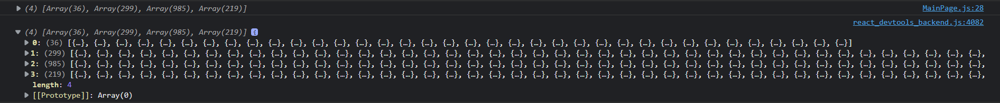

<h1>myMovieSite_portfolio_20221008</h1> 

<h3>드디어 서버에 데이터 넣기 성공! :) 그리고..</h3>

  

먼저.. 

 

본래 **꽃밭**이 자리잡은 머릿속에서는 .. 

매일매일 **GIT**에 프로젝트도 커밋하고... 

블로그에 글도 자주 올리고.. 하지만 현실은 달랐다.. 

앞으로는 최대한 꾸준히 올릴 예정 ㅎㅎㅎㅎㅎㅎ;;;;;;;;;;

 

이제 본론으로!! 

  

지난번, 데이터를 넣기 위해 선택한 방법들 그리고 최종적으로  mySQL을 서버로 지정했다..  

향후 서비스화 시켜볼 계획이기에.. 지금은 미약하지만, 계속 배우면서 만들어볼 예정이다.  

우선 처음에는 DB를 한꺼번에 넣으려고 생각했지만.. 시도해본 결과 처리되는 속도도 너무 느렸다.. 

그래서 나누기로 했다..  

첫 번째는 영화정보... 영화제목, 평점, 장르, 개봉일, 국가(촬영관련), 상영시간, 관람등급, 썸네일.. 이렇게 묶어서 **moviedb**라는 테이블에 정리해두었고 결과는 아래와 같다.  

 

양이 조금 많아서.. 약간 혼란스러워 보이지만.. 지금으론 이게 최선이다..  

그 다음은 제작진 정보인데.. 엑셀로 정리해서 mysql명령문으로 변환해서 사용하다 보니... 한계가 있었다..  

참고로.. 

    

아래 형태에서 mySQL에서 변환할 때, 맨 위(1행)에 있는 목록들이 JSON에서의 **property** 목록들로 변환됩니다.  

제작진의 경우 이중으로 묶어야 하는데 엑셀도 그다지 잘 하는 편이 아니라  

방법을 알고 계신 분이 있다면, 

jackerbell@naver.com으로 메일 좀 부탁드려요........ 

여기서 잠깐! . 어떻게 바꾸냐고?? 

깨알 같아서 잘 보이지 않겠지만. 

무려 엑셀파일의 내용을 Ctrl+C,V 후 Output as {선택한 언어} 에서 선택하면 자동으로 해당 언어에 맞게 전환이된다.  

내 경우는 MySQL 명령문이 자동으로 뙇!!!!!!!!!!!!!!!!! 

http://shancarter.github.io/mr-data-converter/ 사용했던 사이트다..  

구글링, 깃헙을 헤매면 찾아낸 귀중한 사이트.. 앞으로 써먹을 일이 종종 있을 것같은 예감이... 

이렇게 넣으면서 슬프게도 줄거리가 빠졌다..  

VSC로 확인해보니 ""가 난무해 오류가 일어났다.. 그대로 넣을 경우 | 문자까지 그대로 출력되어 써먹을 수가 없었다.. 아쉬운대로 삭제.. 

이후에 정리한 결과들은 아래와 같다.  

위의 사진과 같은 형식으로 감독과 배우3명 형식으로 총 4개의 table을 db에 추가해주었다.  

당연히 모든 영화의 출연진이 4명일리는 없다.. 크롤링 과정에서 행렬을 맞추고 또 프로젝트를 만드는 시간 또한 고려해서 어쩔 수 없이 4개로 고정시켰다. 

모자라거나 빠진 부분이 있지만.. 일단 강행할 수 밖에 없었다.. 

영화 소개 페이지에서 보러가기 항목에 소개페이지 링크를 연결해두는 방식으로 보완할 예정이다.  

이렇게 서버 작업도 끝이 났고 드디어 DB를 axios로 받아서 화면에 렌더링시킬 순간이 왔다..! 
  

필요한 express,axios,bodyparser 등등 미리 설치해주시고~~ 

  

db.js 파일로 mysql에서 접근할 정보들 입력해주시고~~~ 

  

 

useEffect 쓰고 끝에 []로 한 번만 실행되게 설정한 후(마운트될 때 1번), 

**비동기처리**로 axios를 이용해 불러온다.. 

그리고 위에서 **Slide**컴포넌트가 있는 **MainPage** 컴포넌트에 props로 값을 전달했다. 

이후  

값이 전달된 모습! 

내부에 메인화면에서 소개할 리스트들도 필요하기 때문에..  

이번엔 MainPage 컴포넌트에서 axios 요청을 보냈다.  

그리고 최종적으로 

 이렇게 데이터를 전달하고 나면,  

화면이 완성된다. 

이렇게!! 

처음엔 라프텔 처럼 슬라이드 기반으로 가려고 했으나,, 

슬라이드는 한 개만 두고 나머지는 위의 사진처럼 Grid 형식으로 나열해 정리하는게 심플하면서도 깔끔한 느낌이 들어 위의 형식으로 정하게 되었다.  

axios로 전달하는 과정에서 특히 힘들었던건... 

바로 요놈!! 

바인딩된 값이 셋팅이 되기 전에 불려와서 위와 같은 오류가 발생하는 것이라고.. 구글에 나오더라.. 

이걸 해결하기 위해서 단계적으로 접근했다.  

첫 번째는 **Optional chaining**(?) 

위의 코드에서는  

이렇게 property로 접근하기 전에 적용시켜두었다. 

이유는 즉슨!, 오류가 계속 일어나는데 구체적으로 어떤 값이 출력되는지 나오지가 않았다... 

**undefined**가 대부분이지만, 확인이 필요하기에 붙여두었다. 

중간 chaning을 잘못 작성해서 property에 접근하지 못해 오류가 발생하는 경우가 종종 있었다... 

그렇게 값이 도착하지 못한 부분을 찾은 후  

두 번째는 조건부 렌더링! 

위의 코드에서 props.listData에 값이 들어오면  

렌더링을 시키고 아니면 대기 상태에 들어간다. 

즉, 값이 들어옴과 동시에 렌더링이 되어 오류가 발생하지 않게 된다.. 

여러 삽질을 한 끝에 일단, 데이터는 무난하게 전달할 수 있게 되었다..  

번외편으로~ 

여기에서.. 위의 코드가 존재하는 이유는 

아래의 코드처럼 배열에 맞춰 **map함수**를 활용해 반복을 시키면 내부의 내용을 제각각 넣어줘야한다. 

단 아래의 data 인수는 listIdx에 존재하는 division이라는 property만 참조하므로 나머지는 index의 수순에 맞게 배열을 각각 가져올 필요가 있다.   

콘솔창으로 가져온 결과를 확인해보면 

아래의 사진처럼 배열 내부에 각각 데이터가 담긴 배열들을 보관하는 방식으로 가져올 필요가 있다.  

이렇게 되면 0~3 index에 맞추어 각각 데이터를 넣어줄 수 있다.  

그러기 위해선 배열 내부에 배열을 넣어줘야 한다. 

평범한 자바스크립트가 아닌 리액트이므로  

push와 같은 일반적인 배열함수는 사용이 불가능하다.  

그래서 spread 연산자와 배열의 합성법을 조합해 위와 같은 방식으로 배열을 합성했고 그 결과가 콘솔창에 나오는 것처럼 배열 내부에 있는 배열들이다.  

위의 배열들은 순서대로 최신영화 정보, 고평점영화 정보, 고전영화 정보, 여러국가에서 촬영한 정보들을 나타낸다.  

그리고 그 과정에서 서브 쿼리를 활용했다.  

이렇게.. 

배열로 하려 했으나... 셀의 서식이 텍스트일때만 감쌌을 때 셀에 나오는 결과가 유효했다.  

그런데 이 상태로 SQL에 변환이 되니 텍스트로 나왔다.... 그래서 결국 선택한 방법이 문자열의 길이를 통해서 분간하는 방법이었다.  

추후에 해결할 방법을 찾으면 보완할 예정!  

이렇게 정신없이 작성하다보니, 어느새 새벽 2시다.. 

이제 자러감 ... 

                         

**엔딩 씬은 못참지!!!!!!**

