<h1>myMovieSite_portfolio_20221017</h1> 

<h3>드디어 서버에 데이터 넣기 성공! :) 그리고..</h3>

 

지난 번 데이터에서  

제작진 정보와 영화 정보를 분리했지만,.. 

잘못된 판단이었다..  

영화에 대해서 간단히 소개를 할 때, 제작진의 정보가 분리되어 있으면, 매칭하기가 어렵기 때문;; 

그렇기 때문에 다시 제작진 정보까지 합쳐진 엑셀 파일을 MySQL 입력문으로 전환했고.. 새롭게 데이터를 만들었다.. 

 

데이터 문제와 더불어 또다른 문제가 있었으니... 

바로 로딩 속도가 느려진 것이었다.. 

메인페이지를 로딩하는데 무려 5초가 넘는 시간이 소요되었다... 

심각한 문제이기에 코드를 분석해보았는데..  

개인적으로 생각한 원인은 이러했다. 

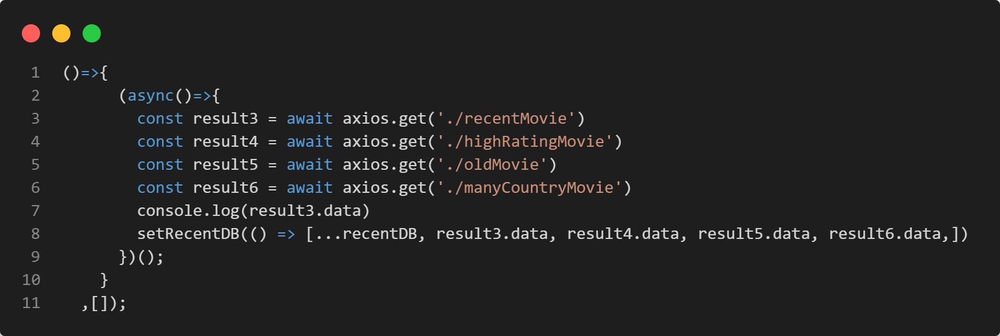

 

데이터를 호출할 때, 메인페이지에서는 아래와 같은 형식으로 4개로 나누어 종류별로 **axios** 요청을 통해 각각 호출하도록 코드를 작성했고 

그 결과가 위의 코드다..  

컴포넌트를 **map** 방식으로 반복생성하기 때문에 위의 데이터를 한 배열에 넣는 대신 배열 내부에 각각의 배열이 존재하는 형태로 합쳐야했다.  

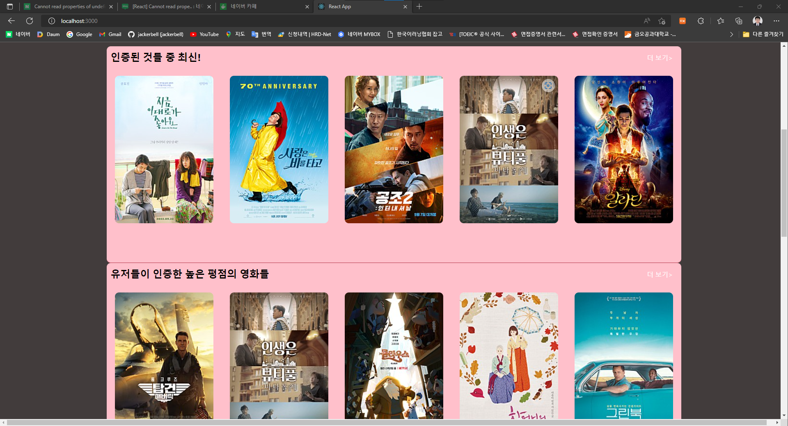

 

구글링으로 검색하며 시행착오를 거친 결과!  

**spread operator(...)**로 먼저 사전에 정의한 **state(useState([]))**의 원소들을 분해해 개별요소로 만든 후, 서버에서 호출한 데이터들을(JSON 배열)과 함께 배열로 묶어주면 [A데이터,B데이터,C데이터,D데이터] 이런식으로 배열이 정리가 된다. 

단, 한 화면에서 이렇게 불러오기 때문에 위의 화면이 로딩되는데 상당한 시간이 소요되었다. 

여기서 해결하기 위해 고민한 결과..  

반복 생성한 개별 컴포넌트에서 서버에서 요청하는 것이 더 나을 것이라 생각이 들었다. 

예로 무거운박스들을 한 번에 쌓아서 옮기는 것보다 

인원을 나눠서 병렬식으로 처리하는 것이 더 효율적이라는 생각하에, 반복생성한 컴포넌트 내부에서 개별적으로 요청을 처리하도록 코드를 아래와 같이 수정했다. 

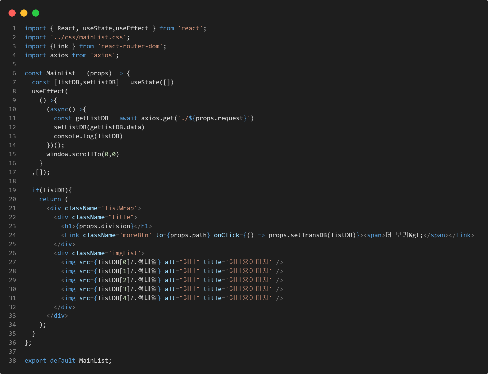

 

배열의 합성이 아쉽긴 하지만,.. 속도가 너무 처참하기에 어쩔 수 없는 수정을 감행했다.(내 시간이...) 

데이터를 개별적으로 호출한 것은 좋지만, 그럼 개별요청을 어떻게 구분할 것인가?? 에 대해서는 Line 11을 보면 **props.request**란 것이 있다. 

요놈은 바로 

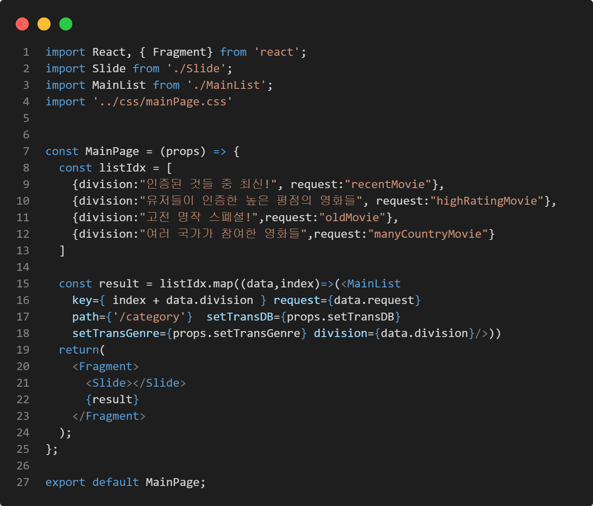

 

상위 컴포넌트에서 각 리스트에 제목을 할당하기 위해서 만든 JSON 배열에 **request**라는 프로퍼티를 추가했고, 이 프로퍼티는 서버파일(**server.js**)에 존재하는 요청문과 동일하다. 비교를 위해 아래에 서버파일에 존재하는 요청문을 넣어보았다. 

 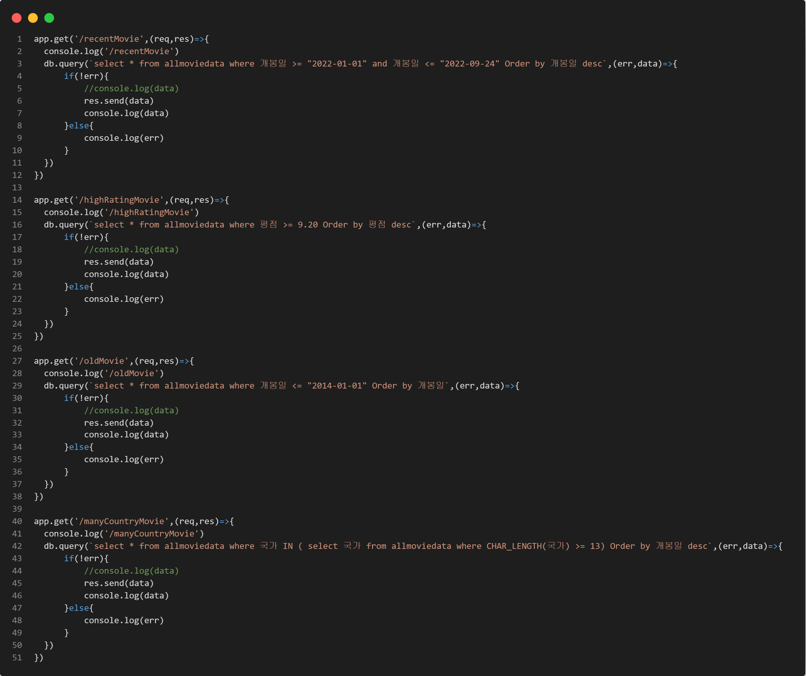

 

이러한 방식으로 분류를 해보니 이젠 1초가 조금 넘어가는 시점에 페이지가 모두 로딩되었다. 

그 다음은 카테고리 항목 작업.. 

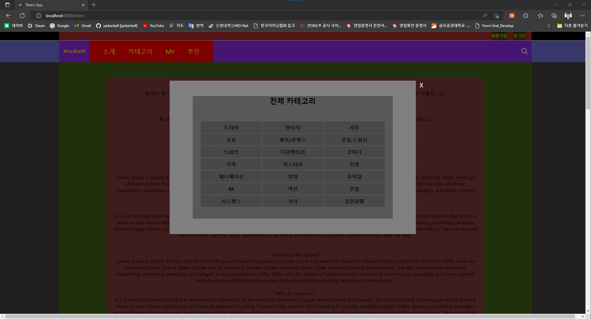

 

지난번 만들어 두었던 카테고리에 **Link** 태그를 넣어서 처리했다. 

각 장르를 클릭하면 카테고리 페이지로 이동해 해당 장르에 맞는 영화들을 이미지파일들을 나열하는 형식으로 처리했다.  

실행결과는 ! 

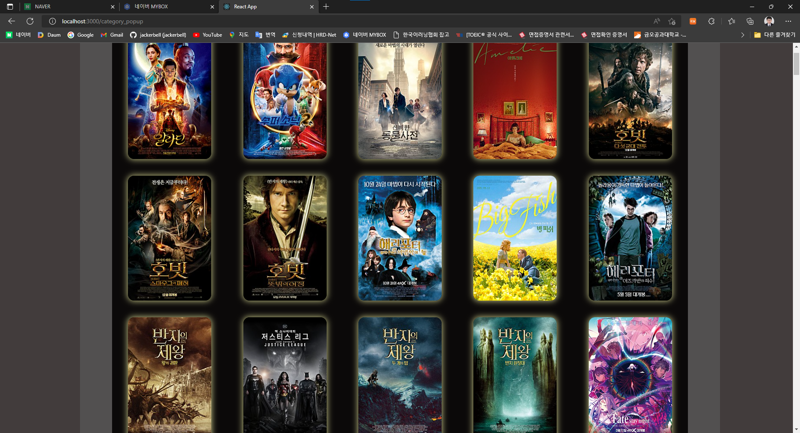

위와 같은 형식으로 처리해보았다.. 

이미지만 적당하게 가져오고 해당 이미지를 클릭했을 때 팝업창을 띄워서 상세 설명을 할 생각이다. 

우선 메뉴항목에서의 데이터 전송이 더 시급한 사항이기에 이는 좀 더 나중에 작업하기로 했다.(곧 만들 예정) 

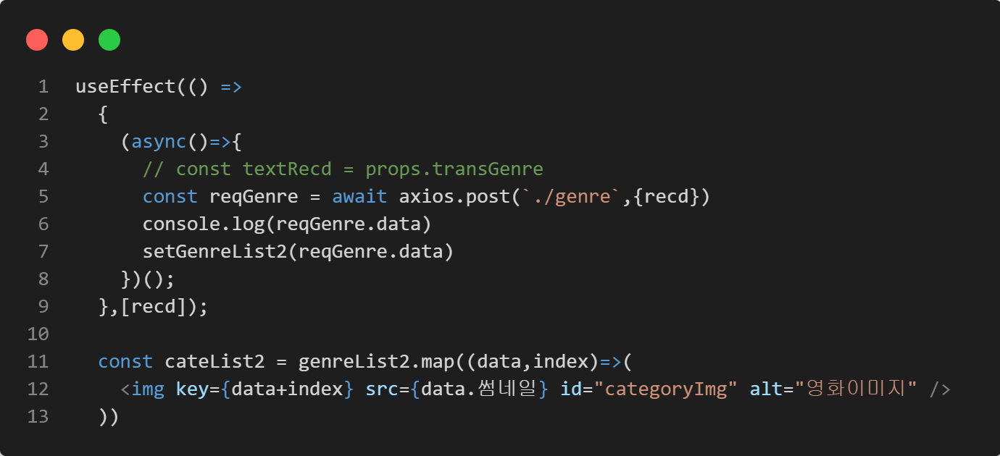

요청을 할 때, 중요한 점은 팝업창의 장르를 클릭했을 때, 페이지가 넘어감과 동시에  

장르별로 서버에 있는 요청문에 조건 부분으로 넣어야 한다는 점이었다. 

안 그러면 장르의 갯수에 맞춰서 조건문을 작성해야.. 할 수는 없기에!!!!!!!!!! 
위의 방식을 선택했다. 

간단히 클릭을 했을 때 해당 장르가 적힌 텍스트 **state**를 카테고리 컴포넌트에 넘긴 후 **axios** 요청에 넣어서 전송하고 **axios**에서는 받은 텍스트를 **sever.js**에 있는 **query** 요청문 내부의 조건문에 넣으면  

완성이다. 

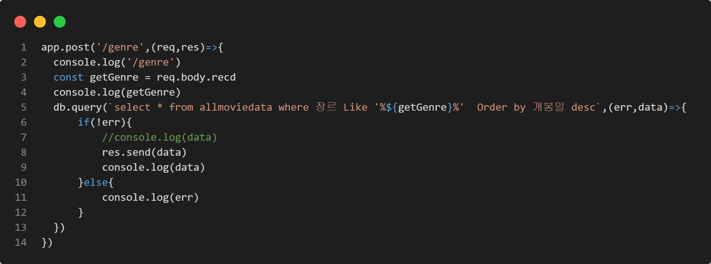

여기서.. 

**Header**와 **Category**는 부모 자식관계가 아닌 상황이지만 

팝업에서 나타난 장르를 눌렀을 때, 해당 장르의 키워드를 **axios**로 서버에 데이터를 요청하는 **Category** 컴포넌트까지 전달해주어야 한다. 

그래서 아래의 그림과 같은 방식으로 팝업창 내부의 키워드를 클릭이벤트로 전달했다. 

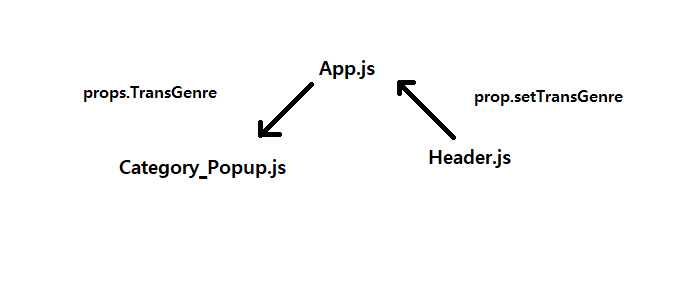

그림에 대해 설명하자면,  

우선 **Header.js** 컴포넌트에서 팝업창에서 키워드를 클릭할 때, 클릭한 키워드(텍스트)를 **props**로 전달받은 **setTransGenre**를 이용해 **transGenre**의 상태를 바꾸고

**Category_Popup.js** 컴포넌트로 이동한다. 

이 때, **App.js**의 **transGenre**의 상태가 바뀌면서 **Category_Popup.js 컴포넌트**에 **props**로 전달한 **transGenre**로 인해 키워드를 받고 해당 키워드를 **axios** 요청에 포함시켜 서버로 보내 조건문으로 사용.. 원하는 데이터를 출력하는 방식이다. (비슷한 방식으로 동작하는 모든 부분에 이 방식을 적용) 

먼저, **App.js**에 텍스트를 전달하기 위한 **state**를 생성하고 **Header** 컴포넌트에 **props**로 전달했다. 

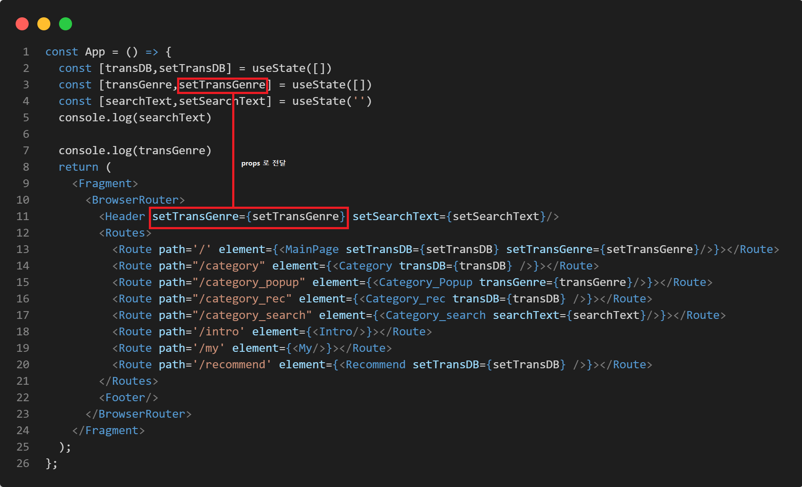

그 후 **props**로 전달받은 **setTransGenre**를 이용해 팝업창에서 장르 키워드를 클릭할 시 **transGenre**의 상태를 해당 키워드로 바꾸었다. 

여기서 **list**는 **genreList** 배열의 요소들을 순서대로 가져온다.  

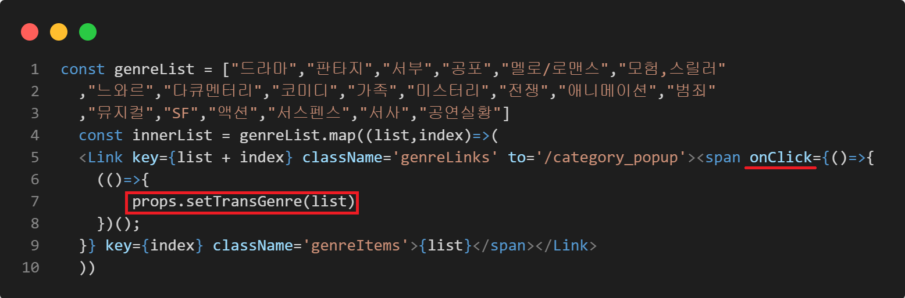

 

이제 팝업창에서 요소를 클릭했다고 가정한다면, **App.js**에 있는 **transGenre**의 상태가 클릭한 장르의 키워드로 바뀌어있을 것이다. 

이제 해당 키워드를 데이터를 요청하는 **Category** 컴포넌트(정확히는 **Category_Popup.js** 컴포넌트)로 전달해준다.  

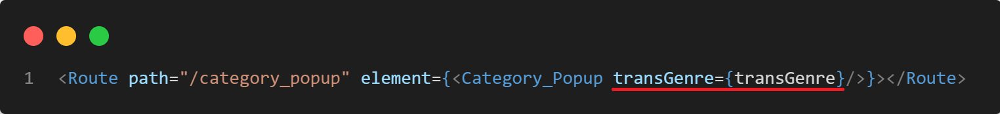

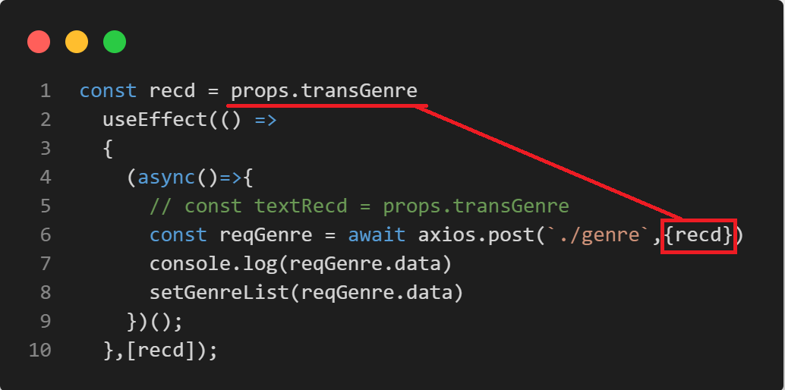

**useEffect**에서 **[recd]**의 경우 팝업창에서 키워드를 선택할 때마다, 서버에 계속 전송시켜 데이터를 받아올 필요가 있기 때문에, **transGenre**의 변화에 맞춰 실행되도록 설정했다. 

이렇게 **axios**를 통해서 서버 파일에 보낸 후  

서버 파일에서는 

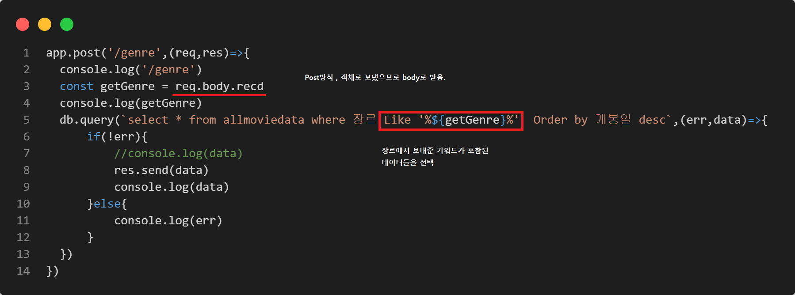

이렇게 처리해주면, 완료!! 

메뉴에 있는 추천항목도 이런 방식으로 처리를 했다.  

그렇기에 추천 항목은 추천 항목 화면만 보여주고 끝내겠다. 

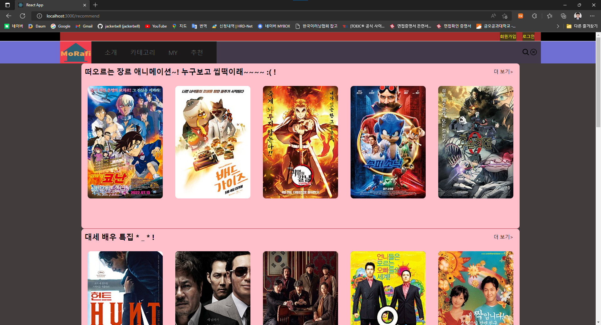

추천 항목 역시 메인화면에 나오는 리스트를 사용해서 나열하는 방식으로 처리를 했다. 

기본적으로 소개하는 것이 주이기에... 굳이 다른 스타일로 적용하지는 않았다. 

이제 최종적으로 각 이미지를 클릭했을 때, 팝업 형식 혹은 다른 컴포넌트를 불러와 소개 페이지로 이동하는 방식으로 해당 영화의 자세한 정보를 보여주는 것과 검색창을 활용해서 단어로 검색하는 기능이 필요한데 , 

우선 검색기능부터 만들기로 했다. 

간단한 애니메이션을 넣은 후  

검색기능을 넣었다. 

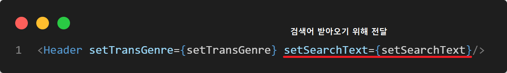

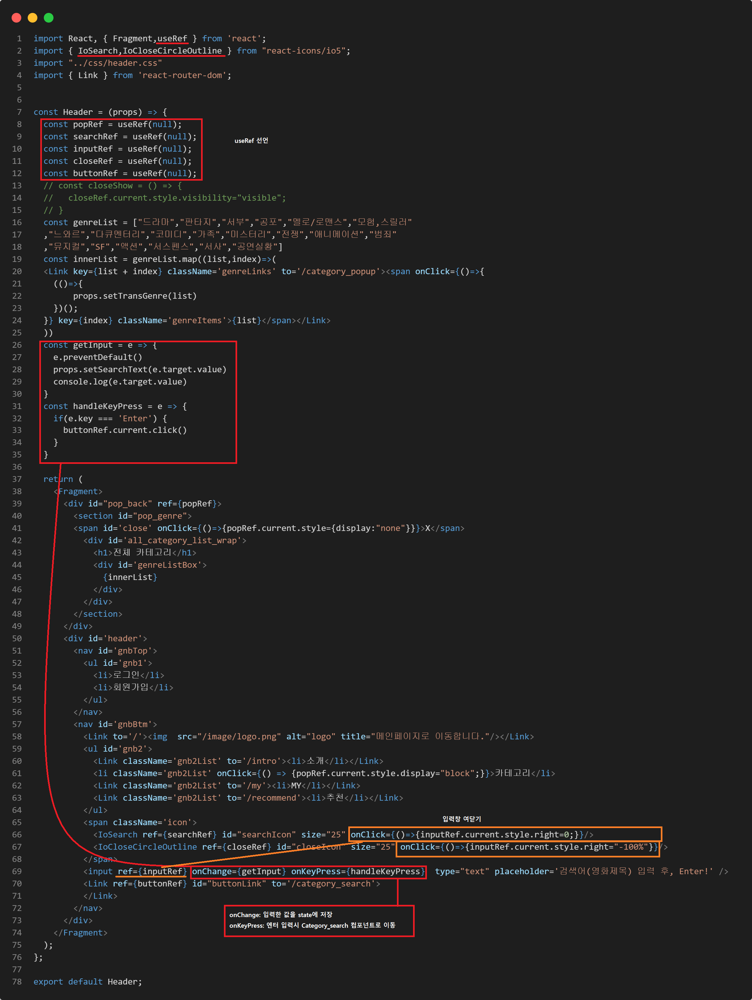

입력창의 경우 우선 화면밖으로 밀어뒀다가**( right:="-100%" )** 입력아이콘(돋보기)을 클릭하면 화면으로 끌어오고**(right=0)** 닫기아이콘을 클릭하면 다시 화면 밖으로 밀어내는**(right="-100%")**식으로 코드를 작성했다. 

한 가지 아쉬운 점은 닫기 버튼도 본래 입력아이콘을 눌렀을 때 입력창과 동시에 나타나도록 만들 예정이었으나 **onClick** 내부에 추가로 함수를 작성해도 효과가 없었고 외부에서 따로 함수를 정의한 뒤에  **closeRef**의 애니메이션을 적용한 뒤 호출식으로 함수를 불러봐도 적용이 되지 않아서 어쩔 수 없이 입력아이콘과 닫기아이콘을 화면에 동시에 띄워놨다..  

이는 방법을 찾는대로 바로 수정할 예정! 

 

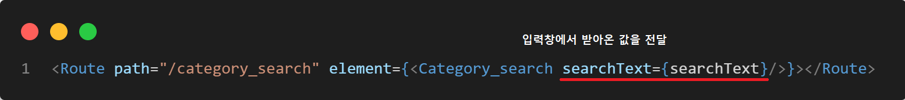

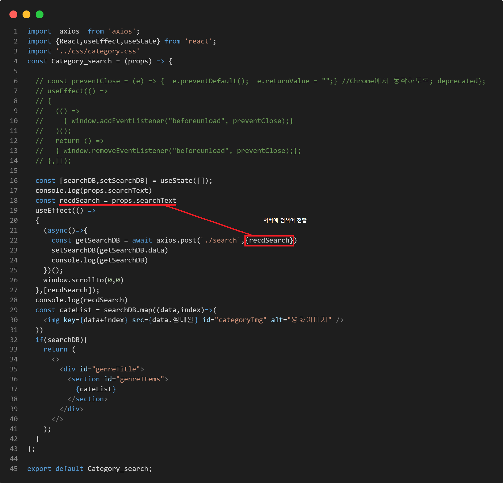

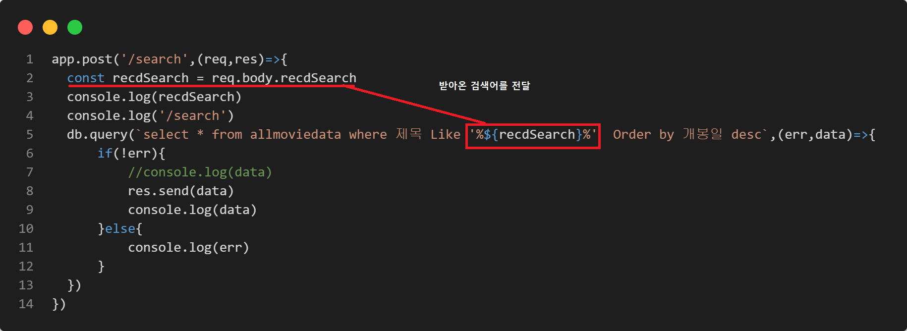

**useEffect**의 **[recdSearch]**의 경우도 팝업창과 동일한 원리로 설정해두었다.  

이후 실행해보면 아래와 같이 작동하는 것을 확인할 수 있다.  

[<video src="../../_images/GOMCAM 20221104_1421350557.mp4"></video>](https://user-images.githubusercontent.com/65724413/199899592-a4933676-7f75-4bfc-bbd4-efa2015200d0.mp4)

초성으로 바꿔보려 했으나..  

아직까지 만들지 못한 기능들(데이터 상세 조회,회원가입,로그인,My,리뷰글작성 등)이 많기에 어쩔 수 없이 단어차원의 검색수준으로 미뤄두고 추후 초성으로도 입력이 가능하도록 수정할 예정이다.  

후.......................... 

사실 어제(10월 18일) 올릴 예정이었으나..  

산골짜기에 있는 예비군 훈련장에 갔다오고 다른 일정과 겹치다보니 아예 공부조차 하지 못했다.. ㅠㅠ 

아직까지 만들어야할 기능들의 수와 난이도를 생각하면.. 

눈 앞이 캄캄해지지만.. 

 

만들면서,.. 참 많은 것들을 느낀다. 

이런 간단한 조회 기능 하나만 만드는데도 이렇게 노력이 많이 들어가는데 

실제 회사에서 서비스를 만드시는 분들이 정말 대단하다고 느껴진다...  

진심 **respect**~.... 

그러다보니 꼭 회사에 가서 업무를 통해 배우고 싶다는 생각이 든다. 

물론, 도움이 될만큼 내가 성장해야겠지만 ㅎㅎ 

이후에도 작업은 계속될 예정이다. 

최대한 이번 달안에는 끝내는 것이 목표..  

이력서도 써야하고 이래저래 일이 많다. 

하지만 힘내서 꼭 취업해야지!!!!!!! 

그럼, **20000!~**  

