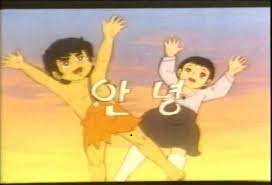

<h1>myMovieSite_portfolio_20221104</h1> 

<h3>1차 작업 완료 이후 지속적인 업데이트로.....</h3>

 

드디어... 

완성시키긴 했는디... 

아쉬운 결과다. 

 

`CRUD` 기능 중 사실 상 `Read(조회)` 기능만 구현했고, 나머지 기능들은 현재 시점에서 코드를 좀 더 보완한 뒤에 진행할 예정이다. 

`Redux`와 같은 상태관리 라이브러리를 바로 적용하기에는 실습을 통해 연습해볼 필요성을 느꼈기 때문에 `props`를 통해 해당 컴포넌트에 키워드를 보내는 식으로 설계했다. 

추가로, 마크(일종의 북마크) 기능을 통해서 자신이 좋았다고 생각한 영화를 따로 기록할 수 있게 되었지만 이후 My 리스트를 구현하는 과정이 좀 더 정리가 필요하다고 생각했다. 

마크 기능은 로그인 이후 되는 것으로 설계했기 때문에, 기능을 확실하게 구현하려면 좀 더 시간이 필요하다고 느꼈다. 

소요된 기간은 총 50일 정도 였다.  

인트로는 여기까지로 하고.... 본격적으로 진행과정을 보고하겠다.!!  

먼저 검색창에 간단한 애니메이션을 추가해보았다.  

기존에 `search(돋보기)`아이콘과 닫기 아이콘이 화면에 모두 나와있는 상태였지만, 조금 수정을 했다.  

본래 `getElementById` 요소같이 객체에 직접 접근하는 것을 리액트에서는 지양하는 것으로 알고있다. 

컴포넌트 자체가 인스턴스를 다수 보유할 수 있고, 해당 인스턴스에는 `id`를 비롯한 여러 요소들이 존재한다.  

다른말로 `id`를 썼을 경우 중복이 될 수 있기 때문에... 보통은 `DOM`을 제어할 경우 `ref`를 쓰는 것으로 알고있다.(물론, `ref`도 가급적 쓰지 않는 편이 좋은 걸로 알고 있다.) 

다만, 이번 같은 경우 closeIcon, searchIcon에 대해서는 `ref`를 `인스턴스`로 넣어도 작동되지 않았는데 이유는.. 

해당 아이콘 역시도 컴포넌트였기 때문이다. 

즉, 커스텀 컴포넌트는 `ref` 속성이 존재하지 않아 `ref`를 전달받을 수 없어서 `forwardRef`를 이용해 부모컴포넌트에서 자식컴포넌트로 `props`를 통해 전달해야 했다. 

그렇기 때문에 `ref`를 컴포넌트에 인스턴스로 넣고 동작시키려고 해도 반응이 전혀없었던것... 

콘솔창에서도 `forwardRef`에 대한 언급이 있었는데.. 이 때문에 경고문이 등장한 것이었다.  

다만, 각각이 따로 독립된 상태로 존재해야 했고 그에 따라 코드를 작성해서 실험해봤지만 요소에 반응이 없어서 

동작을 구현하기 위해 `getElementById`를 사용해 구현했고 결과는 아래와 같다.  

[<video src="../../_images/GOMCAM 20221104_1132290642.mp4"></video>](https://user-images.githubusercontent.com/65724413/199899195-096f8fb3-28aa-4285-a01a-dba1d8175c30.mp4)

 

애니메이션 자체는 간단하지만 그 중 `visibility`라는 속성을 사용한 이유를 설명하자면, `opacity`의 경우 대상을 투명하게 만들 수 있지만 사용한 이후에도 그대로 영역을 차지하고 있기 때문에 대상과 함께 영역까지 사라지게 만드는 속성인 `visibility`를 사용했다. 

 

 

그 다음으로 했던 것은 상세 페이지 작업이었다.  

추천리스트까지 만들었고 주제별로 db를 정리한 작업과 더불어 검색기능까지 구현했기에 이제 이 데이터들에 대한 상세 정보를 보여주는 페이지를 작업할 순서였다. (추가로 북마크까지) 

해당 이미지의 경우 서버에서 불러온 data 항목중 `이미지` 프로퍼티를 반영한 것인데, 그 외에도 제목, 평점, 개봉일 등 많은 프로퍼티들이 내재되어 있다. 

여기서 이미지를 클릭할 시 서버로 제목을 보내 조건으로 제목을 통해 검색할 수 있도록 만들어보았다. 

 

 

데이터를 받아오는 것과 `post`로 보내는 것 자체는 이전에도 했었던 작업이기에 비슷한 방식으로 진행했고 결과도 무난하게 잘 나왔다. 

상세 페이지 다음은 북마크 차례!!, `localstorage`는 여기서 처음 사용해보았다.  

<a href="https://we1cometomeanings.tistory.com/340 ">[we1comeToMeaningS](https://we1cometomeanings.tistory.com/) </a>

위 사이트의 내용을 참조해서 프로젝트에 적용시켜 보았다. 

간단히 정리해보자면... 

클릭했을 때, 북마크의 글자색을 변화시키기 위한 `toggle state`를 만들었고 마크의 `class`에는 `toggle` 여부에 따라 다른 클래스를 적용시키는 삼항연산자를 적용했다.  

거기에 더해서 `onClick 이벤트`를 부여해 `setToggle` 함수를 이용해 `toggle`의 상태를 바꾸도록 설정했다. 

`state`를 보면 `localstorage.getItem('toggle'+props.code)`라고 되어있는데  

이는 새로고침을 할 경우 모든 state가 초기화가 되면서 처음부터 렌더링 과정을 시작하기에 상태 저장이 되지 않기 때문이다. 

`localstorage`는 웹 상에 있는 공간에 저장을 해두므로 쿠키나 세션같이 브라우저를 새로고침 해도 상태가 유지될 수 있다. 

`localstorage.setItem('toggle',props.code,value)`로 먼저 `storage`내부에 `'toggle'+props.code`라는 키 값과 `value`를 동시에 선언한다. 

이 때, `value` 는 문자열로만 저장이 되므로 만약 그 이외의 값을 넣을 경우 `JSON.stringify()` 함수를 통해 `JSON 문자열`값으로 변환해주어야 한다. 

그렇기에 상태를 유지하기 위해서 최초 선언시 `locastorage`에서 데이터를 꺼내오는 형태로 설정하였고 아래에서 키와 값을 넣어준것! 

참고로 `props.code`는 `data`의 프로퍼티 중 `url`코드 끝부분에 있는 영화의 코드를 의미하는데 처리방식은 아래와 같다. 

 

끝 부분에 `listDB[index].url.slice(53,)` 라고 되어 있는데 url의 끝부분중 `https://naverMovie.xxxxxxx...code=Number` 형식의 url이므로 53번째부터 끝까지 즉 숫자가 시작되는 영역부터 끝까지 slice로 잘라내고 이를 세부페이지에 보내는 형식이다. 

이런 식으로 키 값을 구분해놓지 않으면 모든 영화의 세부페이지에서 북마크 상태가 공유되어버린다. 

A영화를 마크했는데 B,C,D... 등 다른 영화들도 북마크되어 있는 상태로....... 

상세페이지에서의 `+props.code`는 구별을 위한 장치인 셈이다.  

그래서 마킹을 하면 아래와 같이 my의 글자색이 노란색으로 바뀌는 것을 알 수 있다. 

새로고침을 해도 변화가 없다. 

[<video src="../../_images/GOMCAM 20221104_1356180046.mp4"></video>](https://user-images.githubusercontent.com/65724413/199899345-e8137e46-4a8c-42c1-a155-87dfb8f365fa.mp4)

그 외에는 카테고리 항목으로 갔을 때,

이미지가 무한정 나열되는 것이 보기가 좋지 않아 페이지네이션 작업을 했다. 

먼저 결과 코드부터 보자면..

일전 학원에서 실습으로 사용했던 것을 참조해 만들어보았다. 

페이지 수가 10페이지 수가 10페이지가 넘으면 10페이지씩 넘길 수 있는 이동키(`before10`,`next10`)이 활성화되도록 하였고 

이전, 다음페이지의 경우 이전페이지가 없거나 다음페이지가 없을 경우에 대해서 간단히 조건문을 작성하여 처리하였다.  

현재 페이지를 표시하는 기능은 앞에서 보여준 것처럼 삼항연산자를 이용해 현재페이지와 이미지에서 가져온 `props.currentPage`를 매칭시켜 현재 페이지가 맞는지 조건문으로 확인한 후 스타일을 적용하는 식으로 구현했다.  

이 부분에 대해서는 아래의 url을 참고하면 좋겠다. 

<a href="https://jackerbell.github.io/coding/class03(pagination)/">Class03(pagination)</a> 

구현 결과는 아래와 같다. 

 

그 외에도 스타일을 조금 수정하거나  

`footer`에 내용을 추가하는 등 작은 수정사항들이 있었다. 

기간도 넘었고, 만족스러운 결과는 아니었지만... 

여기까지라도 구현할 수 있었던 점이 내심 뿌듯했다. 

기능은 앞으로도 추가될 예정이다. 

가장 먼저 추가를 한다면, 로그인/회원가입 기능 구현할 것이다.  

가능하면 server의 session을 이용하고 싶지만 아직 바로 다룰 수 있는 수준은 아니기 때문에  

먼저 `session storage`로 구현을 해본 후 연습하면서 도입을 할 예정이다.  

그 외에도 댓글, talk 등 넣고 싶은 부분이 굉장히 많고 사실... 새로고침을 할 때 state가 유지되지 않아 그 부분에 대해 문제해결이 시급하다.... 

후................. 

여기까지조차도 사실 힘들었다. 

업데이트는 지금 당장은 어렵다.(자소서, 코테준비, 면담 등.... ) 

그 다음 작업사항으로는 대망의 호스팅이 남아있다... 그를 위해 MySQL도 다운그레이드 해야한다. (8.0 → 5.7)  그렇게 해야 cafe24 호스팅을 이용할 수 있다... 

여전히 갈 길이 멀지만 그래도 꾸준히 성장하다보면, 언젠가 되겠지... 

개발자!!!!!! 

... 

부족한 호스팅이었지만 앞으로 더 발전할테니 기대하시길~~~~!!!!!!!!!   
그럼 20000   

