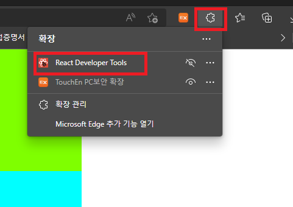

# 2022. 08. 11. 수업내용 정리 #

## CRUD 구현..  (코드 설명 위주로)

<br><br>

* 주제

  app.js에서 생성한 데이터를 바탕으로 CRUD(생성,조회,수정,삭제) 기능 구현<br>

  ```react
  //App.js
  
  import './App.css';
  import {Component} from 'react';
  
  class App extends Component {
  
    constructor(props){
      super(props)
      this.state={
          // 사용할 데이터 
        personList:[
          {name:'이민호',age:20,height:176.6},
          {name:'정채연',age:21,height:162.4},
          {name:'송중기',age:22,height:177.8},
          {name:'김철수',age:23,height:176.2}
        ]
      }
    }
  
   
  
  
    render(){
      
  
  
      return (
        <div id="App">
        </div>
      );
    }
  }
  
  export default App;
  
  ```

  ```css
  /* App.css */
  
  #App{
    width:1000px;
    height:1000px;
    background-color: aqua;
    margin:0 auto;
  }
  ```

  <br><br>

  * Read(조회.. 이번 예시에서는 전체 조회 기능만 만듭니다.)

    1. 먼저 App.js에서 생성한 `personList` 데이터를 화면에 렌더링시키기 위해 `Person.js`컴포넌트와 `Person.css`  파일을 각각 생성해줍니다.<br>

    ```react	
    /* Person.js */
    
    import {Component} from 'react';
    import '../css/Person.css';
    class Person extends Component {
    
      constructor(props){
        super(props)
        this.state={
        }
      }
    
    
      render(){
        const {edit}=this.state
          return (
            <div id="Person">
                  <div>
                      이름:{this.props.name}
                  </div>
                  <div>
                      나이:{this.props.age}
                  </div>
                  <div>
                      키:{this.props.height}
                  </div>
                  <button>삭제</button>
                  <button>수정</button>
            </div>
          ); 
      }
    }
    
    export default Person;
    
    ```

    ```css
    /* Person.css */
    
    #Person{
        width:800px;
        height:100px;
        background-color: chartreuse;
        margin:20px;
    }
    ```

    <br>

    2. 생성한 `Person.js`컴포넌트를 App.js로 import한 후 array.map() 함수를 이용해 데이터의 길이만큼 반복 생성합니다. <br>

    ```react	
    //App.js
    
    import './App.css';
    import {Component} from 'react';
    import Person from './components/Person.js';
    
    class App extends Component {
    
      constructor(props){
        super(props)
        this.state={
          // 사용할 데이터
          personList:[
            {name:'이민호',age:20,height:176.6},
            {name:'정채연',age:21,height:162.4},
            {name:'송중기',age:22,height:177.8},
            {name:'김철수',age:23,height:176.2}
          ]
        }
      }
    
    
      render(){
        //personList배열을 map한다.(매핑-대응)
        const result=this.state.personList.map(
          (data)=>(<Person key={data.name} name={data.name} 
          age={data.age} height={data.height}/>)
        )
        //const result=<Person name="이민호" age=21 height=176.6/>
        //<Person name="정채연" age=22 height=162.4/>
        //<Person name="이민호" age=21 height=176.6/>
    
    
        return (
          <div id="App">
            {result}  <!-- map함수를 통해 데이터를 넣고 재배열시킨 결과가 렌더링 -->
          </div>
        );
      }
    }
    
    export default App;
    
    ```

    <br>

    웹페이지 화면 ▼

    /모두연동.png)

    <br>

    <br>

  * Create(생성)

    1. 새로운 정보를 생성하기 위해서 `InputComp.js`와 `InputComp.css`파일을 아래와 같이 작성해줍니다.  <br>
  
    ```react
    /* InputComp.js */
    
    import '../css/InputComp.css';
    import {Component} from 'react';
    
    class InputComp extends Component{
        constructor(props){
            super(props)
            this.state={            // 1. 내부에서 사용할 state 생성..
                name:'',
                age:'',
                height:''
            }
        }
    
        addPersonInfo=()=>{         // 2. 추가 기능 생성
            alert("추가!(InputComp.js)")
            const {name,age,height}=this.state
            //비(아닐)구조화 할당 (destruction assignment - ES6)
            //구조분해할당, 파괴 할당
            alert("추가할 이름(InputComp.js):"+name)
            alert("추가할 나이(InputComp.js):"+age)
            alert("추가할 키(InputComp.js):"+height)
    
            this.props.addPersonInfo(name,age,height)
            //App.js의 addPersonInfo.. 자식 컴포넌트 요소에서 부모 컴포넌트 요소로 값을 전달해주기 위해 필요함. (props 이용)
        }
    
        // 3. 이름, 나이, 키에 대해서 입력한 값을 state의 값으로 넣어주기 위한 이벤트 객체 기능 사용.
        nameChange=(e)=>{//매개변수에 이벤트 객체가 넘어오고
            console.log(e.target.value)//이벤트가 일어난곳의 value (input value)
            this.setState({
                name:e.target.value
            })
        }
    
        ageChange=(e)=>{
            this.setState({
                age:e.target.value
            })
        }
    
        heightChange=(e)=>{
            this.setState({
                height:e.target.value
            })
        }
    
    
        render(){
            return(
                <div id='InputComp'>
                    <!-- 각 입력 부분마다 -->
                    <input type='text' placeholder='이름 입력' 
                    onChange={this.nameChange}/>
                    <input type='text' placeholder='나이 입력'
                    onChange={this.ageChange}/>
                    <input type='text' placeholder='키 입력'
                    onChange={this.heightChange}/>
                    <button onClick={this.addPersonInfo}>추가</button>
                </div>
            )
        }
    }
    
    export default InputComp;
    ```
  
    ```css
    /* InputComp.css */
    
    #InputComp{
        width:1000px;
        height:200px;
        background-color: chartreuse;
    }
    ```

    <br>

    2. 생성한 `InputComp.js`파일을 App.js로 import 한 후, `addPersonInfo` 함수를 가져옵니다. <br>
  
    ```react
    /* App.js */
    
    import './App.css';
    import {Component} from 'react';
    import Person from './components/Person.js';
    import InputComp from './components/InputComp.js';
    
    class App extends Component {
    
      constructor(props){
        super(props)
        this.state={
          personList:[
            {name:'이민호',age:20,height:176.6},
            {name:'정채연',age:21,height:162.4},
            {name:'송중기',age:22,height:177.8},
            {name:'김철수',age:23,height:176.2}
          ]
        }
      }
    
      addPersonInfo=(name,age,height)=>{ // 여기에서 name, age, height은 Input.comp에서 e.target을 통해 입력값을 받은 값들. 
        alert("추가(App.js)")
        alert("추가할 이름(App.js):"+name)
        alert("추가할 나이(App.js):"+age)
        alert("추가할 키(App.js):"+height)
        const personObj = {name:name,age:age,height:height}// 새로 추가할 데이터 정보를 담을 배열
        this.setState({
          personList:this.state.personList.concat(personObj)// 원본 자체를 변환시키지 않고 반환을 통해 추가를 하려면 concat 사용!
        })
        //push vs concat
        //push 추가된 배열이 반환 안되고, push만하면 배열자체가 바뀜
        //concat 추가된 배열이 반환된다.
      }
    
    
      render(){
        const result=this.state.personList.map(
          (data)=>(<Person key={data.name} name={data.name} 
          age={data.age} height={data.height}
          deletePerson={this.deletePerson}
          updatePerson={this.updatePerson}/>)
        )
    
        return (
          <div id="App">
            <InputComp addPersonInfo={this.addPersonInfo}/> <!-- App.js에서 생성한 addPersonInfo로 입력한 데이터값을 가져올 수 있음 -->
            {result}
          </div>
        );
      }
    }
    
    export default App;
    
    ```

    <br>

    웹페이지 화면 ▼

    /모두연동-16609785551178.png)

    <br>

    데이터 추가 ▼

    /모두연동-16609770192444.png)

    <br><br>

  * Delete(삭제)

    1.다시 Person.js로 돌아가서 삭제 기능을 추가하기 위해서 `deletePerson`함수를 만들어주고 미리 생성해두었던 삭제 버튼에 `onClick`이벤트를 추가해줍니다. 이 때, 삭제할 대상을 선택할 수 있도록 부모요소에서 `name`  값을 받아옵니다.<br>
  
    ```react
    /* Person.js */
    
    import {Component} from 'react';
    import '../css/Person.css';
    class Person extends Component {
    
      constructor(props){
        super(props)
        this.state={
        }
      }
    
      deletePerson=()=>{
        alert("삭제!(Person.js)")
        alert("삭제할 이름:"+this.props.name)
        this.props.deletePerson(this.props.name)
          //App.js가 넘긴 삭제함수
      }
    
      ageChange=(e)=>{
        console.log(e.target.value)
        this.setState({
          age:e.target.value
        })
      }
    
    
      render(){
          return (
            <div id="Person">
                  <div>
                      이름:{this.props.name}
                  </div>
                  <div>
                      나이:{this.props.age}
                  </div>
                  <div>
                      키:{this.props.height}
                  </div>
                  <button onClick={this.deletePerson}>삭제</button>
                  <button>수정</button>
            </div>
          ); 
      }
    }
    
    export default Person;
    
    ```

    2. 부모요소에서도 `deletePerson` 함수를 생성하여 `name`을 인수로 전달해줍니다.<br>

       삭제의 경우 `array.filter`함수를 활용해 삭제 버튼이 눌린 데이터의 이름과 매칭되는 데이터를 제외한 나머지 데이터로만 재배열시키는 방식으로새롭게 `personList`를 재배열시킵니다. 그렇게 되면 삭제 버튼이 눌린 데이터만 삭제됩니다. <br>
  
    ```react
    /* App.js */
    
    import './App.css';
    import {Component} from 'react';
    import Person from './components/Person.js';
    import InputComp from './components/InputComp.js';
    
    class App extends Component {
    
      constructor(props){
        super(props)
        this.state={
          personList:[
            {name:'이민호',age:20,height:176.6},
            {name:'정채연',age:21,height:162.4},
            {name:'송중기',age:22,height:177.8},
            {name:'김철수',age:23,height:176.2}
          ]
        }
      }
    
      addPersonInfo=(name,age,height)=>{
        alert("추가(App.js)")
        alert("추가할 이름(App.js):"+name)
        alert("추가할 나이(App.js):"+age)
        alert("추가할 키(App.js):"+height)
        const personObj = {name:name,age:age,height:height}
        this.setState({
          personList:this.state.personList.concat(personObj)
        })
      }
    
      deletePerson=(name)=>{
        alert("삭제!(App.js)")
        alert("삭제할 이름(App.js):"+name)
        //...
        const filteredList=this.state.personList.filter(
          (data)=>(data.name != name) )//조건에 맞는 원소만 통과
          //JSON배열에서 배열원소가 data로 하나씩 넘어오고
          //배열 데이터의 name이 매개변수 name과 다른 원소만 리턴되서
          //새로운 배열로 만들어진다.
        this.setState({
          personList:filteredList
        })
      }
    
    
      render(){
        const result=this.state.personList.map(
          (data)=>(<Person key={data.name} name={data.name} 
          age={data.age} height={data.height}
          deletePerson={this.deletePerson}/>) // deletePerson 함수 연동..  
        )
    
        return (
          <div id="App">
            <InputComp addPersonInfo={this.addPersonInfo}/>
            {result}
          </div>
        );
      }
    }
    
    export default App;
    
    ```

    <br>

    웹페이지 화면 ▼

    /모두연동-16609784560486.png)

    <br>

    삭제된 후 ▼

    /image-20220820155456538.png)

    <br><br>

  * Update(수정)

    최종적으로 생성된 정보를 수정하는 기능을 넣기 위해서 `Person.js`파일에서 `updatePerson`함수를 생성합니다. <br>

    이 때, 생성된 정보를 수정하면 새로 입력을 해야하므로, 렌더링 함수로 넘겨줄 반환값을 조건에 따라 두 가지로 형성합니다. (수정가능, 수정불가능)<br>
  
    ```react
    /* Person.js */
    
    import {Component} from 'react';
    import '../css/Person.css';
    
    class Person extends Component {
    
      constructor(props){
        super(props)
        this.state={
          edit:false,//isLoggedIn:false
          age:this.props.age//20
        }
      }
    
      deletePerson=()=>{
        alert("삭제!(Person.js)")
        alert("삭제할 이름:"+this.props.name)
        this.props.deletePerson(this.props.name)
      }
    
      updatePerson=()=>{
        alert("수정!(Person.js)")//소속명시
        const {edit,age}=this.state//비구조화할당
        const {name}=this.props//비구조화할당
        if(edit===true){
          //수정버튼 클릭했는데 현재 지금 수정 가능모드다.
          this.props.updatePerson(name,age)//App.js의 수정함수
        } 
        //수정불가능모드 -> 수정가능 모드 -> 수정 불가능
        this.setState({
          edit:!this.state.edit
        })
        //false->true->false->true
        //수정불가능화면->수정가능화면->수정불가능화면->수정가능화면
      }
    
      ageChange=(e)=>{
        console.log(e.target.value)//30
        this.setState({
          age:e.target.value
        })
      }
    
    
      render(){
        const {edit}=this.state
        if(edit===false){//수정불가능 모드일때
          return (
            <div id="Person">
                  <div>
                      이름:{this.props.name}
                  </div>
                  <div>
                      나이:{this.props.age}
                  </div>
                  <div>
                      키:{this.props.height}
                  </div>
                  <button onClick={this.deletePerson}>삭제</button>
                  <button onClick={this.updatePerson}>수정</button>
            </div>
          );
        }else{//수정가능 모드일때
          return (
            <div id="Person">
                  <div>
                      이름:{this.props.name}
                  </div>
                  <div>
                      나이:<input type='text' defaultValue={this.props.age}
                      onChange={this.ageChange}/>
                  </div>
                  <div>
                      키:{this.props.height}
                  </div>
                  <button onClick={this.deletePerson}>삭제</button>
                  <button onClick={this.updatePerson}>수정</button>
            </div>
          );  
        }
        
      }
    }
    
    export default Person;
    
    ```

    <br>

    2. App.js에서 `updatePerson`함수 생성 후 삼항연산자와 `spread` 연산자를 활용하여 `personList`를 재배열시킵니다.  
  
    ```react
    /* App.js */
    
    import './App.css';
    import {Component} from 'react';
    import Person from './components/Person.js';
    import InputComp from './components/InputComp.js';
    
    class App extends Component {
    
      constructor(props){
        super(props)
        this.state={
          personList:[
            {name:'이민호',age:20,height:176.6},
            {name:'정채연',age:21,height:162.4},
            {name:'송중기',age:22,height:177.8},
            {name:'김철수',age:23,height:176.2}
          ]
        }
      }
    
      addPersonInfo=(name,age,height)=>{
        alert("추가(App.js)")
        alert("추가할 이름(App.js):"+name)
        alert("추가할 나이(App.js):"+age)
        alert("추가할 키(App.js):"+height)
        const personObj = {name:name,age:age,height:height}
        this.setState({
          personList:this.state.personList.concat(personObj)
        })
      }
    
      deletePerson=(name)=>{
        alert("삭제!(App.js)")
        alert("삭제할 이름(App.js):"+name)
        //...
        const filteredList=this.state.personList.filter(
          (data)=>(data.name != name) )
        this.setState({
          personList:filteredList
        })
      }
    
      updatePerson=(name,age)=>{
        alert("수정!(App.js)")
        alert("수정대상 이름:"+name)//이민호
        alert("수정할 값:"+age)//30
        //어떤 함수 써서 JSON배열 변경
        /*
        const jsonArrayLen=this.state.personList.length
        var {personList}=this.state//비구조화할당
        es5 기준 방법
        for(var i=0; i<jsonArrayLen; i++)
        {
          if(personList[i].name==name){
            console.log('찾았다!')
            console.log(personList[i].name)
            console.log(personList[i].age)
            console.log(personList[i].height)
            personList[i].age=age
          }
        }
        this.setState({
          personList:personList
        })
        */
        // ...(삼점연산자-three dot opeartor) , map , =>
        // 재배열된 함수를 넣을 변수 생성 이후 다시 매핑.. 
        const updateStudentList=this.state.personList.map(
          (data)=>(data.name === name)? ({...data,age:age}):data 
            //person.js에서 수정버튼을 누른 리스트의 데이터'name'과 일치하는 데이터가 있을 경우에는 해당 데이터의 age항목을 바꾸고 'name'과  일           치하는 대상이 없을 경우 데이터 목록을 그대로 반환
        )//... spread operator (펼친다.)
        //data.name - state안에 있는 JSON배열의 원소의 name
        //name - 함수 매개변수가 받은 name
        
        this.setState({
          personList:updateStudentList
        })
    
    
      }
    
      render(){
        const result=this.state.personList.map(
          (data)=>(<Person name={data.name} 
           age={data.age} height={data.height}
           deletePerson={this.deletePerson}
           updatePerson={this.updatePerson}/>) 
        )
    
        return (
          <div id="App">
            <InputComp addPersonInfo={this.addPersonInfo}/>
            {result}
          </div>
        );
      }
    }
    
    export default App;
    
    ```

    <br>

    웹페이지 화면 ▼

    /image-20220820165441575.png)

  /모두연동-166098243261710.png)

  <br>

  수정완료 ▼

  /모두연동-166098249785812.png)

  <br>

  ★ 참고로 edge, chrome 웹에서 확장프로그램으로 **React Develop Tools**를 설치하면 개발자도구에서 state의 변경사항을 확인할 수 있습니다. <br>

  1. 'Microsoft Edge 추가 기능 열기' 선택 후 react 검색<br>

  /모두연동-166098318527322.png)

  <br>

  2. 'React Developer Tools' 설치 확인 <br>
  
  <div style="text-align:center;">
  	
  </div>

  <br>

  3. 개발자 도구로 들어가서 'Components' 선택 <br>

  /모두연동-166098309087420.png)

  <br>

  수정 전 ▼<br>

  /모두연동-166098334767526.png)

  <br>

  수정 후 ▼<br>

  /모두연동-166098327154724.png)

  <br><br><br>

   조회 기능(위의 실습에서는 상시 전체 조회로 처리)은 사실 추가가 필요하나 수업상에서 진행하는데로 했기에 없으나 따로 컴포넌트를 만들어 구현을 해볼 예정입니다. <br>

   ref) : https://any-ting.tistory.com/9 클래스형 컴포넌트 하위 → 상위

  ​		: https://developer.mozilla.org/ko/docs/Web/JavaScript/Reference/Operators/Spread_syntax spread Operator

  ​		:https://devmoony.tistory.com/66 웹의 리액트 확장 프로그램 

  
  
  