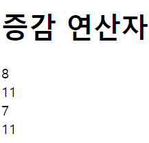
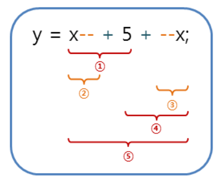

# 2022. 05. 13. 수업내용 정리 #3/3

## 연산자 ... 증감연산자

<br>

+ 증감연산자(increment and decrement operator)

  증감 연산자는 피연산자를 1씩 증가 혹은 감소시킬 때 사용하는 연산자입니다.<br>

  이 연산자는 피연산자가 단 하나뿐인 단항 연산자입니다.<br>

  <br>

  증감 연산자는 해당 연산자가 피연산자의 어느 쪽에 위치하는가에 따라 연산의 순서 및 결과가 달라집니다. 
  
  | 증감 연산자 |                            설명                             |
  | :---------: | :---------------------------------------------------------: |
  |     ++x     |  먼저 피연산자의 값을 1 증가시킨 후에 해당 연산을 진행함.   |
  |     x++     | 먼저 해당 연산을 수행하고 나서, 피연산자의 값을 1 증가시킴. |
  |     --x     |  먼저 피연산자의 값을 1 감소시킨 후에 해당 연산을 진행함.   |
  |     x--     | 먼저 해당 연산을 수행하고 나서, 피연산자의 값을 1 감소시킴. |
  
  ```html
  <!DOCTYPE html>
  <html lang="ko">
  
  <head>
  	<meta charset="UTF-8">
  	<title>JavaScript Operators</title>
  </head>
  
  <body>
  
  	<h1>증감 연산자</h1>
  
  	<script>
  		var x = 10, y = 10;
  		document.write((++x - 3) + "<br>");		// x의 값을 우선 1 증가시킨 후에 3을 뺌.
  		document.write(x + "<br>");				// 11
  		document.write((y++ - 3) + "<br>");		// 먼저 y에서 3을 뺀 후에 y의 값을 1 증가시킴.
  		document.write(y);						// 11
  	</script>
  	
  </body>
  
  </html>
  ```
  
  웹 페이지 화면 ▼
  
  
  
  <br><br>
  
+ 증감연산자의 연산 순서

  증감연산자는 피연산자의 어느 쪽에 위치하는가에 따라 연산의 순서가 달라집니다.

  <br><br>

  다음 예제는 증감연산자의 연산순서를 살펴보기 위한 예제입니다.

  ```html
  <!DOCTYPE html>
  <html lang="ko">
  
  <head>
  	<meta charset="UTF-8">
  	<title>JavaScript Operators</title>
  </head>
  
  <body>
  
  	<h1>증감 연산자의 연산 순서</h1>
  
  	<script>
  		var x = 10;				// 8
  		var y = x-- + 5 + --x;	// 23
  		
  		document.write(x + "<br>");
  		document.write(y);
  	</script>
  	
  </body>
  
  </html>
  ```

  웹 페이지 화면 ▼

  

<br>다음 그림은 위의 예제에서 수행되는 연산의 순서를 보여줍니다. 



<br>① : 첫번째 감소연산자(decrement operator)는 피연산자의 뒤쪽에 위치하므로, 덧셈 연산이 먼저 수행됩니다.

② : 덧셈 연산이 수행된 후에 감소 연산이 수행됩니다. (x의 값: 9)

③ : 두번째 갑소연산자는 피연산자의 앞쪽에 위치하므로, 덧셈 연산보다 먼저 수행됩니다.(x의 값: 8)

④ : 감소 연산이 수행된 후에 덧셈 연산이 수행됩니다.

⑤ : 마지막으로 변수 y에 결과값의 대입 연산이 수행됩니다. (y의 값: 23)