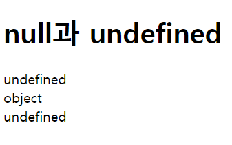
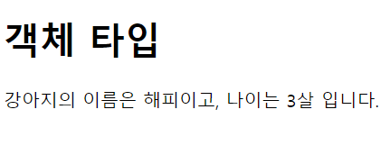

# 2022. 05. 13. 수업내용 정리 #1/3

## 타입 ... 

<br>

+ 타입

  타입(data type)이란 프로그램에서 다룰 수 있는 값의 종류를 의미합니다.<br>

  자바스크립트에서는 여러 형태의 타입을 미리 정의하여 제공하고 있으며, 이것을 기본 타입이라고 합니다.<br>

  자바스크립트의 기본 타입은 크게 원시 타입과 객체 타입으로 구분할 수 있습니다. <br><br>

  원시 타입(primitive type)은 다음과 같습니다.<br><br>

  1. 숫자열(number)
  2. 문자열(string)
  3. 불리언(boolean)
  4. 심볼(symbol) : ECMAScript 6부터 제공됨
  5. undefined<br><br>

  객체 타입(object type)은 아래와 같습니다.

  ```javascript
  var num = 10;          // 숫자
  var myName = "홍길동"; // 문자열
  var str;               // undefined
  ```

  <br>

+ 숫자(number)

  자바스크립트는 다른 언어와 달리 정수와 실수를 구분하지 않고, 모든 수를 실수 하나로만 표현합니다.<br>

  또한, 매우 큰 수나 매우 작은 수를 표현할 경우에 e표기법을 사용할 수 있습니다.

  ```javascript
  var firstNum = 10;     // 소수점을 사용하지 않은 표현
  var secondNum = 10.00; // 소수점을 사용한 표현
  var thirdNum = 10e6;   // 10000000
  var fourthNum = 10e-6; // 0.00001
  ```

  <br>

+ 문자열

  큰따옴표("")나 작은따옴표('')로 둘러싸인 문자의 집합을 의미합니다.<br>

  큰따옴표는 작은따옴표로 둘러싸인 문자열에만 포함될 수 있으며, 작은따옴표는 큰따옴표로 둘러싸인 문자열에만 포함될 수 있습니다.

  ```javascript
  var firstStr = "이것도 문자열입니다.";      // 큰따옴표를 사용한 문자열
  var secondStr = '이것도 문자열입니다.';     // 작은따옴표를 사용한 문자열
  var thirdStr = "나의 이름은 '홍길동'이야."  // 작은따옴표는 큰따옴표로 둘러싸인 문자열에만 포함될 수 있음.
  var fourthStr = '나의 이름은 "홍길동"이야.' // 큰따옴표는 작은따옴표로 둘러싸인 문자열에만 포함될 수 있음.
  ```

  <br>

+ 불리언

  참(true)과 거짓(false)을 표현합니다. <br>

  자바스크립트에서 불리언 값은 예약어인 true와 false를 사용하여 나타낼 수 있습니다. 

  ```javascript
  var firstNum = 10;
  var secondNum = 11;
  document.getElementById("result").innerHTML = (firstNum == secondNum); // false
  ```

  <br>

+ 심볼(symbol)

  ECMAScript 6부터 새롭게 추가된 타입입니다.<br>

  심볼은 유일하고 변경할 수 없는 타입으로, 객체의 프로퍼티를 위한 식별자로 사용할 수 있습니다.

  ```javascript
  var sym = Symbol("javascript");  // symbol 타입
  var symObj = Object(sym);        // object 타입
  ```

  <br>

+ typeof 연산자

  피연산자의 타입을 반환하는 피연산자가 하나뿐인 연산자입니다.

  ```javascript
  typeof 10;        // number 타입
  typeof "문자열";  // string 타입
  typeof true;      // boolean 타입
  typeof undefined; // undefined 타입
  typeof null;      // object 타입
  ```

  <br>

+ null & undefined

  자바스크립트에서 null이란 object 타입이며, 아직 '값'이 정해지지 않은 것을 의미합니다.<br>

  또한, undefined란 null과는 달리 '타입'이 정해지지 않은 것을 의미합니다.<br>

  따라서 자바스크립트에서 undefined는 초기화되지 않은 변수나 존재하지 않는 값에 접근할 때 반환됩니다.<br>

  ```html
  <!DOCTYPE html>
  <html lang="ko">
  
  <head>
  	<meta charset="UTF-8">
  	<title>JavaScript DataType</title>
  </head>
  
  <body>
  
  	<h1>null과 undefined</h1>
  	<p id="result"></p>
  
  	<script>
  		var num;		// 초기화하지 않았으므로 undefined 값을 반환함.
  		var str = null;	// object 타입의 null 값
  		
  		// 정의되지 않은 변수에 접근하면 undefined 값을 반환함.
  		document.getElementById("result").innerHTML = 
  			(typeof num) + "<br>" + (typeof str) + "<br>" + (typeof secondNum);
  	</script>
  
  </body>
  </html>
  ```

  웹 페이지 화면 ▼

  

null과 undefined는 동등연산자(==)와 일치연산자(===)로 비교할 때 그 결과값이 다르므로 주의해야 합니다.<br>

null과  undefined는 타입을 제외하면 같은 의미이지만, 타입이 다르므로 일치하지 않습니다.

```javascript
null ==  undefined; // true
null === undefined; // false
```

<br>

객체(object)

자바스크립트의 기본 타입은 객체(object)입니다.<br>

객체란 실생활에서 우리가 인식할 수 있는 사물로 이해할 수 있습니다.<br>

객체는 여러 프로퍼티(property)나 메소드(method)를 같은 이름으로 묶어놓은 일종의 집합체입니다.

```html
<!DOCTYPE html>
<html lang="ko">

<head>
	<meta charset="UTF-8">
	<title>JavaScript DataType</title>
</head>

<body>

	<h1>객체 타입</h1>
	<p id="result"></p>

	<script>
		var dog = { name: "해피", age: 3 };	// 객체의 생성

		// 객체의 프로퍼티 참조
		document.getElementById("result").innerHTML = 
			"강아지의 이름은 " + dog.name + "이고, 나이는 " + dog.age + "살 입니다.";
	</script>
	
</body>
</html>
```

웹 페이지 화면 ▼

