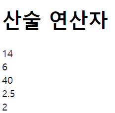
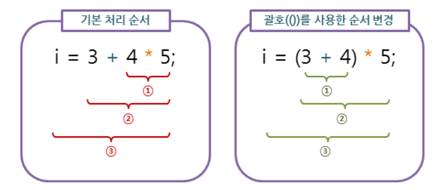
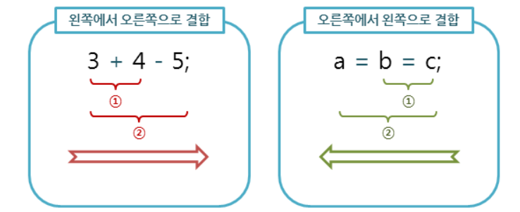

# 2022. 05. 13. 수업내용 정리 #2/3

## 변수 ... 

<br>

+ 연산자

  여러 종류의 연산을 위한 다양한 연산자를 제공하고 있습니다. <br><br>

  * 산술 연산자

    사칙연산을 다루는 가장 기본적이면서도 많이 사용하는 연산자입니다.<br>

    모두 두 개의 피연산자를 가지는 이항연산자이며, 피연산자들의 결합 방향은 왼쪽에서 오른쪽입니다.<br>

  | 산술 연산자 |                             설명                             |
  | :---------: | :----------------------------------------------------------: |
  |      +      |      왼쪽 피연산자의 값에 오른쪽 피연산자의 값을 더함.       |
  |      -      |      왼쪽 피연산자의 값에서 오른쪽 피연산자의 값을 뺌.       |
  |      *      |      왼쪽 피연산자의 값에 오른쪽 피연산자의 값을 곱함.       |
  |      /      |     왼쪽 피연산자의 값을 오른쪽 피연산자의 값으로 나눔.      |
  |      %      | 왼쪽 피연산자의 값을 오른쪽 피연산자의 값으로 나눈 후, 그 나머지를 반환함. |

  <br><br>

  ```html
  <!DOCTYPE html>
  <html lang="ko">
  
  <head>
  	<meta charset="UTF-8">
  	<title>JavaScript Operators</title>
  </head>
  
  <body>
  
  	<h1>산술 연산자</h1>
  
  	<script>
  		var x = 10, y = 4;
  		document.write(x + y + "<br>");
  		document.write(x - y + "<br>");
  		document.write(x * y + "<br>");
  		document.write(x / y + "<br>");
  		document.write(x % y);
  	</script>
  	
  </body>
  
  </html>
  ```

  웹 페이지 화면 ▼

  

  <br>

  * 연산자의 우선순위(operator precedence)와 결합방향(associativity)

    수식 내에 여러 연산자가 함께 등장할 때, 어느 연산자가 먼저 처리될 것인가를 결정합니다.<br>

    <br>

    아래 그림은 가장 높은 우선순위를 가지고 있는 괄호(( ))연산자를 사용해서 연산자의 처리 순서를 변경하는 것을 보여줍니다.

    

    <br>

    연산자의 결합 방향은 수식 내에 우선순위가 같은 연산자가 둘 이상 있을 때, 먼저 어느 연산을 수행할 것인가를 결정합니다.

    

    <br>

  * 연산자의 우선순위표

  | 우선순위 |   연산자   |                             설명                             |      결합 방향      |
  | :------: | :--------: | :----------------------------------------------------------: | :-----------------: |
  |  **1**   |     ()     |                          묶음(괄호)                          |          -          |
  |  **2**   |     .      |                          멤버 접근                           | 왼쪽에서 오른쪽으로 |
  |          |    new     |                     인수 있는 객체 생성                      |          -          |
  |  **3**   |     ()     |                          함수 호출                           | 왼쪽에서 오른쪽으로 |
  |          |    new     |                     인수 없는 객체 생성                      | 오른쪽에서 왼쪽으로 |
  |  **4**   |     ++     |                       후위 증가 연산자                       |          -          |
  |          |     --     |                       후위 감소 연산자                       |          -          |
  |  **5**   |     !      |                       논리 NOT 연산자                        | 오른쪽에서 왼쪽으로 |
  |          |     ~      |                       비트 NOT 연산자                        | 오른쪽에서 왼쪽으로 |
  |          |     +      |                   양의 부호 (단항 연산자)                    | 오른쪽에서 왼쪽으로 |
  |          |     -      |                   음의 부호 (단항 연산자)                    | 오른쪽에서 왼쪽으로 |
  |          |     ++     |                       전위 증가 연산자                       | 오른쪽에서 왼쪽으로 |
  |          |     --     |                       전위 감소 연산자                       | 오른쪽에서 왼쪽으로 |
  |          |   typeof   |                          타입 반환                           | 오른쪽에서 왼쪽으로 |
  |          |    void    |                        undefined 반환                        | 오른쪽에서 왼쪽으로 |
  |          |   delete   |                       프로퍼티의 제거                        | 오른쪽에서 왼쪽으로 |
  |  **6**   |     **     |                       거듭제곱 연산자                        | 오른쪽에서 왼쪽으로 |
  |          |     *      |                         곱셈 연산자                          | 왼쪽에서 오른쪽으로 |
  |          |     /      |                        나눗셈 연산자                         | 왼쪽에서 오른쪽으로 |
  |          |     %      |                        나머지 연산자                         | 왼쪽에서 오른쪽으로 |
  |  **7**   |     +      |                  덧셈 연산자 (이항 연산자)                   | 왼쪽에서 오른쪽으로 |
  |          |     -      |                  뺄셈 연산자 (이항 연산자)                   | 왼쪽에서 오른쪽으로 |
  |  **8**   |     <<     |                   비트 왼쪽 시프트 연산자                    | 왼쪽에서 오른쪽으로 |
  |          |     >>     |          부호 비트를 확장하면서 비트 오른쪽 시프트           | 왼쪽에서 오른쪽으로 |
  |          |    >>>     |         부호 비트를 확장하지 않고 비트 오른쪽 시프트         | 왼쪽에서 오른쪽으로 |
  |  **9**   |     <      |                    관계 연산자(보다 작은)                    | 왼쪽에서 오른쪽으로 |
  |          |     <=     |                관계 연산자(보다 작거나 같은)                 | 왼쪽에서 오른쪽으로 |
  |          |     >      |                     관계 연산자(보다 큰)                     | 왼쪽에서 오른쪽으로 |
  |          |     >=     |                관계 연산자(보다 크거나 같은)                 | 왼쪽에서 오른쪽으로 |
  |          | instanceof |                      인스턴스 여부 판단                      | 왼쪽에서 오른쪽으로 |
  |  **10**  |     ==     |                         동등 연산자                          | 왼쪽에서 오른쪽으로 |
  |          |    ===     |                         일치 연산자                          | 왼쪽에서 오른쪽으로 |
  |          |     !=     |                         부등 연산자                          | 왼쪽에서 오른쪽으로 |
  |          |    !==     |                        불일치 연산자                         | 왼쪽에서 오른쪽으로 |
  |  **11**  |     &      |                       비트 AND 연산자                        | 왼쪽에서 오른쪽으로 |
  |  **12**  |     ^      |                       비트 XOR 연산자                        | 왼쪽에서 오른쪽으로 |
  |  **13**  |     \|     |                        비트 OR 연산자                        | 왼쪽에서 오른쪽으로 |
  |  **14**  |     &&     |                       논리 AND 연산자                        | 왼쪽에서 오른쪽으로 |
  |  **15**  |    \|\|    |                        논리 OR 연산자                        | 왼쪽에서 오른쪽으로 |
  |  **16**  |    ? :     |                         삼항 연산자                          | 오른쪽에서 왼쪽으로 |
  |  **17**  |     =      | 대입 연산자 (=, +=, -=, *=, /=, %=, <<=, >>=, >>>=, &=, ^=, \|=) | 오른쪽에서 왼쪽으로 |
  |  **18**  |    ...     |                             전개                             |          -          |
  |  **19**  |     ,      |                         쉼표 연산자                          | 왼쪽에서 오른쪽으로 |

  ★위의 표에서 나온 순서대로 우선순위가 빠른 연산자가 가장 먼저 실행됩니다. 

  ★또한, 같은 우선순위를 가지는 연산자가 둘 이상 있을 때에는 결합 순서에 따라 실행 순서가 결정됩니다. 