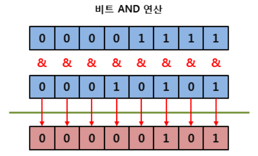

# 2022. 05. 13. 수업내용 정리 #3/3

## 연산자 ... 비트연산자

<br>

+ 비트 연산자(bitwise operator)

  비트 연산자는 논리 연산자와 비슷하지만, 비트 단위로 논리 연산을 수행합니다.<br>

  또한, 비트 단위로 전체 비트를 왼쪽이나 오른쪽으로 이동시킬 때도 사용합니다.<br>

| 비트 연산자 |                             설명                             |
| :---------: | :----------------------------------------------------------: |
|      &      |    대응되는 비트가 모두 1이면 1을 반환함. (비트 AND 연산)    |
|     \|      | 대응되는 비트 중에서 하나라도 1이면 1을 반환함. (비트 OR 연산) |
|      ^      |   대응되는 비트가 서로 다르면 1을 반환함. (비트 XOR 연산)    |
|      ~      |   비트를 1이면 0으로, 0이면 1로 반전시킴. (비트 NOT 연산)    |
|     <<      | 지정한 수만큼 비트를 전부 왼쪽으로 이동시킴. (left shift 연산) |
|     >>      | 부호를 유지하면서 지정한 수만큼 비트를 전부 오른쪽으로 이동시킴. (right shift 연산) |
|     >>>     | 지정한 수만큼 비트를 전부 오른쪽으로 이동시키며, 새로운 비트는 전부 0이 됨. |

<br>

아래의 그림은 AND연산자(&)의 동작을 나타내고  비트가 모두 1일 때만 1을 반환하며, 다른 경우는 모두 0을 반환합니다.                                                                                     

<div style="text-align: center;">
 
 </div>

​        

<br>

다음 그림은 OR연산자(|)의 동작을 나타니교 두 비트 중 하나라도 1이면 1을 반환하며, 두 비트 모두 0일 때만 0을 반환합니다.

/스크립트연산자예시10.png)

<br>

다음 그림은 XOR연산자(^)의 동작을 나타내고 대응되는 두 비트가 서로 다르면 1을 반환하고, 같으면 0을 반환합니다.

/스크립트연산자예시11.png)

<br>

다음 그림은 NOT연산자(~)의 동작을 나타내고 해당 비트가 1이면 0을 반환하고, 0이면 1을 반환합니다.

/스크립트연산자예시12.png)

<br>

다음 예제는 shift 연산자(>>,<<) 및 NOT연산자(~) 의 예제 입니다.

```html
<!DOCTYPE html>
<html lang="ko">

<head>
	<meta charset="UTF-8">
	<title>JavaScript Operators</title>
</head>

<body>

	<h1>비트 연산자</h1>

	<script>
		var x = 15, y = -8, z = 15;
		document.write((x << 1) + "<br>");	// 곱하기 2
		document.write((y >> 1) + "<br>");	// 나누기 2
		document.write((y >>> 1) + "<br>");	// 부호 비트까지도 전부 오른쪽으로 이동됨.
		document.write(~z);					// 1의 보수
	</script>
	
</body>

</html>
```

웹 페이지 화면▼


<br>

첫 번째 연산은 비트를 전부 왼쪽으로 1비트씩 이동시키는 연산입니다.<br>

따라서 그 결과값은 처음 값에 2를 곱한 것과 같게 됩니다.<br>

반대로 두 번째 연산은 비트를 전부 오른쪽으로 1비트씩 이동시키는 연산입니다.<br>

따라서 그 결과값은 처음 값에 2를 나눈 것과 같게 됩니다.