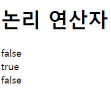

# 2022. 05. 13. 수업내용 정리 #3/3

## 연산자 ... 비교연산자

<br>

+ 논리 연산자(logical operator)

  논리 연산자는 주어진 논리식을 판단하며, 참(true)과 거짓(false)을 반환합니다.<br>

  &&연산자와 || 연산자는 두 개의 피연산자를 가지는 이항 연산자이며, 피연산자들의 결합 방향은 왼쪽에서 오른쪽입니다.<br>

  !연산자는 피연산자가 단 하나뿐인 단항 연산자이며, 피연산자의 결합 방향은 오른쪽에서 왼쪽입니다.<br>

| 논리 연산자 |                             설명                             |
| :---------: | :----------------------------------------------------------: |
|     &&      |      논리식이 모두 참이면 참을 반환함. (논리 AND 연산)       |
|    \|\|     |  논리식 중에서 하나라도 참이면 참을 반환함. (논리 OR 연산)   |
|      !      | 논리식의 결과가 참이면 거짓을, 거짓이면 참을 반환함. (논리 NOT 연산) |

<br>논리 연산자의 모든 동작 결과를 보여주는 진리표(truth table)

|   A   |   B   | A && B | A \|\| B |  !A   |
| :---: | :---: | :----: | :------: | :---: |
| true  | true  |  true  |   true   | false |
| true  | false | false  |   true   | false |
| false | true  | false  |   true   | true  |
| false | false | false  |  false   | true  |

<br>

```html
<!DOCTYPE html>
<html lang="ko">
<head>
	<meta charset="UTF-8">
	<title>JavaScript Operators</title>
</head>
<body>

	<h1>논리 연산자</h1>

	<script>
		var x = true, y = false;
		document.write((x && y) + "<br>");	// false
		document.write((x || y) + "<br>");	// true
		document.write(!x);					// false
	</script>
	
</body>
</html>
```

웹 페이지 화면▼



