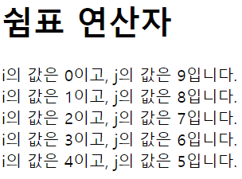
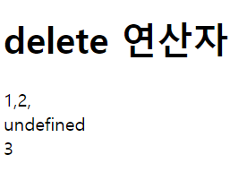
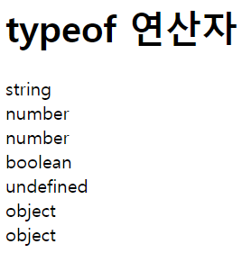
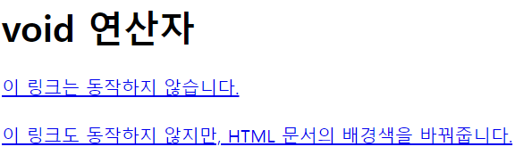

# 2022. 05. 13. 수업내용 정리 #3/3

## 연산자 ... 기타연산자

<br>

+ 문자열 결합 연산자

  덧셈(+) 연산자는 피연산자의 타입에 따라 두 가지 다른 연산을 수행합니다.<br>

  1. 피연산자가 둘 다 숫자면, 산순 연산인 덧셈 수행.<br>
  2. 피연산자가 하나라도 문자열이면, 문자열 결합 수행.<br>

```html
<!DOCTYPE html>
<html lang="ko">

<head>
	<meta charset="UTF-8">
	<title>JavaScript Operators</title>
</head>

<body>

	<h1>문자열 결합 연산자</h1>

	<script>
		var x = 3 + 4;						// 피연산자가 둘 다 숫자이면 덧셈 연산을 수행함.
		var y = "좋은 " + "하루 되세요!"	// 피연산자가 둘 다 문자열이면 문자열 결합 연산을 수행함.
		var z = 12 + "1"					// 피연산자가 하나라도 문자열이면 문자열 결합 연산을 수행함.
		document.write(x + "<br>");
		document.write(y + "<br>");
		document.write(z);
	</script>
	
</body>

</html>
```

웹 페이지 화면▼


+ 삼항 연산자(ternary operator)

삼항 연산자는 유일하게 피연산자를 세 개나 가지는 조건 연산자입니다.<br>

##### 문법

표현식 ? 반환값1 : 반환값2

<br>

물음표(?) 앞의 표현식에 따라 결과값이 참이면 '반환값1'을 반환하고, 거짓이면 '반환값2'를 반환합니다.<br>

```html
<!DOCTYPE html>
<html lang="ko">

<head>
	<meta charset="UTF-8">
	<title>JavaScript Operators</title>
</head>

<body>

	<h1>삼항 연산자</h1>

	<script>
		var x = 3, y = 5;
		var result = (x > y) ? x : y // x가 더 크면 x를, 그렇지 않으면 y를 반환함.
		document.write("둘 중에 더 큰 수는 " + result + "입니다.");
        /*
        	if/else 문의 대용 가능
        */
	</script>
	
</body>

</html>
```

웹페이지 화면▼


<br><br>

+ 쉼표 연산자

  쉼표 연산자를 for문에서 사용하면, 루프마다 여러 변수를 동시에 갱신할 수 있습니다.<br>

  ```html
  <!DOCTYPE html>
  <html lang="ko">
  
  <head>
  	<meta charset="UTF-8">
  	<title>JavaScript Operators</title>
  </head>
  
  <body>
  
  	<h1>쉼표 연산자</h1>
  
  	<script>
  		// 루프마다 i의 값은 1씩 증가하고, 동시에 j의 값은 1씩 감소함.
  		for (var i = 0, j = 9; i <= j; i++, j--) {
  			document.write("i의 값은 " + i + "이고, j의 값은 " + j + "입니다.<br>");
  		}
  	</script>
  	
  </body>
  
  </html>
  ```

  웹페이지 화면 ▼

  

<br><br>

+ delete 연산자

  delete 연산자는 피연사자인 객체, 객체의 프로퍼티(property) 또는 배열의 요소(element) 등을 삭제해 줍니다.<br>

  피연산자가 성공적으로 삭제되었을 경우에는 참(true)을 반환하고, 삭제하지 못했을 경우엔는 거짓(false)을 반환합니다.<br>

  이 연산자는 피연산자가 단 하나뿐인 단항 연산자이며, 피연산자의 결합 방향은 오른쪽에서 왼쪽입니다.<br>

  ```html
  <!DOCTYPE html>
  <html lang="ko">
  
  <head>
  	<meta charset="UTF-8">
  	<title>JavaScript Operators</title>
  </head>
  
  <body>
  
  	<h1>delete 연산자</h1>
  
  	<script>
  		var arr = [1, 2, 3];				// 배열 생성
  		delete arr[2];						// 배열의 원소 중 인덱스가 2인 요소를 삭제함.
  		document.write(arr + "<br>");		// [1, 2, ]
  		// 배열에 빈자리가 생긴 것으로 undefined 값으로 직접 설정된 것은 아님.
  		document.write(arr[2] + "<br>");
  		// 배열의 요소를 삭제하는 것이지 배열의 크기까지 줄이는 것은 아님.
  		document.write(arr.length);
  	</script>
  	
  </body>
  
  </html>
  ```

  웹페이지 화면 ▼

  

<br><br>

+ typeof 연산자

  피연산자의 타입을 반환합니다.<br>

  이 연산자는 피연산자가 단 하나뿐인 단항 연산자이며, 피연산자의 결합 방향은 오른쪽에서 왼쪽입니다.<br><br>

  자바스크립트에서 많이 사용하는 값과 그 값에 대한 typeof 연산자의 결과값은 다음과 같습니다.<br>

  |        값        | typeof 연산자의 결괏값 |
  | :--------------: | :--------------------: |
  |    숫자, NaN     |        "number"        |
  |      문자열      |        "string"        |
  |   true, false    |       "boolean"        |
  |       null       |        "object"        |
  |    undefined     |      "undefined"       |
  |       함수       |       "function"       |
  | 함수가 아닌 객체 |        "object"        |

  ```html
  <!DOCTYPE html>
  <html lang="ko">
  
  <head>
  	<meta charset="UTF-8">
  	<title>JavaScript Operators</title>
  </head>
  
  <body>
  
  	<h1>typeof 연산자</h1>
  
  	<script>
  		document.write((typeof "문자열") + "<br>");
  		document.write((typeof 10) + "<br>");
  		document.write((typeof NaN) + "<br>");
  		document.write((typeof false) + "<br>");
  		document.write((typeof undefined) + "<br>");
  		document.write((typeof new Date()) + "<br>");
  		document.write(typeof null);
  	</script>
  	
  </body>
  
  </html>
  ```

  웹페이지 화면 ▼

  

<br><br>

+ instanceof 연산자

  피연산자인 객체가 특정 객체의 인스턴스인지 아닌지를 확인해 줍니다.<br>

  피연산자가 특정 객체의 인스턴스이면 참을 반환하고, 특정 객체의 인스턴스가 아니면 거짓(false)을 반환합니다.<br>

  두 개의 피연산자를 가지는 이항 연산자이며, 피연산자들의 결합 방향은 왼쪽에서 오른쪽입니다.<br>

  ```html
  <!DOCTYPE html>
  <html lang="ko">
  
  <head>
  	<meta charset="UTF-8">
  	<title>JavaScript Operators</title>
  </head>
  
  <body>
  
  	<h1>instanceof 연산자</h1>
  
  	<script>
  		var str = new String("이것은 문자열입니다.");
  		document.write(str + "<br>");
  		
  		document.write((str instanceof Object) + "<br>");
  		document.write((str instanceof String) + "<br>");
  		document.write((str instanceof Array) + "<br>");
  		document.write((str instanceof Number) + "<br>");
  		document.write(str instanceof Boolean);
  	</script>
  	
  </body>
  
  </html>
  ```

  웹페이지 화면 ▼

  /스크립트연산자예시20-165287790063117.png)

  <br><br>

+ void 연산자

  피연산자로 어떤 타입의 값이 오던지 상관없이 언제나 undefined 값만을 반환합니다.<br>

  이 연산자는 피연산자가 단 하나뿐인 단항 연산자이며, 피연산자의 결합 방향은 오른쪽에서 왼쪽입니다.<br>

  ```html
  <!DOCTYPE html>
  <html lang="ko">
  
  <head>
  	<meta charset="UTF-8">
  	<title>JavaScript Operators</title>
  </head>
  
  <body>
  
  	<h1>void 연산자</h1>
  
  	<a href="javascript:void(0)">이 링크는 동작하지 않습니다.</a><br><br>
  	<a href="javascript:void(document.body.style.backgroundColor='yellow')">
  		이 링크도 동작하지 않지만, HTML 문서의 배경색을 바꿔줍니다.
  	</a>
  	
  </body>
  
  </html>
  ```

  웹페이지 화면 ▼

  

