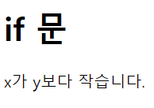
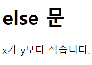
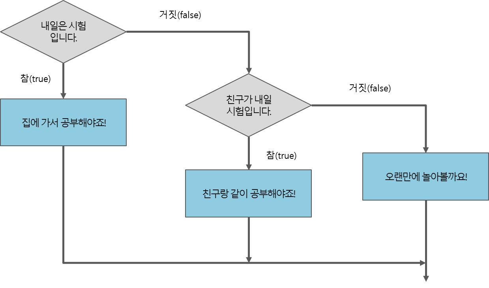
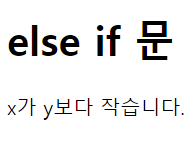

# 2022. 05. 17. 수업내용 정리 #1/2

## 조건문 ifelse, switch,

<br>

+ 제어문(control flow satatements)

  프로그램의 순차적인 흐름을 제어해야 할 때 사용하는 설명문을 제어문이라고 합니다.<br>

  이러한 제어문에는 조건문, 반복문 등이 포함됩니다.<br><br>

  * 조건문

    조건문이란 프로그램 내에서 주어진 표현식의 결과에 따라 별도의 명령을 수행하도록 제어하는 실행문입니다.<br>

    조건문 중에서 가장 기본이 되는 실행문은 if문입니다.<br><br>

    자바스크립트에서 사용할 수 있는 조건문의 형태는 다음과 같습니다.<br><br>

    1. if 문
    2. if / else 문
    3. if / if else / else 문
    4. switch 문<br><br>

  * if 문

    표현식의 결과가 참이면 주어진 실행문을 실행하고, 거짓이면 아무것도 실행하지 않습니다.

    아래는 실행문을 순서도로 표현한 예시입니다.

    /조건문예시1.png)

    <br>

    <h5>if 문의 표현식</h5>

  ```문법
  if(표현식){
  	표현식의 결과가 참일 때 실행하고자 하는 실행문.
  }
  ```

  <br>

  ```javascript
  <!DOCTYPE html>
  <html lang="ko">
  
  <head>
  	<meta charset="UTF-8">
  	<title>JavaScript Conditional Statement</title>
  </head>
  
  <body>
  
  	<h1>if 문</h1>
  
  	<script>
  		var x = 10, y = 20;
  		if (x == y) {
  			document.write("x와 y는 같습니다.");
  		}
  		if (x < y) {
  			document.write("x가 y보다 작습니다.");
  		}
  		if (x > y) // 실행될 실행문이 한 줄뿐이라면 대괄호({})를 생략할 수 있음.
  			document.write("x가 y보다 큽니다.");
  	</script>
  	
  </body>
  
  </html>
  ```

  웹페이지 화면 ▼

  

  ★ 만약 if 문의 실행문이 한줄이면, 중괄호({ })를 생략할 수 있습니다.<br><br>

  * else 문

    if문과 같이 사용할 수 있는 else 문은 if문의 표현식 결과가 거짓일 때 주어진 실행문을 실행합니다.<br>

    if / else 문을 순서도로 표현하면 다음 그림과 같이 표현할 수 있습니다.<br>

    /조건문예시3.png)

    <br>

    <h5>else 문 문법</h5>

    ```문법
    if (표현식) {
        표현식의 결과가 참일 때 실행하고자 하는 실행문;
    } 
    
    else {
        표현식의 결과가 거짓일 때 실행하고자 하는 실행문;
    }
    ```

    ```html
    <!DOCTYPE html>
    <html lang="ko">
    
    <head>
    	<meta charset="UTF-8">
    	<title>JavaScript Conditional Statement</title>
    </head>
    
    <body>
    
    	<h1>else 문</h1>
    
    	<script>
    		var x = 10, y = 20;
    		if (x == y) {
    			document.write("x와 y는 같습니다.");
    		} else { // x와 y가 같지 않은 경우
    			if (x < y)
    				document.write("x가 y보다 작습니다.");
    			else // 실행될 실행문이 한 줄뿐이라면 대괄호({})를 생략할 수 있음.
    				document.write("x가 y보다 큽니다.");
    		}
    	</script>
    	
    </body>
    
    </html>
    ```

    웹페이지 화면 ▼

    

    ★ 만약 if 문의 실행문이 한줄이면, 중괄호({ })를 생략할 수 있습니다.<br><br>

  * else if 문

    else if 문은 if 문처럼 표현식을 설정할 수 있으므로, 중첩된 if 문을 좀 더 간결하게 표현할 수 있습니다.<br>

    하나의 조건문 안에서 if 문과 else 문은 단 한 번만 사용될 수 있습니다.<br>

    하지만 else if 문을 여러 번 사용되어 다양한 조건을 설정할 수 있습니다.<br><br>

    if / else if / else 문을 순서도로 표현하면 다음 그림과 같이 표현할 수 있습니다.<br>

    

    <br>

    <h5>else if 문의 문법</h5>

    ```문법
    if (표현식1) {
        표현식1의 결과가 참일 때 실행하고자 하는 실행문;
    } 
    
    else if (표현식2) {
        표현식2의 결과가 참일 때 실행하고자 하는 실행문;
    } 
    
    else {
        표현식1의 결과도 거짓이고, 표현식2의 결과도 거짓일 때 실행하고자 하는 실행문;
    }
    ```

    else if 문을 사용하면 앞선 예제를 더욱 간결하게 표현할 수 있습니다.

    ```html
    <!DOCTYPE html>
    <html lang="ko">
    
    <head>
    	<meta charset="UTF-8">
    	<title>JavaScript Conditional Statement</title>
    </head>
    
    <body>
    
    	<h1>else if 문</h1>
    
    	<script>
    		var x = 10, y = 20;
    		if (x == y) {
    			document.write("x와 y는 같습니다.");
    		}
    		else if (x < y) {
    			document.write("x가 y보다 작습니다.");
    		}
    		else { // x > y인 경우
    			document.write("x가 y보다 큽니다.");
    		}
    	</script>
    	
    </body>
    
    </html>
    ```

    웹페이지 화면 ▼

    

    

    ★ else if 문에서도 실행될 실행문이 한 줄뿐이라면 중괄호를 생략할 수 있습니다.<br><br>

    switch 문

    switch 문은 if / else 문과 마찬가지로 주어진 조건 값에 따라 프로그램이 다른 명령을 수행하도록 하는 조건문입니다.<br>

    이러한 switch 문은 if/else 문보다 가독성 측면에서 더 좋습니다.<br><br>

    <h5>switch 문의 문법은 다음과 같습니다.</h5>

    ```문법
    switch (조건 값) {
    
        case 값1:
            조건 값이 값1일 때 실행하고자 하는 실행문;=
            break;
    
        case 값2:
            조건 값이 값2일 때 실행하고자 하는 실행문;
            break;
        
        default:
            조건 값이 어떠한 case 절에도 해당하지 않을 때 실행하고자 하는 실행문;
            break;
    }
    ```

    <br>

    default 절은 조건 값이 위에 나열된 어떠한 case 절에도 해당하지 않을 때 실행됩니다.<br>

    이 구문은 생략가능하며, 필요할 때만 선언할 수 있습니다.<br><br>

    각 case 절 및 default 절은 반드시 break 키워드를 포함하고 있어야 합니다.<br>

    break 키워드는 조건 값에 해당하는 case 절이나 default 절이 실행된 뒤에 전체 switch 문을 빠저나가게 해줍니다.<br><br>

    ★ default 절의 위치가 반드시 switch 문의 맨 마지막일 필요는 없습니다.

    ```html
    <!DOCTYPE html>
    <html lang="ko">
    
    <head>
    	<meta charset="UTF-8">
    	<title>JavaScript Conditional Statement</title>
    </head>
    
    <body>
    
    	<h1>여러 개의 case 절을 가지는 switch 문</h1>
    
    	<script>
    		var day = new Date().getDay(); // 오늘의 요일을 반환함. (일요일: 0 ~ 토요일: 6)
    
    		switch (day) {
    			case 1: // 월요일인 경우
    			case 2: // 화요일인 경우
    			case 3: // 수요일인 경우
    			case 4: // 목요일인 경우
    			default: // 0부터 6까지의 값이 아닌 경우
    				document.write("아직도 주말은 멀었네요... 힘내자구요!!");
    				break; 
    			case 5: // 금요일인 경우
    				document.write("오늘은 불금이네요!!");
    				break; 
    			case 6: // 토요일인 경우
    			case 0: // 일요일인 경우
    				document.write("즐거운 주말에도 열심히 공부하는 당신~ 최고에요!!");
    				break;
    		}
    	</script>
    	
    </body>
    
    </html>
    ```

    웹페이지 화면 ▼

    

    <br>

    

    ​																																																																			

