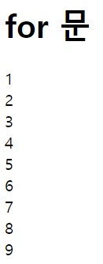
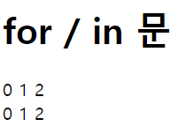
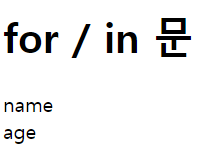
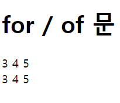
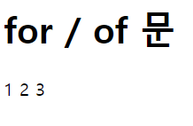

# 2022. 05. 19. 수업내용 정리 #1/2

## 반복문 while, for.. 

<br>

+ 반복문

  반복문이란 프로그램 내에서 똑같은 명령을 일정 횟수만큼 반복하여 수행하도록 제어하는 실행문입니다.<br>

  프로그램이 처리하는 대부분의 코드는 반복적인 형태가 많으므로, 가장 많이 사용되는 실행문 중 하나입니다.<br><br>

  자바스크립트에서 사용할 수 있는 반복문의 형태는 다음과 같습니다.<br><br>

  1. while 문
  2. do / while 문
  3. for 문
  4. for / in 문
  5. for / of 문<br><br>

  * while 문

    while 문은 특정 조건을 만족할 때까지 계속해서 주어진 실행문을 반복 실행합니다.<br>

    <br>

    while 문을 순서도로 표현하면 다음 그림과 같습니다.<br>

    /반복문예시1.png)

    + * 

    <h5>문법</h5>

    ```문법
    while (표현식) {
        표현식의 결과가 참인 동안 반복적으로 실행하고자 하는 실행문;
    }
    ```

    <br>

    while 문은 우선 표현식이 참인지를 판단하여 참이면 내부의 시랳ㅇ문을 실행합니다.<br>

    내부의 실행문을 전부 실행하고 나면, 다시 표현식으로 돌아와 또 한 번 표현식이 참인지를 판단하게 됩니다.<br>

    이렇게 표현식의 검사를 통해 반복해서 실행되는 반복문을 루프(loop)라고 합니다.<br>

    <br>

    ```html
    <!DOCTYPE html>
    <html lang="ko">
    
    <head>
    	<meta charset="UTF-8">
    	<title>JavaScript Iteration Statement</title>
    </head>
    
    <body>
    
    	<h1>while 문</h1>
    
    	<script>
    		var i = 1;
    		
    		while (i < 10) { // 변수 i가 10보다 작을 때만 while 문을 반복함.
    			document.write(i + "<br>");
    			i++; // 반복할 때마다 변수 i를 1씩 증가시켜 변수 i가 10보다 커지면 반복문을 종료함.
    		}
    	</script>
    	
    </body>
    
    </html>
    ```

    웹페이지 화면 ▼

    /반복문예시2.png)

     <br>

    while 문 내부에 표현식의 결과를 변경하는 실행문이 존재하지 않을 경우 프로그램은 루프를 영원히 반복(무한루프)하게 됩니다.<br>

    이 경우, 프로그램은 영원히 종료되지 않습니다.<br>

    무한 루프는 특별히 의도한 경우가 아니라면 반드시 피해야 하는 상황입니다.<br>

    <br>

    따라서 while 문을 작성할 때는 표현식의 결과가 어느 순간에는 거짓을 갖도록 표현식을 변경하는 실행문을 반드시 포함해야 합니다.<br>

    ★ while 문에서 실행될 실행문이 한 줄 뿐이라면 중괄호를 생략할 수 있습니다.<br><br>

  * do while 문

    while 문을 루프에 진입하기 전, 먼저 표현식부터 검사하지만 do / while 문은 저 루프를 한 번 실행한 후에 표현식을 검사합니다.<br>

    즉, do / while 문은 먼저 루프를 한 번 실행한 후에 표현식을 검사합니다. <br>

    <br>

    do /  while 문을 순서도로 표현하면 다음 그림과 같습니다.<br>

    /반복문예시3.png)

    <br>

    <h5>문법</h5>

    ```문법
    do {
        표현식의 결과가 참인 동안 반복적으로 실행하고자 하는 실행문;
    } while (표현식);
    ```

    ```html
    <!DOCTYPE html>
    <html lang="ko">
    
    <head>
    	<meta charset="UTF-8">
    	<title>JavaScript Iteration Statement</title>
    </head>
    
    <body>
    
    	<h1>do / while 문</h1>
    
    	<script>
    		var i = 1, j = 1;
    		
    		while (i > 3) { // 변수 i의 초기값은 1이기 때문에 이 while 문은 한 번도 실행되지 않음.
    			document.write("i : " + (i++) + "<br>");
    		}
    		
    		do { // 변수 j의 초기값은 1이기 때문에 이 do / while 문은 단 한 번만 실행됨.
    			document.write("j : " + (j++) + "<br>");
    		} while (j > 3);
    	</script>
    	
    </body>
    
    </html>
    ```

    웹페이지 화면 ▼

    

    <br>

    <br>

  * for 문

    for 문은 while 문과는 달리 자체적으로 초기식, 표현식, 증감식을 모두 포함하고 있는 반복문입니다. <br>

    따라서 while 문보다는 좀 더 간결하게 반복문을 표현할 수 있습니다.<br>
    <br>

    for 문을 순서도로 표현하면 다음 그림과 같습니다.<br>

    /반복문예시5.png)

    <br>

    <h5>문법</h5>

    ```문법
    for (초기식; 표현식; 증감식) {
        표현식의 결과가 참인 동안 반복적으로 실행하고자 하는 실행문;
    }
    ```

    <br>

    for 문을 구성하는 초기식, 표현식, 증감식은 각각 생략될 수 있습니다.<br>

    또한, 쉼표 연산자(,)를 사용하면 여러 개의 초기식이나 증감식을 동시에 사용할 수도 있습니다.<br>

    <br>

    for 문을 사용하면 앞선 예제의 while 문을 더욱 더 간결하게 표현할 수 있습니다.<br>
    ```html
    <!DOCTYPE html>
    <html lang="ko">
    
    <head>
    	<meta charset="UTF-8">
    	<title>JavaScript Iteration Statement</title>
    </head>
    
    <body>
    
    	<h1>for 문</h1>
    
    	<script>
    		/*
    		var i = 1;
    		while (i < 10) { // 변수 i가 10보다 작을 때만 while 문을 반복함.
    			document.write(i + "<br>");
    			i++; // 반복할 때마다 변수 i를 1씩 증가시켜 변수 i가 10보다 커지면 반복문을 종료함.
    		}
    		*/
    		for (var i = 1; i < 10; i++) {
    			document.write(i + "<br>");
    		}
    	</script>
    	
    </body>
    
    </html>
    ```

    웹페이지 화면 ▼

    

    <br>

    ★ for 문에서 실행될 실행문이 한 줄 뿐이라면 중괄호를 생략할 수 있습니다.

    <br><br>

  * for / in 문

    for / in 문은 일반적인 for 문과는 전혀 다른 형태의 반복문입니다.<br>

    for / in 문은 해당 객체의 모든 열거할 수 있는 프로퍼티(enumberable properties)를 순회할 수 있도록 해줍니다.<br>

    ★ 열거할 수 있는 프로퍼티란 내부적으로 enmerable 플래그가 true로 설정된 프로퍼티를 의미합니다.<br>	이러한 프로퍼티들은 for / in 문으로 접근할 수 있게 됩니다.<br>

    <br>

    위의 팁에 관한 자세한 내용은 아래의 사이트를 참조 

    → [모던 자바스크립트 : 프로퍼티 플래그와 설명자 :: chanyeong](https://chanyeong.com/blog/post/11)

    <br>

    이 반복문은 루프마다 객체의 열거할 수 있는 프로퍼티의 이름을 지정된 변수에 대입합니다.<br>

    이렇게 대입받은 변수를 이용하면 루프 안에서 객체의 열거할 수 있는 프로퍼티에 순차적으로 접근할 수 있습니다.<br>

    <br>

    for / in 문의 문법은 다음과 같습니다.

    <h5>문법</h5>

    ```문법
    for (변수 in 객체) {
        객체의 모든 열거할 수 있는 프로퍼티의 개수만큼 반복적으로 실행하고자 하는 실행문;
    }
    ```

    <br>

     for / in 문을 사용하여 배열의 요소에 접근하는 예제

    ```html
    <!DOCTYPE html>
    <html lang="ko">
    
    <head>
    	<meta charset="UTF-8">
    	<title>JavaScript Iteration Statement</title>
    </head>
    
    <body>
    
    	<h1>for / in 문</h1>
    
    	<script>
    		var arr = [3, 4, 5];
    
    		for (var i = 0; i < arr.length; i++) { // 배열 arr의 모든 요소의 인덱스(index)를 출력함.
    			document.write(i + " ");
    		}
    		document.write("<br>");
    
    		for (var i in arr) { // 위와 같은 동작을 하는 for / in 문
    			document.write(i + " ");
    		}
    	</script>
    	
    </body>
    
    </html>
    ```

    웹 페이지 화면 ▼

    

    <br>

    for / in 문을 사용하여 객체의 프로퍼티에 접근하는 예제입니다.<br>

    ```html
    <!DOCTYPE html>
    <html lang="ko">
    
    <head>
    	<meta charset="UTF-8">
    	<title>JavaScript Iteration Statement</title>
    </head>
    
    <body>
    
    	<h1>for / in 문</h1>
    
    	<script>
    		var obj = {
    			name : "이순신",
    			age : 20
    		};
    
    		for (var i in obj) {
    			document.write(i + "<br>");
    		}
    	</script>
    	
    </body>
    
    </html>
    ```

    웹페이지 화면 ▼

    

    <br>

    ★ for / in 문은 해당 ㄱ개체가 가진 모든 프로퍼티를 반환하는 것이 아닌, 오직 열거할 수 있는 프로퍼티만을 반환합니다.<br><br>

  * for / of 문

    for / of 문은 반복할 수 있는 객체(iterable objects)를 순회할 수 있도록 해주는 반복문입니다.<br>

    <br>

    자바스크립트에서 반복할 수 있는 객체에는 Array, Map, Set, arguments 객체 등이 있습니다.<br>

    이 반복문은 루프마다 객체의 열거할 숭 ㅣㅆ는 프로퍼티의 값을 지정된 변수에 대입합니다.<br>

    <br>

    <h5>문법</h5>

    ```문법
    for (변수 of 객체) {
        객체의 모든 열거할 수 있는 프로퍼티의 개수만큼 반복적으로 실행하고자 하는 실행문;
    }
    ```

    <br>

    다음 예제는 for / of 문을 사용하여 배열의 요소에 접근하는 예제입니다.

    ```html
    <!DOCTYPE html>
    <html lang="ko">
    
    <head>
    	<meta charset="UTF-8">
    	<title>JavaScript Iteration Statement</title>
    </head>
    
    <body>
    
    	<h1>for / of 문</h1>
    
    	<script>
    		var arr = [3, 4, 5];
    
    		for (var i = 0; i < arr.length; i++) { // 배열 arr의 모든 요소의 인덱스(index)를 출력함.
    			document.write(arr[i] + " ");
    		}
    		document.write("<br>");
    
    		for (var value of arr) { // 위와 같은 동작을 하는 for / of 문
    			document.write(value + " ");
    		}
    	</script>
    	
    </body>
    
    </html>
    ```

    웹페이지 화면 ▼

    

    <br>

    다음 예제는 for / of 문을 사용하여 Set 객체의 프로퍼티에 접근하는 예제입니다.<br>

    ```html
    <!DOCTYPE html>
    <html lang="ko">
    
    <head>
    	<meta charset="UTF-8">
    	<title>JavaScript Iteration Statement</title>
    </head>
    
    <body>
    
    	<h1>for / of 문</h1>
    
    	<script>
    		var arr = new Set([1, 1, 2, 2, 3, 3]);
    
    		for (var value of arr) {
    			document.write(value + " ");
    		}
    	</script>
    	
    </body>
    
    </html>
    ```

    웹페이지 화면 ▼

    

    