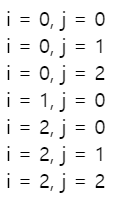
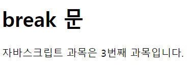

# 2022. 05. 24. 수업내용 정리 

## 기타제어문

<br>

+ label 문

  프로그램 내의 특정 영역을 식별할 수 있도록 해주는 식별자<br>

  continue 문과 break 문의 동작이 프로그램의 흐름을 특정 영역으로 이동시킬 수 있습니다. <br>

  <br>

  문법

  ```html
  label:           <!-- 자바스크립트에서 사용할 수 있는 식별자면 모두 가능 -->
  	statement       <!-- break는 모든 레이블 구문에서, continue는 반복 레이블 구문에서만 사용할 수 있다.-->		
  ```

  ```javascript
  var i, j;
  
  loop1:
  for (i = 0; i < 3; i++) {      //첫번째 for문은 "loop1" 레이블을 붙였다.
     loop2:
     for (j = 0; j < 3; j++) {   //두번째 for문은 "loop2" 레이블을 붙였다.
        if (i === 1 && j === 1) {
           continue loop1;
        }
        console.log('i = ' + i + ', j = ' + j);
     }
  }
  
  // 다음 두 경우를 어떻게 스킵하는지 주목 : "i = 1, j = 1", "i = 1, j = 2"
  ```

  웹페이지 화면 ▼

  

  <br><br>

+ continue 문

  루프 내에서 해당 루프의 나머지 부분을 건너뛰고, 바로 다음 표현식의 판단으로 넘어가도록 합니다.<br>

  반복문 내에서 특정 조건에 대한 처리를 제외할 때, 자주 사용합니다.<br><br>

  두 가지 형태로 사용이 가능합니다.<br>

  <br>

  문법

  ```html
  1. continue;
  2. continue 라벨이름;
  ```

  ```html
  <!DOCTYPE html>
  <html lang="ko">
  
  <head>
  	<meta charset="UTF-8">
  	<title>JavaScript Etc Control Statement</title>
  </head>
  
  <body>
  
  	<h1>continue 문</h1>
  
  	<script>
  		var exceptNum = 3;
  
  		for (var i = 0; i <= 100; i++) {
  			if (i % exceptNum == 0) // exceptNum(3)의 배수는 출력하지 않음.
  				continue;
  			document.write(i + " ");
  		}
  	</script>
  </body>
  </html>
  ```

  웹페이지 화면 ▼

  /기타제어문예시2.png)

  <br>

  <br>

+ break 문

  루프 내에서 사용해 해당 반복문을 완전히 종료시키고, 반복문 바로 다음에 위치한 실행문으로 프로그램의 흐름을 이동시킵니다.<br>

  표현식의 판단 결과에 상관없이 반복문을 완전히 빠져나가고 싶을 때 사용합니다.<br>

  <br>

  문법

  ```html
  1. break;
  2. break 라벨이름;
  ```

  ```html
  <!DOCTYPE html>
  <html lang="ko">
  
  <head>
  	<meta charset="UTF-8">
  	<title>JavaScript Etc Control Statement</title>
  </head>
  
  <body>
  
  	<h1>break 문</h1>
  
  	<script>
  		var lectures = ["html", "css", "자바스크립트", "php"];
  		var topic = "자바스크립트";
  
  		for (var i = 0; i < lectures.length; i++) {
  			if (lectures[i] == topic) {
  				document.write(topic + " 과목은 " + (i + 1) + "번째 과목입니다.");
  				break; // 원하는 값을 찾은 후에는 더 이상 for 문을 반복하지 않고 빠져나감.
  			}
  		}
  	</script>
  	
  </body>
  
  </html>
  ```

  웹페이지 화면 ▼

  